### Introduction

Pandas is a very popular and flexible python based library for data analysis and manipulation. Pandas provides a table like 2D data structure having rows and columns known as DataFrames. These DataFrames are extensively used by data scientist's.

In this blog we will get familiarized with some of the popular DataFrame techniques for Data Manipulation.

### 1) Reading the Data

The pandas library is imported usually with 'pd' alias as follows:

```python
import pandas a pd
```

We mostly read the data from directly from an xls file or csv file. For reading the csv file we used pd.read_csv methoda and specify the file name as follow:

```python
df=pd.read_csv('student_data.csv')
```

Alternatively we can create a toy dictionary and convert it into dataframe as follow:

```python
#Creating a dictionary
dictt = {'name':["ram","sita","sudhir","krishna","hari"],
'age': [17,17,16,15,17],'math_score':[90, 40, 80, 98,88],
'science_score':[70,80,70,100,75] }
#Converting the dictionary into dataframe wtih 5 rows and 4 columns
df = pd.DataFrame(dictt)
```

We can display the first few rows of the dataframe using the head method as shown below:

```python
df.head()
```

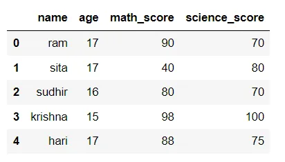

### 2.Describe Method:

This method gives the statistics such as min value, max value, mean, quantile values ( 25th 50th 75th) for all the numerical features in the data set.

In our case age math_score and sceince_score columns are numerical columns so there key statistics are shown when desribe method is called.

```python
df.describe()
```

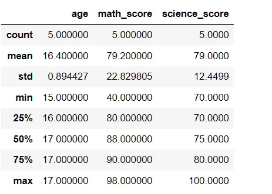

### 3.Boolean Indexing :

Pandas allows us to filter the data based on the boolean vector generated using the actual data in the dataframe rather than column or row labels .This method is known as Boolean indexing.

Here we create a boolean vector (condition) to find out rows that have math_score greater than 85

```python
 condition=df['math_score']>85
 print(condition)
```

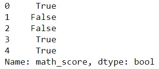

Here first (zeroth index) fourth and fifth row satisfy the condition i.e. math_score > 85 so they have True while rest have False boolean value.

Using the boolean vector condtion we filter our dataframe as follow

```python
df[condition]
```

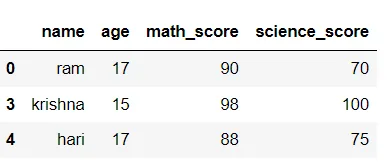

### 4.Dataframe Sorting

We can sort the dataframe based on column values using the sort_values method. We specify the column/s inside the sort_values method according to which we want to sort the data frame

```python
sort_by_math_score=df.sort_values('math_score')
print(sort_by_math_score)
```

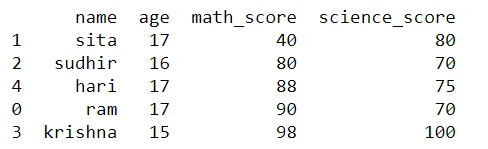

We can also sort the dataframe in the descending order by specifying the value of ascending argument in the sort_values method as False.

```python
sort_by_math_score=df.sort_values('math_score',
ascending=False)
print(sort_by_math_score)
```

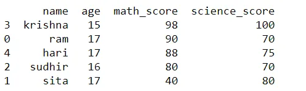

We can also sort dataframes using more than one column by specifying these columns as a list and passing them to sort_values method as follow:

```python
sort_by_age_and_math_score=df.sort_values(
['age','math_score'])
print(sort_by_age_and_math_score)
```

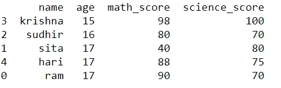

Here we first sort the dataframe using the age column and then by math_score values.

### 5.CUT Method

Cut is a popular technqiue used to label bins to the dataframe rows based on column_values.

In our example we provide math_grade based on math_score i.e. students that scored 0-40 in maths are given poor grade , 40-70 are given the average grade and so forth.

For this we first specify the bin values and there labels as follow:

```python
bins=[0,40,70,85,100]
label_names=['poor','average','good','very good']
```

Then we specify the column , bins and label names in the cut method to get the desired label for each instance as folllow:

```python
df['math_grade']=pd.cut(df['math_score'],
bins,labels=label_names)
print(df.head())
```

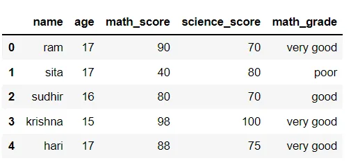

Here sudhir has a math_grade good as his math's score is 80 which lies in the bin 70-85 and has the label name good.

### 6.Groupby

As the name itself suggests groupby is used for grouping data into categories and then applying some function to each subset. Groupby is frequently used with aggregation functions to give some form of insights.

Here we group by using the math_grade category and using the size get the count of each category as shown below:

```python
grade_group=df.groupby('math_grade')
grade_group.size()
```

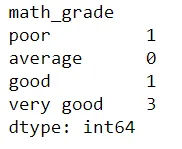

Here it can be seen that 3 students have got very good grade in maths.

We can also apply aggregate functions like sum, mean ,max and so forth to the grouped dataframe as follow:

```python
df.groupby(['math_grade'])['math_score'].min()
```

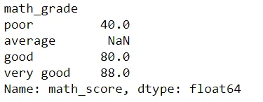

Here it can be seen that the lowest math score among students who got very good math grade was 88.

Lastly we can groupby using more than one column by passing the columns of interest as list to groupby function.

```python
 grade_age_group=df.groupby(['math_grade','age'])
 grade_age_group.size()
```

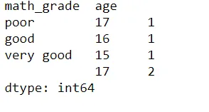

Here we can see that of the 3 people that got very good grades in math one is 15 year old while other two are 17 year old.

Conclusion

Hence in this blog we saw some popular pandas dataframe technique's used widely for data analysis and manipulation. The link to the github repository is [here.](https://github.com/rubash9849/data_inisghts/blob/main/pandas_techniques/dataframe.ipynb)
