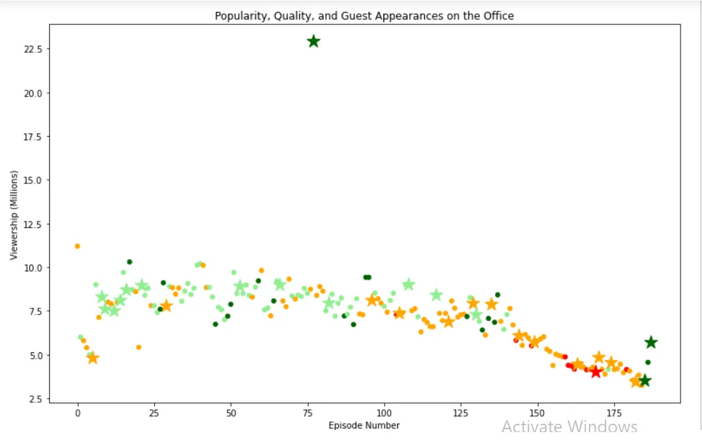

If you are a fan of comedy shows, then you probably heard of "The Office". And if you didn't, here is a description about it.

**The Office!** What started as a British mockumentary series about office culture in 2001 has since spawned ten other variants across the world, including an Israeli version (2010-13), a Hindi version (2019-), and even a French Canadian variant (2006-2007). Of all these iterations (including the original), the American series has been the longest-running, spanning 201 episodes over nine seasons.

Data Camp has a project that analyses the data from all the episodes of the series to answer a few questions, one of which is did the popularity of the show went up or down?

You can find the link to the project [here](https://projects.datacamp.com/projects/1170). The data for this project is on Kaggle at this [link](https://www.kaggle.com/nehaprabhavalkar/the-office-dataset).

This dataset contains information on a variety of characteristics of each episode. In detail, these are:
**datasets/office_episodes.csv**

- **episode_number:** Canonical episode number.
- **season:** Season in which the episode appeared.
- **episode_title:** Title of the episode.
- **description:** Description of the episode.
- **ratings:** Average IMDB rating.
- **votes:** Number of votes.
- **viewership_mil:** Number of US viewers in millions.
- **duration:** Duration in number of minutes.
- **release_date:** Airdate.
- **guest_stars:** Guest stars in the episode (if any).
- **director:** Director of the episode.
- **writers:** Writers of the episode.
- **has_guests:** True/False column for whether the episode contained guest stars.
- **scaled_ratings:** The ratings scaled from 0 (worst-reviewed) to 1 (best-reviewed).

The requirements to pass the project are:

1. Create a matplotlib **scatter plot** of the data that contains the following attributes:

   - Each episode's **episode number plotted along the x-axis**
   - Each episode's **viewership (in millions) plotted along the y-axis**
   - A **color scheme** reflecting the **scaled ratings** (not the regular ratings) of each episode, such that:

     - Ratings < 0.25 are colored "red"
     - Ratings >= 0.25 and < 0.50 are colored "orange"
     - Ratings >= 0.50 and < 0.75 are colored "lightgreen"
     - Ratings >= 0.75 are colored "darkgreen"

- A **sizing system**, such that episodes with guest appearances have a marker size of 250 and episodes without are sized 25
- A **title**, reading "Popularity, Quality, and Guest Appearances on the Office"
- An **x-axis label** reading "Episode Number"
- A **y-axis label** reading "Viewership (Millions)"

2. Provide the name of one of the guest stars (hint, there were multiple!) who was in the most watched Office episode. Save it as a string in the variable top_star (e.g. top_star = "Will Ferrell").

### Important!

To test your matplotlib plot, you will need to initalize a matplotlib.pyplot fig object, which you can do using the code fig = plt.figure() (provided you have imported matplotlib.pyplot as plt). In addition, in order to test it correctly, **please make sure to specify your plot (including the type, data, labels, etc) in the same cell as the one you initialize your figure** (fig)! *You are still free to use other cells to load data, experiment, and answer Question 2.*

*In addition, if you want to be able to see a larger version of your plot, you can set the figure size parameters using this code (provided again you have imported matplotlib.pyplot as plt):*

```python
plt.rcParams['figure.figsize'] = [11, 7]
```

Bonus Step!

Although it was not taught in Intermediate Python, a useful skill for visualizing different data points is to use a different marker. Thus, as a bonus step, try to differentiate guest appearances not just with size, but also with a star!

All other attributes still apply (data on the axes, color scheme, sizes for guest appearances, title, and axis labels).

so let's begin!

First thing we need to import the necessary libraries to work with the data, and specify the figure size as mentioned in the instructions.

```python
import matplotlib.pyplot as plt
import pandas as pd
plt.rcParams['figure.figsize'] = [11, 7]
```

Now we read the data from its path, and check the first 5 lines:

```python
df = pd.read_csv('datasets/office_episodes.csv')
df.head()
```

Everything looks in place, so now we start the analysis.

In the requirements we are asked to put third variable as color or size, so as to do that, we need to iterate through the rows in order to group the data according to the specs mentioned.

For color, we start with an empty list and then iterate through the rows to add the colors to the list.

```python
cols= []
for ind , row in df.iterrows():
    if row['scaled_ratings'] < 0.25:
        cols.append('red')
    elif row['scaled_ratings'] < 0.5:
        cols.append('orange')
    elif row['scaled_ratings'] < 0.75:
        cols.append('lightgreen')
    else:
        cols.append('darkgreen')
```

Repeat the steps with the size.

```python
sizes=[]
for ind, row in df.iterrows():
    if row['has_guests'] == False:
        sizes.append(25)
    else: sizes.append(250)
```

Now we add two columns to the dataset with the result of the output, a column for the color and another for the size.

```python
df['colors'] = cols
df['sizes'] = sizes
```

In order to add the marker required in the bonus step, we need to divide the dataset into two data sets based on the presence of a guest star in the episode or not. After that we will draw the two datasets as two overlapping graphs.

```python
non_guest_df = df[df['has_guests'] == False]
guest_df = df[df['has_guests'] == True]
```

Now the final step is the plot step.

```python
fig =plt.figure()
plt.scatter(x=non_guest_df['episode_number'] ,
            y = non_guest_df['viewership_mil'] ,
            c=non_guest_df['colors'] ,
            s =non_guest_df['sizes'])

plt.scatter(x=guest_df['episode_number'] ,
            y = guest_df['viewership_mil'] ,
            c=guest_df['colors'] ,
            s =guest_df['sizes'],
            marker = '*')
plt.title("Popularity, Quality, and Guest Appearances on the Office")
plt.xlabel("Episode Number")
plt.ylabel("Viewership (Millions)")
plt.show()
```

Note that in both graphs we added the third variable color through the c argument and the size through the s.

In the second graph we marked the episodes with guest stars in them as per required so to compare those episodes popularity to the rest of the series.

The last lines are to add the title of the graph and the x and y labels.

Here what the resulting plot looks looks like:



To answer question 2 about the names of the guest stars, we will slice the data to print the names of the stars. There is a 'guest_stars' column where the names are mentioned. I will pick a star from one of the top viewed episodes(i.e more than 20 million views)

```python
df[df['viewership_mil'] > 20]['guest_stars']
```

The output is

```python
77    Cloris Leachman, Jack Black, Jessica Alba
```

To pass the project we choose one name and assign it to the string variable top_star. I chose Jessica Alba.

```python
top_star = 'Jessica Alba'
```
