Introduction

Investors often aim at maximizing returns on investment for a given level of risk. This can be achieved by selecting a number of assets in which to invest in so as to minimize the risk and at the same time maximize the returns on investment. An efficient frontier represents a set of optimal portfolios that offer the highest expected returns for a defined level of risk (https://www.investopedia.com/terms/e/efficientfrontier.asp).

In this tutorial, we will demonstrate how to construct an efficient portfolio of a two-asset portfolio based on the different weight combinations of the assets. The assets we will use for this demonstration are two S&P 500 Exchange Traded Funds (ETFs) of XLE and XLI. . We then proceed to select a suitable portfolio combination on the efficient frontier based on the risk tolerance and the required expected returns.

## Import Required Packages
```python
import numpy as np
import pandas as pd
import yfinance as yf
import matplotlib.pyplot as plt
```

## Load the Data
We will use the daily closing prices for the two assets for a one year period from 27 November, 2017 to 26 November, 2018 . The data is downloaded from Yahoo Finance and loaded into a Data frame.

```python
#specifying the assets
tickers = ['XLE','XLI']

#specifying the start and end dates
start = "2017-11-27"
end = "2018-11-27"

#downloading price data for the assets
data = pd.DataFrame()
for ticker in tickers:
 data[ticker] = yf.download(ticker, start, end)['Close']
```

### Plot of the Daily Close Prices
```python
plt.figure(figsize=(8,5))

plt.plot(data.index, data['XLE'], label='XLE Close')
plt.plot(data.index, data['XLI'], label='XLI Close')
plt.title('Plot of Close Prices', fontsize=16)
plt.xlabel('Date', fontsize=12)
plt.ylabel('Close Prices', fontsize=12)
plt.legend()
plt.show()
```

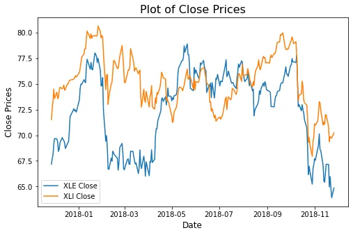

## Calculate the Daily Log Returns

The portfolio of the two assets is constructed using the daily returns of each of the assets. We calculate the daily returns of each of the assets using the daily log returns.

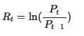


```python
#create empty Data Frame for returns
returns = pd.DataFrame()

#calculate daily log returns
for ticker in tickers:
    returns[ticker] =
    np.log(data[ticker]/data[ticker].shift(1))

#drop rows with NaN
returns = returns.dropna()
returns.head()
```

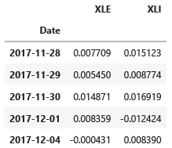

## Daily and Annualized Standard Deviation of Returns

In constructing the portfolio, we will use the annualized standard deviations of each asset returns.

```python
#daily standard deviations
daily_std = returns.std()
daily_std
```

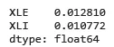

```python
#annualized standard deviations
annualized_std = daily_std * np.sqrt(252)
annualized_std
```

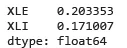

## Correlation of Returns

We get the correlation of the two asset returns

```python
ret_corr = returns[['XLE', 'XLI']].corr()
ret_corr
```

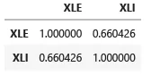

```python
corr_value = np.round(ret_corr['XLE'][1],3)
print('The Correlation between the two assets is:', corr_value)
```

The Correlation between the two assets is: 0.66

## Construction of an Efficient Frontier

We construct an efficient frontier of portfolio based on the different weight combinations of the two ETFs. Using these weight combinations, we calculate the portfolio expected returns and volatility for each.

The portfolio expected return is given by the sum of the weighted individual ETF’s returns.

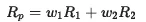


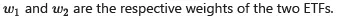

The Portfolio Volatility is computed using the formula for the Two-Asset Portfolio Volatility as shown below:

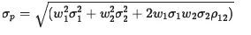

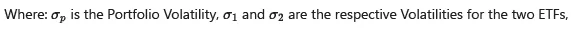

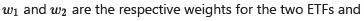

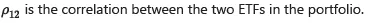

### Portfolio Weights
We define the weights for the various portfolio combinations.

```python
# define weights for the two ETFs
w1=np.linspace(0,1,11)
w2=np.linspace(1,0,11)

#construct a dataframe of weights
weights_df = pd.DataFrame()
weights_df['XLE Weight'] = w1
weights_df['XLI Weight'] = w2

weights_df
```

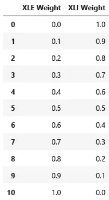

### Portfolio Returns and Volatilities

```python
#volatilities
xle_vol = annualized_std[0]
xli_vol = annualized_std[1]

xle_vol, xli_vol
```

```python
(0.20335309806894042, 0.1710067876397469)
```

```python
#correlation
cor=corr_value
cor
```

```python
0.66
```

### Expected Returns using Capital Asset Pricing Model (CAPM)

The Expected return for each asset using the CAPM is calculated as follows:

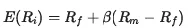

Where:

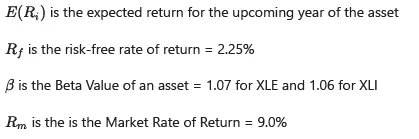

```python
# Define Variables
beta_xle = 1.07 #Beta Value of XLE
beta_xli = 1.06 #Beta Value of XLI
risk_free_rate = 0.0225 # Risk Free Rate
market_return = 0.09 #Market Return
market_std = 0.15 #Market Standard Deviation
```

```python
# Expected Return of XLE
ret_xle = risk_free_rate + beta_xle * (market_return - risk_free_rate)

# Expected Return of XLIret_xli = risk_free_rate + beta_xli * (market_return - risk_free_rate)
```

```python
xle_ret=ret_xle
xli_ret=ret_xli

xle_ret, xli_ret
```

```python
(0.094725, 0.09405)
```

```python
#Compute Returns and Volatility for each combination
portfolio = weights_df.copy()

#portfolio Returns
portfolio['Portfolio Returns'] = ((portfolio['XLE Weight']*xle_ret) + (portfolio['XLI Weight']*xli_ret))

#portfolio volatility
portfolio['Volatility'] = np.sqrt(((portfolio['XLE Weight'])**2 * xle_vol**2) +((portfolio['XLI Weight'])**2 * xli_vol**2) +(2 * (portfolio['XLE Weight']) * xle_vol *(portfolio['XLI Weight']) * xli_vol) * cor)

portfolio
```

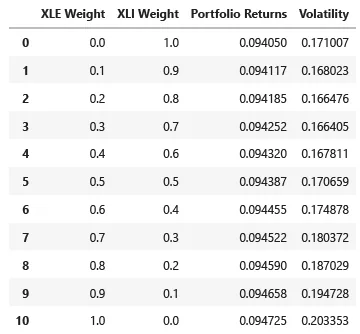

## Portfolio Efficient Frontier

From the above table, we construct the Efficient Frontier for each portfolio weights combination. The figure below shows the scatter plot for the constructed Efficient Frontier of the portfolios

```python
## Plot of the Portfolio Efficient Frontier
plt.figure(figsize= (8,6))

plt.title('Portfolio Efficient Frontier', fontsize=16)
plt.scatter(portfolio['Volatility'],portfolio['Portfolio Returns'],color='r', alpha=0.6)

plt.xlabel('Portfolio Volatility', fontsize=12)
plt.ylabel('Portfolio Returns', fontsize=12)

plt.show()
```

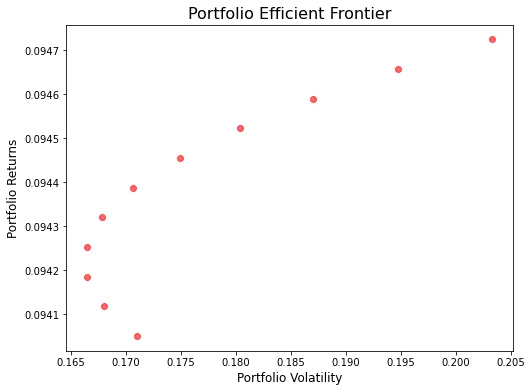

## Selecting a Portfolio with Defined Constraints

From the constructed Efficient Frontier above, we choose our portfolio with the following constraints:

- The Return greater than 9.43% and
- The Volatility not exceeding 16.8%. We achieve this by constructing the threshold lines for returns and volatility on our Efficient Frontier plot as shown below:

```python
#Define the Portfolio Constraints
Vol_threshold = 0.168
return_threshold = 0.0943
n = len(portfolio)
```

```python
# Data ponts
points = []
for i, j in zip(portfolio['Volatility'], portfolio['Portfolio Returns']):
   points.append((i,j))

# Portfolio Weights, (xle, xli)
w = []
for i, j in zip(portfolio['XLE Weight'], portfolio['XLI Weight']):
   w.append((np.round(i,1), np.round(j,1)))
```

```python
#Plot of the Portfolio Efficient Frontier with the Constraints

plt.figure(figsize= (8,6))

plt.title('Portfolio Efficient Frontier', fontsize=16)

plt.plot(portfolio['Volatility'], portfolio['Portfolio Returns'],'-or',alpha=0.6, label='Efficient Frontier')

plt.plot(n * [Vol_threshold], portfolio['Portfolio Returns'],label = 'Volatility Threshold')

plt.plot(np.linspace(0.165,0.205,11), n * [return_threshold],label = 'Returns Threshold')

for i, j in zip(points, w):
   plt.text(i[0],i[1],j)

plt.legend()
plt.show()
```

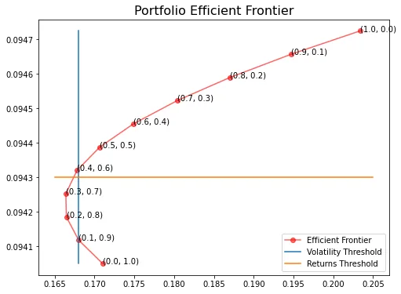

From the plot above, we want to pick a portfolio with returns greater than 9.43% which lies above the Returns Threshold Line. The portfolio should also have a Volatility not exceeding 16.8% meaning it should lie on the Volatility Threshold line or to the left side of it. We can see from the plot that the only combination which satisfies the above constraints is the portfolio with 40% XLE and 60% XLI.

Github Link

The Notebook for this tutorial can be found on the following Github Link:

<https://github.com/Musonda2day/Portfolio-Efficient-Frontier-.git>
