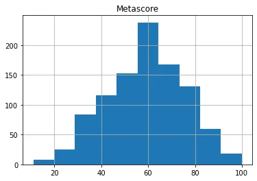
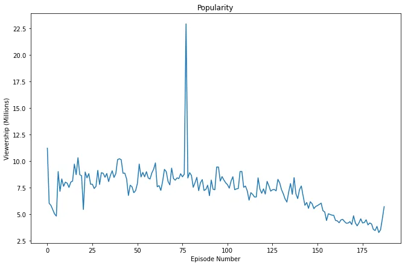
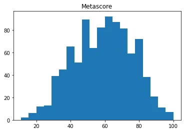
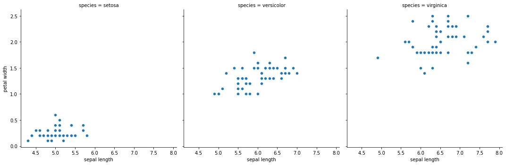
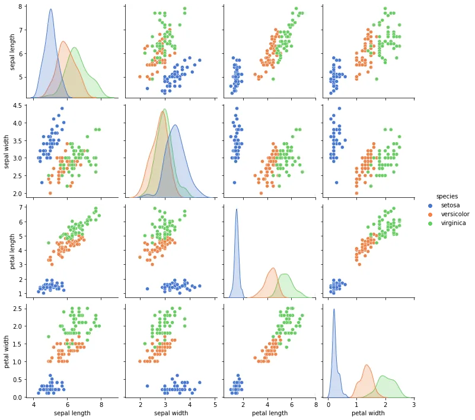

It's Friday morning, you just got your coffee and are ready to chill on that chair and smoothly sail through this last day before the weekend starts. A new email pops with a task that must be finished today. Import, clean and visualize the data so that the managers can extract useful insights from it. AND IT MUST BE DONE BY 3 PM?! If only there was a pipeline you can go through fast enough to get this done on time...

Well, fear not. I am here to save the day. Through this article, you'll get a few key steps (sadly not all of them..) that you'll encounter in 99% of your DS projects. First, importing the data through different file types, Cleaning the data, and finally visualizing it. The main libraries to use will be **Pandas, matplotlib, and Seaborn.**

### I- Importing the data

- **CSV/Text file**

This is the most intuitive task in the pipeline. You can't just exploit your data without reading it.

Let's read our flowers dataset file the usual way in which we only watch out for the separation and the header and display the first few lines.

```python
data_frame = pd.read_csv('flower.csv',delimiter=',',header=0)
data_frame.head()
```

Focus on how you must specify your **delimiter** (the character that separates the values in a row) and the **header** (0 means the first row contains the column names) as well. Always worry about the structure of the data you're working on. You read the data the wrong way all your analysis is bound to be faulty.

- **Fetching CSV/Text files from the web**

The scalability and reproductivity of your work are a must in the world of data science. It's understandable that you would want to save files locally when you work on your code. But, this can generate inconveniences especially when it comes to hard-coded paths to the files in question not to mention the difference between operating systems not to mention the waste of time of manually downloading a file again and again by your colleagues and placing them in the folder to reproduce your work.

Solution? Web fetch the files! You don't want to add extra code? You'll never have to. Pandas handles web fetching of the files automatically. Check this code snippet.

```python
data_frame = pd.read_csv('https://gist.githubusercontent.com/curran/a08a1080b88344b0c8a7/raw/0e7a9b0a5d22642a06d3d5b9bcbad9890c8ee534/iris.csv',delimiter=',',header=0)
data_frame.head()
```

As you can see, all you had to do was introduce the direct download link to Pandas' file_path argument. The code will run seamlessly as if it never had to download it through the web. **The rest of the arguments is the same as loading in local files.**

- **Excel file (XLS)**

CSV and TXT files aren't the only files that contain data. Excel files have been around for a long time. They are quite common given how easy they are to handle with a GUI interface such as Microsoft Excel or Libre Office. Eventually, you run into these files.

Don't worry, by now it's no surprise that pandas can handle this kind of file a well. there is a slight difference in the fact that these files contain **sheets.** You can think of this as a book containing many pages where each page has its own table and data.

```python
new_df = pd.read_excel('iris.xls',sheet_name=0,header=1)
new_df.head()
```

Just like text files, the **header** argument specifies the row which contains the column names. and the sheet_name can be specified either via its index (0 being the first one) or through its actual name (Ex: "sheet1").

- **Database query**

A lot of the time, you'll have to fetch your data from actual databases instead of files. Obviously, you won't wait for the DB engineer to download the data for you. Data scientists aren't that weak. We can get our data ourselves.

```python
import sqlite3
import pandas as pd
conn = sqlite3.connect('test_database')
sql_query = pd.read_sql_query ('SELECT * FROM table', conn)

database_dataframe = pd.DataFrame(sql_query, columns = ['col1','col2','col3' """...."""])
database_dataframe.head()
```

By now, it's easy to understand how versatile Pandas is. All you have to do is call the read_sql_query function with **the query and connection established to the database as arguments**. The rest, pandas will take care of.

So that takes care of importing our data to the code. Now the most important part! Cleaning our data. Your analysis / AI models will only be as good as your data.

### II- Cleaning the data

```python
data_frame = pd.read_csv('https://raw.githubusercontent.com/LearnDataSci/articles/master/Python%20Pandas%20Tutorial%20A%20Complete%20Introduction%20for%20Beginners/IMDB-Movie-Data.csv',delimiter=',',header=0)
data_frame.head()
```

The data we're going to be working on is the famous IMBD dataset of movies. The data is imported via a direct GitHub link (that was it's easier for you to copy-paste it the work)

- **Dropping duplicates**

Data is prone to duplicate values due to user input errors (signing up multiple times or filling the same form twice etc..) or simply random bugs that can occur making such duplicates happen. You most certainly don't want these affecting your analysis. These rows must be eliminated.

The dataset I loaded doesn't have redundant lines so I had to create them manually.

```python
dup_dataframe = data_frame.append(data_frame[:10])

print('Number of duplicated values before dropping')
display(dup_dataframe.duplicated(subset=dup_dataframe.columns).sum())

dup_dataframe.drop_duplicates(inplace=True)

print('Number of duplicated values after dropping')
display(dup_dataframe.duplicated().sum())
Dropping Incomplete Data
```

A few things to note here:
In the function call of the "**duplicated"** function, I made sure to specify the **subset** argument. This is due to the simple fact that, unlike this good quality data which I had to duplicate myself. **Sometimes entires can be duplicated up to only 3 or 4 columns out of 6 columns for example.** So sometimes, dropping duplicate values isn't as simple as getting fully duplicated lines. **It is up to you to decide after consulting the data what counts as a duplicated line.**

The second thing to note is the "**inplace"** when I dropped the duplicated values. That argument tells the function to modify the original data frame from which the function was called.

- **Drop missing values**

Just like errors resulting in duplicate values, other human errors can result in empty fields which can cripple specific code blocks(especially the math-y ones). These values can be dealt with in two ways.

The first way is to simply **drop the rows containing null values**.

```python
display(data_frame.isnull().sum())
df_dropped = data_frame.dropna(how = 'any')
print('After dropping duplicates')
display(df_dropped.isnull().sum())
```

In this function call, I simply dropped any line containing any null value (the argument **how**). But you can specify many parameters, like the **subset** argument which specifies what columns to look at, the **thresh** argument which specifies the minimum number of null values that must be present in a row.

The second way of dealing with missing values is to generate your own values. but these can be any values, they have to respect the statistical distribution of your data. one of the safest ways to add data to missing values is to go by adding the mean of a column.

```python
metascore_mean = data_frame['Metascore'].mean()
data_frame['Metascore'] = data_frame['Metascore'].fillna(metascore_mean)
data_frame.isnull().sum()
```

Again, this is up to you to decide after having consulted your data. sometimes adding the data is better than dropping especially if the dataset is small.

- **Clip Outliers**

Finally, we all hate trolls, don't we? Or simply untimely events that happen from time to time. These can lead to having inputs that mess up with our data. Some values can be either too big or too small compared to the "normal" values you'd see in a specific column. These are called **outliers**. They can mess up an analysis of data or an AI model really easily. They can prove fatal and hide within values of large datasets.

The following is only for demonstration purposes. By no means is it considered a good thing to do nor it is a common practice.



For this example, we'll consider any value **less than 20** and any value **more than 80** an outlier.

One first way to deal with this is to simply drop any lines you consider containing outliers.

```python
data_frame = data_frame[(data_frame['Metascore'] >= 20) & (data_frame['Metascore'] <= 80)]
data_frame['Metascore'].describe()
```

The second way of dealing with this is **clipping**. You set a max and min value that your data will never go under or exceed. This can be done via the **apply** function. This function allows you to apply a function to all the rows in a column or even run your function row by row and return values. This function is amazing in both efficiency and readability.

```python
def outlier(val):
    if val < 30:
        return 30
    if val > 70:
        return 70
    return val

data_frame['Metascore'] = data_frame['Metascore'].apply(outlier)

data_frame['Metascore'].describe()
```

Using this function, I decided to tighten the range of values even more.

### III-Visualizing data

- **Visualization of line plots**

Line plots are amazing when it comes to displaying variation over time.

This plot can be used to view the behavior of sales, engagement over time of videos, price change of a certain object, etc..

One great example to show the power of line plots is a throwback to check the viewership of the "The Office" episodes through seasons.

```python
data = pd.read_csv('office_episodes.csv')
fig = plt.figure(figsize=(11,7))
plt.title("Popularity")
plt.xlabel('Episode Number')
plt.ylabel('Viewership (Millions)')
plt.plot(data['episode_number'], data['viewership_mil'])
#plt.show()
```

This required some setup for visibility purposes:

First, we create the figure select i**ts size** according to our visibility needs.
Next, we set the **title, xlabel(Label on the x-axis), ylabel(Label on the y-axis).**

Finally, we plot the data (if you're not using jupyter use **plt.show()** to actually display the figure.

**Result:**



As we can see in that plot, First we can spot that one episode that stood out from the rest (hmm, why though? If curious check my other blog regarding Netflix shows :p). Also, we can spot the fact that viewership started declining midway. I mean let's be real the show ran for 10 seasons. that was most likely bound to happen to any tv show that runs that long.

- **Scatter plots**

Scatter plots are your best friend if you want to study the correlation between two variables (or more!). Do the umbrella sales go up in the winter? (Duh it does). But, still, you'll get a clearer visualization of this using to scatter plots. This example shows the correlation between the **sepal length** and the **petal width** of flowers in the iris dataset we used earlier.


This plot shows a **positive correlation** between the sepal length and the petal width (this means both follow the same direction). We'll see later if this holds true or not.

- **Histograms**

Histograms are the perfect way of studying your data's statistical distribution. It shows visually the mean, the deviation, and the skew of your data. Which are important information for choosing the right criteria for clipping or dropping your data in the earlier steps.

```python
data_frame = pd.read_csv('https://raw.githubusercontent.com/LearnDataSci/articles/master/Python%20Pandas%20Tutorial%20A%20Complete%20Introduction%20for%20Beginners/IMDB-Movie-Data.csv',delimiter=',',header=0)
plt.figure()
plt.hist(data_frame['Metascore'],bins=20)
#plt.show()
```



when visualizing histograms, you can set the number of **bins.** These are the number of intervals that split the data you're viewing. Usually, 5-10 bins is the best range as it can keep the distribution easy to understand. I've already shown the normal histogram with 10 bins earlier when I clipped outliers so here's another plot showing the histogram with 20 bins.

- **Splitting rows and cols based on Categorical Data**

Let's restudy the correlation between the sepal length and the petal width and now let's categorize our data as well.

Given that writing minimal with the best outcome is our goal. Let's switch to **Seaborn.** Seaborn is built on matplotlib and offers more flexibility and readability of the code. Also, it is super sophisticated compared to matplotlib. Usually categorizing our data will lead to manually selecting the data based on the species then plotting each sub-category. well, seaborn does that with just one line. Using **relplot**, it is a wrapper that introduces more visibility to the usual **line and scatter** plots. These are **relational plots.** They are perfect to show how data behaves under different subsets.

```python
data_frame = pd.read_csv('flower.csv',delimiter=',',header=0)
a=sns.relplot(data = data_frame,x='sepal length',y='petal width', kind='scatter', col='species',palette="muted")
#plt.show()
```

What did we specify when we called this function?

First, we specified our **dataframe** and both columns that will serve as **x and y,** the **kind** of relational plot we want which in this case is a **scatter** plot. the **col** argument is the column with which we want to split our plots to which in this case **is the species name**. Finally, the **palette** argument is to choose the colors and theme of the figures' display.



3 plots, side to side, with titles and labels already generated. Now, what can we still hold to the earlier correlation where we concluded that they are positively correlated? It seems the category of the flower might be a factor deciding these measures.

- **pair plots**

Finally, one plot sometimes is simply not enough. What do we do? GET MORE PLOTS!

But wait, we're on a tight schedule, you made it all the way here and still got only 10 minutes? Let's generate all the possible plots to study the flowers based on their species.

Seaborn's pair plots are one step above **relplots. I**nstead of scattering two columns across different subsets. it allows you to generate all possible scatter plots while highlighting the subsets. Again, all it takes is one line of code.

```python
a=sns.pairplot(data_frame,hue='species',palette="muted", kind='scatter')
```



As you can see above, it compared all the columns against each other. When the same column is met, a **histogram** of the possible values is displayed instead. This is one of the quickest ways to generate this many plots. Take a moment to imagine what the code would look like to generate all this.

I highly encourage you to take the time and study seaborn's [documentation](https://seaborn.pydata.org/index.html). A 100 articles wouldn't even give this library justice for how sophisticated it is.

I hope this article was worth your time. You can find the outputs and the code of this article in this [notebook](https://github.com/zqngetsu96/DataInsight_Assignments_and_projects/blob/main/Importing%2C%20visualizing%20and%20cleaning%20data%20in%20python/Import%2C%20Clean%20and%20visualize%20your%20Data.ipynb).

Now go meet that scary deadline fellow DS warrior.
