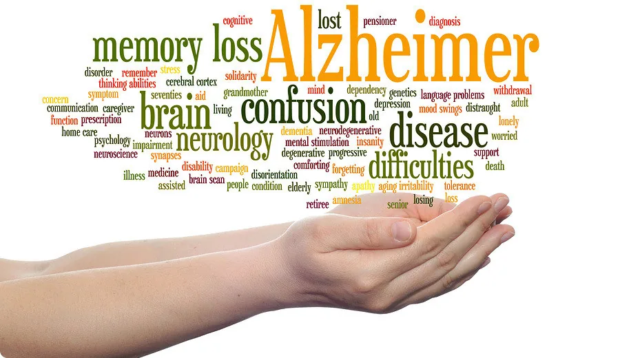
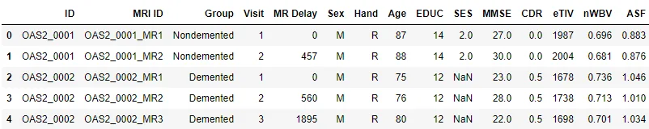
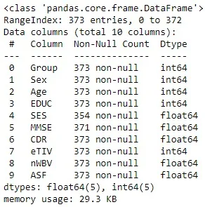
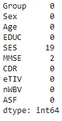
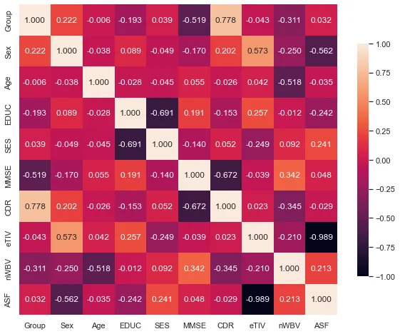
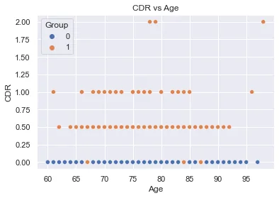
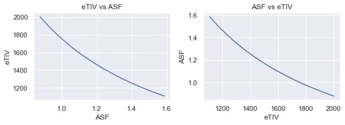
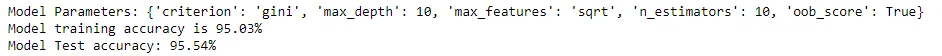
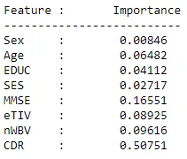
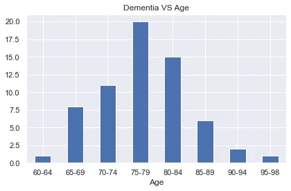

by [G. Temgoua](https://github.com/tem-ctrl)

## Introduction
Neurodegenerative diseases are those which affect mental health of those affected by progressively destroying functions and structure of neurons in a process known as **neurodegeneration**. Neurodegenerative diseases include *Parkinson's disease*, *Alzheimer's disease* and five others. Out of the 7 known neurodegenerative diseases, Alzheimer's disease alone accounts for 60-80% of dementia cases. [[1](http://localhost:8888/notebooks/main.ipynb#1), [2](http://localhost:8888/notebooks/main.ipynb#2)]
Alzheimer's disease symptoms include:

1. Difficulty in remembering recent events
2. Problems with language
3. Disorientation
4. Mood swings
5. ...

In this post we will explore a way to predict Alzheimer's disease leveraging the power of machine learning models applied on a dataset composed of post-MRI measures of 150 people.

## Origin and description of data
### Origin
The data used for this project is the version 2 of [Open Access Series of Imaging Studies (OASIS)](http://www.oasis-brains.org/) project which aims to make neuroimaging data sets of the brain available to the scientific community free of charge thanks to their desire of facilitate future discoveries in basic and clinical neuroscience.

### Description
The data set consists of a longitudinal collection of 150(88 women) subjects aged 60 to 98. Each subject was scanned on 2 to 5 visits, separated by at least one year for a total of 373 imaging sessions. For each subject, 3 or 4 individual T1-weighted MRI scans obtained in single scan sessions are included. The subjects are all right-handed and include both men and women. 72 of the subjects were characterized as nondemented throughout the study. 64 of the included subjects were characterized as demented at the time of their initial visits and remained so for subsequent scans, including 51 individuals with mild to moderate Alzheimer’s disease. Another 14 subjects were characterized as nondemented at the time of their initial visit and were subsequently characterized as demented at a later visit, their mental health status is labelled as converted.

The dataset is organized in 15 columns named as follows:

- ID : Patient unique identification number.
- MRI ID: Unique MRI ID per visit
- Group : Mental health status of the patient (Demented, Nondemented or Converted)
- Visit : Visit number (1 to 5)
- MR Delay: Time (in days) since the last visit
- Sex : Gender (M or F)
- Hand : Dominant hand (all R)
- Age : Age at time of image acquisition (years)
- EDUC : Years of education
- SES : Socioeconomic Status
- MMSE : Mini Mental State Examination (0 = worst to 30 = best)
- CDR : Clinical Dementia Rating (0 = no dementia, 0.5 = very mild AD, 1 = mild AD, 2 = moderate AD)
- ETIV : Estimated Total Intracranial Volume (𝑐𝑚3cm3 )
- NWBV : Normalize Whole Brain Volume
- ASF : Atlas Scaling Factor

These characteristics belong to two different obvious clusters: Patients' personal information (Age, Dominant hand, gender...) and their medical measurements (CDR, ASF...).

An exploratory data analysis will helps us to better understand the data an eventually answer the following questions:

1. How does the risk of contracting Alzheimer's disease evolve with age?
2. Which medical factors should be closely monitored in order to prevent Alzheimer's disease?
3. How accurately can we predict Alzheimer's disease?

```python
import pandas as pd
import matplotlib.pyplot as plt
import seaborn as sns
from sklearn.preprocessing import StandardScaler
from sklearn.model_selection import GridSearchCV, train_test_split
from sklearn.ensemble import RandomForestClassifier
from sklearn.metrics import accuracy_score
sns.set()
import warnings
warnings.filterwarnings('ignore')
```

## Loading and exploring data
```python
df = pd.read_csv("data/oasis_longitudinal.csv")
df.head()
```



Since we are only interested in predicting Alzheimer's disease, we won't consider the patient's ID, MRI ID, Visit, MR Delay and Dominant hand, therefore we drop those columns. Also, machine learning models expect all data to be numeric so we will encode **Sex** and **Group** columns as follows:

- Sex

  - 1 = 'M'
  - 0 = 'F'
- Group

  - 1 = 'Demented' or 'Converted'
  - 0 = 'Non demented'

```python
# Label encode categorical columns
to_drop = ['ID', 'MRI ID', 'Visit', 'MR Delay', 'Hand']
if to_drop[0] in df.columns:
    df.drop(columns=to_drop, inplace=True)

df.Group = df.Group.apply(lambda x: 0 if x == 'Nondemented' else 1)
df.Sex = df.Sex.apply(lambda x: 0 if x == 'F' else 1)
```

Let's take an overview of data info.

```python
df.info()
```



We can see that all data columns are numeric, however there are some missing values in **MMSE** and **SES**, let's find out how many.

```python
dfull(.isn).sum()
```



We will replace missing values by the most frequent value in both **SES** and **MMSE** columns.

```python
df.MMSE.fillna(df.MMSE.value_counts().index[0], inplace=True)
df.SES.fillna(df.SES.value_counts().index[0], inplace=True)
```

### Data visualization
#### Correlation between features.

```python
plt.figure(figsize=(10,8))
sns.heatmap(df.corr(), annot=True, vmin=-1, vmax=1, cbar_kws={'shrink': .75}, fmt='.3f')
plt.show()
```



### **Interpretation of the heatmap**[**¶**](http://localhost:8888/notebooks/main.ipynb#Interpretation-of-the-heatmap)

A correlation close to 1 between features *a* and *b* means high value in *a* implies high value in *b* and vice versa. Alternatively, a correlation close to -1 means high value in *a* implies low value in *b* and vice versa.

We can see that **eTIV** is extremely negatively correlated with **ASF**, so does **SES** and **EDUC** followed by **MMSE** and **CDR**. There's almost no correlation between **Age** and **Group**, so as first glance age has no effect on the risk of contracting Alzheimer's disease. On the other side, the high correlation between **CDR** and **Group** suggests that CDR is the medical factor to be monitored the most closely (See following figure).



We can see that CDR value almost divide data into different groups but there are few demented people with a CDR of 0. This is the kind of irregularity that the machine learning model will attempt to catch in data for an accurate prediction.

```python
fig, ax = plt.subplots(1,2, figsize=(8,3))
ax[0].set_title('eTIV vs ASF')
ax[1].set_title('ASF vs eTIV')
sns.lineplot(x='ASF', y='eTIV', data=df, err_style=None, ax=ax[0])
sns.lineplot(y='ASF', x='eTIV', data=df, err_style=None, ax=ax[1])
plt.tight_layout()
plt.show()
```



In this case it is not necessary to use both features for training the model, even if it is exactly what we will do especially because In the present case the dataset is of small size so the required computing power is negligible.

### Prepare data for model training and evaluation

```python
features = ['Sex','Age','EDUC','SES','MMSE','eTIV','nWBV','CDR']
X = df[features]
y = df.Group
X_train, X_test, y_train, y_test = train_test_split(X, y, test_size=0.3, shuffle=True)

scaler = StandardScaler()
X_train_scaled = scaler.fit_transform(X_train)
X_test_scaled = scaler.fit_transform(X_test)
```

### Model training and evaluation
```python
params_grid = {'n_estimators':[10],
         'max_features':['sqrt', 'auto'],
          'criterion':['gini'],
          'max_depth':[10],
          'oob_score':[True]
         }
rf_c = RandomForestClassifier(random_state=123)
grid_search = GridSearchCV(estimator=rf_c, param_grid=params_grid, scoring='accuracy', cv=6, refit=True, verbose=0)

grid_search.fit(X_train_scaled,y_train)

y_pred = grid_search.predict(X_test_scaled)
test_acc = accuracy_score(y_test, y_pred)

print(f'Model Parameters: {grid_search.best_params_}')
print(f'Model training accuracy is {grid_search.best_score_ * 100:.2f}%')
print(f'Model Test accuracy: {test_acc*100:.2f}%')
```



### Importance of each feature in the prediction training and test processes

```python
model = grid_search.best_estimator_

features = model.feature_importances_
feature_names = X_train.columns

print("Feature :\tImportance\n--------------------------")
for i in range(len(features)):
    print(f'{feature_names[i]}\t: \t {"%.5f" % features[i]}')
```



As expected, CDR is the most important feature in predicting Alzheimer's disease.

### Evolution of the risk of contracting Alzheimer's disease with age

We will divide ages into bins of 5 years each, count the number of demented persons in each age bin then make a bar plot of these counts.

```python
dfa = pd.read_csv("data/oasis_longitudinal.csv")
dfa = dfa.drop_duplicates('ID', keep='last', ignore_index=False)
df1 = dfa[dfa['Group']=='Demented'].sort_values(by='Age', ascending=True)
bin_lbls = ['60-64', '65-69', '70-74','75-79', '80-84', '85-89', '90-94', '95-98']
bins = [60, 65, 70, 75, 80, 85, 90, 95, 99]
df1['bins'] = pd.cut(df1['Age'], bins=bins, right=False, labels=bin_lbls)
Ages = df1['bins'].value_counts(sort=None)
Ages.plot(kind='bar', figsize=(6,4), legend=None)
plt.title('Dementia VS Age')
plt.xlabel('Age')
plt.xticks([*range(8)],bin_lbls,rotation=0)
plt.tight_layout()
plt.show()
```



As we can see, there's no direct cause/effect relationship between Age and the risk of contracting Alzheimer's disease.

**Conclusion**
Alzheimer's disease is the most frequent neuro degenerative disease that exists. It can't be cured because damages it causes to the brain are irreversible. It can however be monitored to limit damages, for this sake an accurate diagnosis system must be used. The machine learning model developed in this post is able to predict/detect Alzheimer's disease with 95.5% accuracy, based on the patient's personal and medical data.

Find the notebook related to this post [here](https://github.com/tem-ctrl/predicting_alzheimer-s_disease).

**References**

1. Alzheimer’s Disease: Symptoms & Care, by *Primary Care Jacksonville*
2. Neurodegenerative disease, *Wikipedia*
