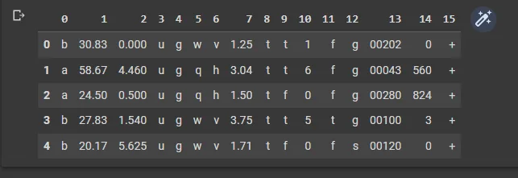
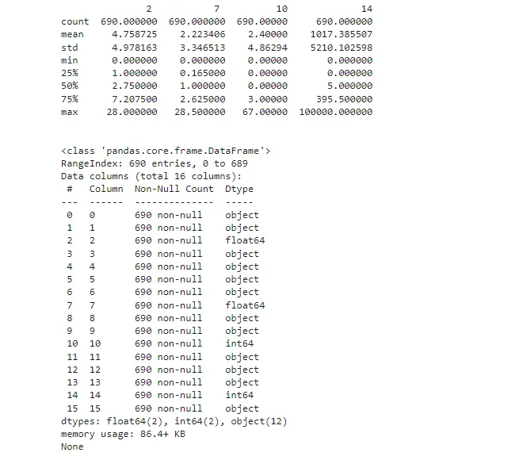
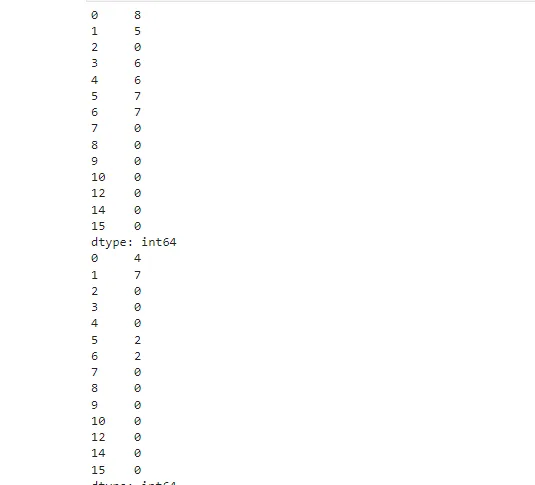

Commercial banks receive a lot of applications for credit cards. Many of them get rejected for many reasons, like high loan balances, low income levels, or too many inquiries on an individual's credit report, for example. Manually analyzing these applications is mundane, error-prone, and time-consuming (and time is money!). Luckily, this task can be automated with the power of machine learning and pretty much every commercial bank does so nowadays. In this notebook, we will build an automatic credit card approval predictor using machine learning techniques, just like the real banks do.

We'll use the Credit Card Approval dataset from the UCI Machine Learning Repository.

```python
# Import necessary library
import pandas as pd
import numpy as np
import matplotlib.pyplot as plt
%matplotlib inline
```

```python
# Load data
df = pd.read_csv("/content/cc_approvals.data", header = None)
df.head()
```



**Data Overview**

```python
# Summary statistics
print(df.describe())

print("\n")

# Dataset information
print(df.info())

print("\n")

# Inspect missing value
print(df.tail(20))

print("\n")

# Columns
print(df.columns)
```



**Split Dataset**

```python
from sklearn.model_selection import train_test_split
# Drop the features 11 and 13
df = df.drop([11, 13], axis=1)
# Spliting datasetdf_train, df_test = train_test_split(df,
                test_size=0.33, random_state=42)
```

**Handling Missing value**

```python
# Import numpy
import numpy as np

# Replace the '?'s with NaN in the train and test sets
df_train = df_train.replace('?', np.NaN)
df_test = df_test.replace('?', np.NaN)
```

```python
# Impute the missing values with mean imputation
df_train.fillna(df_train.mean(), inplace=True)
df_test.fillna(df_train.mean(), inplace=True)
# Count the number of NaNs in the datasets and print the counts to verify
print(df_train.isnull().sum())
print(df_test.isnull().sum())
```



```python
# Iterate over each column of df_train
for col in df_train.columns:
    # Check if the column is of object type
    if df_train[col].dtypes == 'object':
        # Impute with the most frequent value
        df_train =
       df_train.fillna(df_train[col].value_counts().index[0])
        df_test =
        df_test.fillna(df_train[col].value_counts().index[0])
# Count the number of NaNs in the dataset and print the counts to verify
print(df_train.isnull().sum())
print(df_test.isnull().sum())
```

**Preprocessing**

First, we will be converting all the non-numeric values into numeric ones. We do this because not only it results in a faster computation but also many machine learning models (like XGBoost) (and especially the ones developed using scikit-learn) require the data to be in a strictly numeric format. We will do this by using the get_dummies() method from pandas.

```python
# Convert the categorical features in the train and test sets independently
df_train = pd.get_dummies(df_train)
df_test = pd.get_dummies(df_test)
# Reindex the columns of the test set aligning with the train set
df_test = df_test.reindex(columns=df_train.columns,
                fill_value=0)
```

```python
# Import MinMaxScaler
from sklearn.preprocessing import MinMaxScaler
# Segregate features and labels into separate variables
X_train, y_train = df_train.iloc[:, :-1].values,
                df_train.iloc[:, [-1]].values
X_test, y_test = df_test.iloc[:, :-1].values, df_test.iloc[:,
                [-1]].values
# Instantiate MinMaxScaler and use it to rescale X_train and X_test
scaler = MinMaxScaler(feature_range=(0, 1))
rescaledX_train = scaler.fit_transform(X_train)rescaled
X_test = scaler.transform(X_test)
```

## Fitting a logistic regression model to the train set
```python
# Import LogisticRegression
from sklearn.linear_model import LogisticRegression
# Instantiate a LogisticRegression classifier with default parameter values
logreg = LogisticRegression()
# Fit logreg to the train set
logreg.fit(rescaledX_train, y_train)
```

## Model Evaluation
```python
# Import confusion_matrix
from sklearn.metrics import confusion_matrix
# Use logreg to predict instances from the test set and store it
y_pred = logreg.predict(rescaledX_test)
# Get the accuracy score of logreg model and print it
print("Accuracy of logistic regression classifier: ",
                logreg.score(rescaledX_test, y_test))
# Print the confusion matrix of the logreg modelconfusion_matrix(y_test, y_pred)
```

Result:

```python
Accuracy of logistic regression classifier:  1.0
Out[13]:
array([[103,   0],        [  0, 125]])
```

## Grid Search for better Performance
```python
# Import GridSearchCV
from sklearn.model_selection import GridSearchCV
# Define the grid of values for tol and max_iter
tol = [0.01, 0.001 ,0.0001]
max_iter = [100, 150, 200]
# Create a dictionary where tol and max_iter are keys and the lists of their values are the corresponding values
param_grid = dict(tol=tol, max_iter=max_iter)
```

We have defined the grid of hyperparameter values and converted them into a single dictionary format which GridSearchCV() expects as one of its parameters. Now, we will begin the grid search to see which values perform best.

```python
# Instantiate GridSearchCV with the required parameters
grid_model = GridSearchCV(estimator=logreg,
                param_grid=param_grid, cv=5)
# Fit grid_model to the
datagrid_model_result = grid_model.fit(rescaledX_train,
                                np.ravel(y_train))
# Summarize results
best_score, best_params = grid_model_result.best_score_,
                grid_model_result.best_params_
print("Best: %f using %s" % (best_score, best_params))
# Extract the best model and evaluate it on the test set
best_model = grid_model_result.best_estimator_
print("Accuracy of logistic regression classifier: ",
                  best_model.score(rescaledX_test,y_test))
```

Result:

```python
Best: 1.000000 using {'max_iter': 100, 'tol': 0.01}
Accuracy of logistic regression classifier:  1.0
```

[GitHub Link](https://github.com/abubinfahd/Data-Insight/blob/main/CAPSTONE%20Project/ML/Predicting_Credit_Card_Approval.ipynb)
