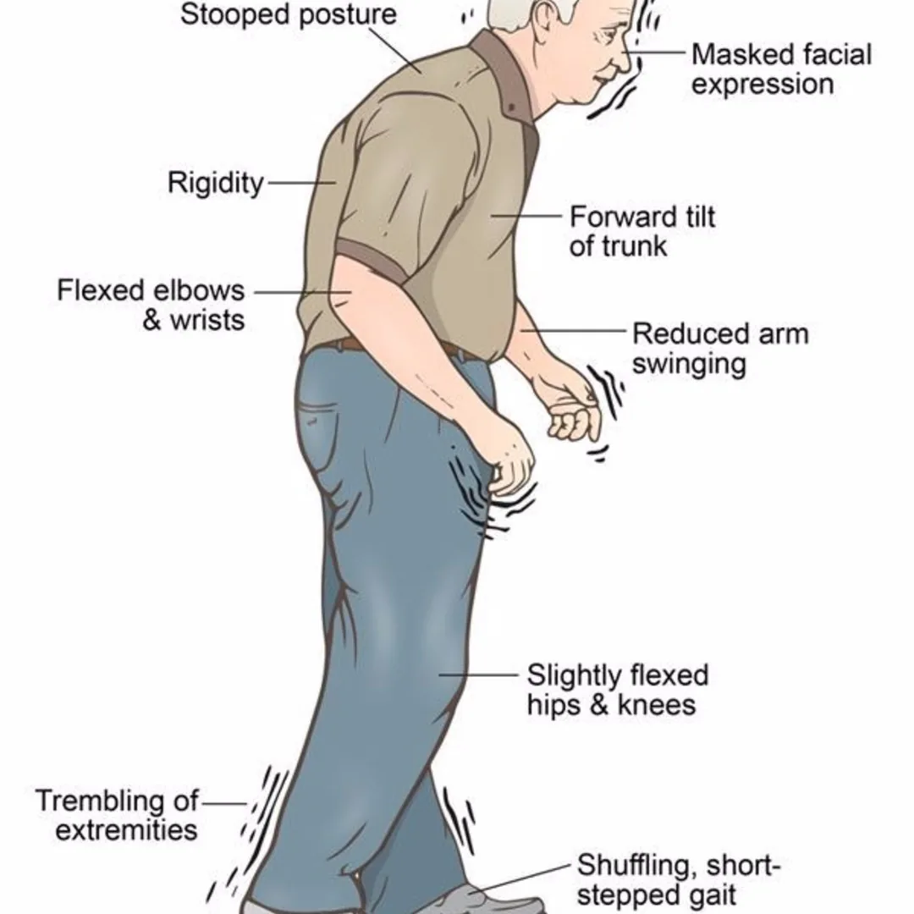

### About Neurodegenerative Diseases

Neurodegenerative diseases are a heterogeneous group of disorders that are characterized by the progressive degeneration of the structure and function of the central nervous system or peripheral nervous system. These diseases cause your brain and nerves to deteriorate over time. They can change your personality and cause confusion. They can also destroy your brain’s tissue and nerves.

It causes permanent damage, so symptoms tend to get worse as the disease progresses. New symptoms are also likely to develop over time. There’s no cure for neurodegenerative diseases, but treatment can still help. Treatment for these diseases tries to reduce symptoms and maintain quality of life. Treatment often involves the use of medications to control symptoms.

Some of the most common symptoms of neurodegenerative diseases include memory loss, forgetfulness, apathy, anxiety, agitation, a loss of inhibition, mood changes, etc.

Some brain diseases, such as Alzheimer’s disease, may develop as you age. They can slowly impair your memory and thought processes. Other diseases, such as Tay-Sachs disease, are genetic and begin at an early age

Some Neurodegenerative Diseases are:

```python
Alzheimer's disease (AD) and other dementias.
Parkinson's disease (PD) and PD-related disorders.
Prion disease.
Motor neurone diseases (MND)
Huntington's disease (HD)
Spinocerebellar ataxia (SCA)
Spinal muscular atrophy (SMA)
```

In this blog, we will be working with the Parksion Disease dataset created by Max Little of the University of Oxford, in collaboration with the National Centre for Voice and Speech, Denver, Colorado, who recorded the speech signals, and can be found here: [Index of /ml/machine-learning-databases/parkinsons (uci.edu)](https://archive.ics.uci.edu/ml/machine-learning-databases/parkinsons/).

### Explanatory Data Analysis

```python
import pandas as pd
import numpy as np
import matplotlib.pyplot as plt
import seaborn as sns
import xgboost as xgb
from sklearn.metrics import accuracy_score
from sklearn.model_selection import train_test_split
from sklearn.metrics import classification_report,mean_absolute_error
```

```python
df.head(10)
```

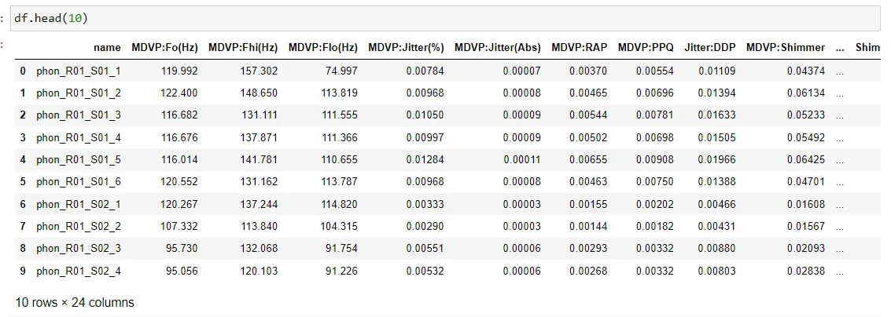

```python
print(df.columns)
```

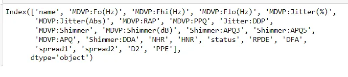

Attribute Information:

Matrix column entries (attributes):

name - ASCII subject name and recording number

MDVP:Fo(Hz) - Average vocal fundamental frequency

MDVP:Fhi(Hz) - Maximum vocal fundamental frequency

MDVP:Flo(Hz) - Minimum vocal fundamental frequency

MDVP:Jitter(%),MDVP:Jitter(Abs),MDVP:RAP,MDVP:PPQ,Jitter:DDP - Several measures of variation in fundamental frequency

MDVP:Shimmer,MDVP:Shimmer(dB),Shimmer:APQ3,Shimmer:APQ5,M

DVP:APQ,Shimmer:DDA - Several measures of variation in amplitude

NHR,HNR - Two measures of the ratio of noise to tonal components in the voice

status - Health status of the subject (one) - Parkinson's, (zero) - healthy

RPDE,D2 - Two nonlinear dynamical complexity measures

DFA - Signal fractal scaling exponent

spread1,spread2,PPE - Three nonlinear measures of fundamental frequency variation

```python
print(df.shape)
```

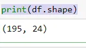

```python
df.isnull().sum()
```

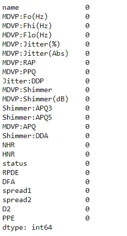

## Data Visualization
```python
#heatmap visualization
cmap = sns.diverging_palette(h_neg = 100, h_pos = 340, as_cmap = True)
plt.subplots(figsize=(20,25))
sns.heatmap(df.corr(), center = 0, cmap = cmap, linewidth = 1, annot = True, fmt=".2g")
```

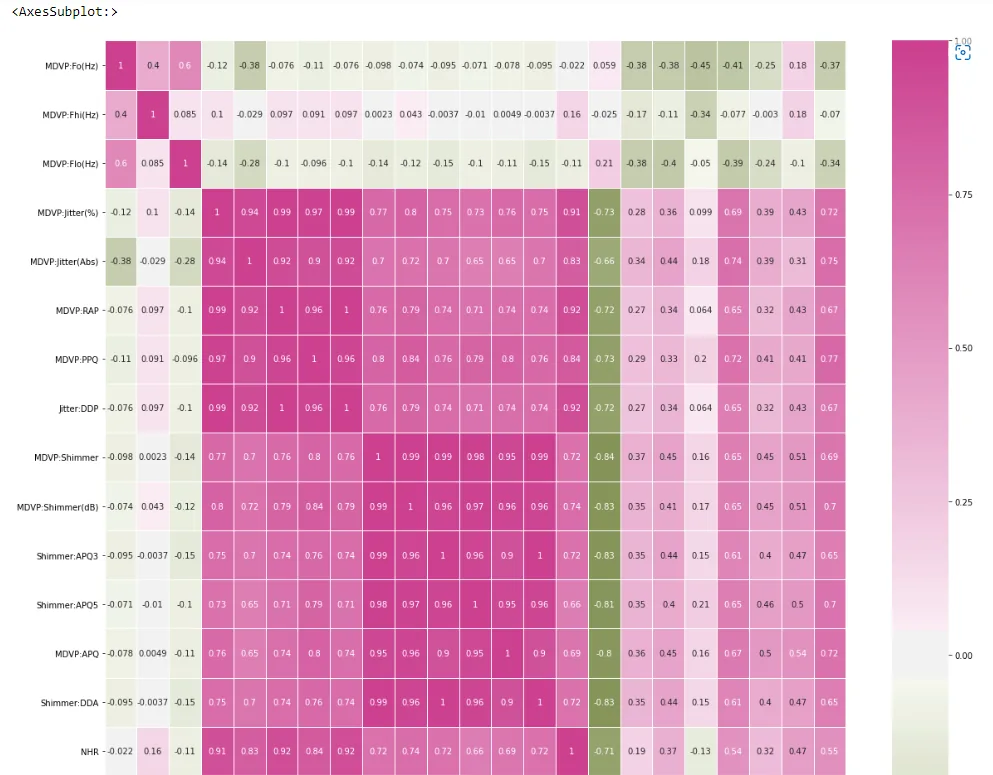

```python
# Create the correlation matrix
corr = df.corr()
# Generate a mask for the upper triangle
mask = np.triu(np.ones_like(corr, dtype=bool))
# Draw the heatmap
plt.subplots(figsize=(20,15))
sns.heatmap(corr, mask=mask, cmap=cmap, center=0, linewidths=1,annot=True, fmt=".2f")
plt.show()
```

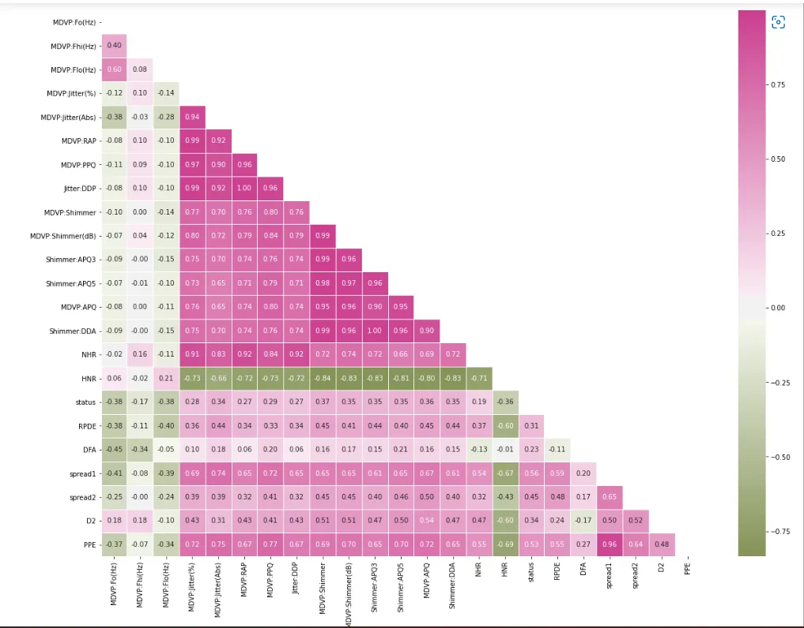

We can see there is a strong correlation among many features. features like 'Shimmer:DDA' and 'Shimmer:APQ3', 'Jitter:DDP' and 'MDVP:RAP' have correlation coefficients equal to 1.

Here we can see there is a strong correlation among many features. Features like 'Shimmer:DDA' and 'Shimmer:APQ3', 'Jitter:DDP' and 'MDVP:RAP' have a correlation coefficient equal to 1.

Doping columns that have a high correlation, so that redundant features are removed.

```python
#%%
# Calculate the correlation matrix and take the absolute value
corr_matrix = df.corr().abs()

# Create a True/False mask and apply it
mask = np.triu(np.ones_like(corr_matrix, dtype=bool))
tri_df = corr_matrix.mask(mask)

# List column names of highly correlated features (r > 0.95)
to_drop = [c for c in tri_df.columns if any(tri_df[c] >  0.95)]

# Drop the features in the to_drop list
reduced_df = df.drop(to_drop, axis=1)

print("The orginal dataframe has {} columns.".format(df.shape[1]))
print("The reduced dataframe has {} columns.".format(reduced_df.shape[1]))
```

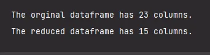

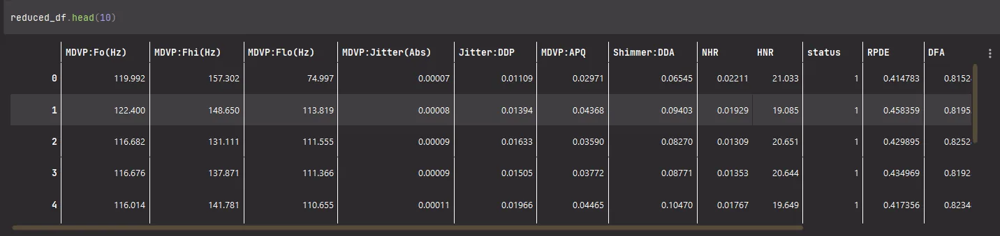

Before we build a model on our dataset, we should first decide on which feature we want to predict. In this case, we are trying to predict status. We need to extract the column holding this feature from the dataset and then split the data into a training and test set. The training set will be used to train the model and the test set will be used to check its performance on unseen data.

```python
# Separate the feature we want to predict from the ones to train the model on
y=reduced_df['status']
X=reduced_df.drop('status',axis=1)
df.corr().status.sort_values()
```

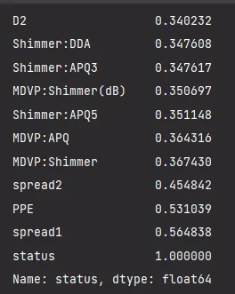

Use the train_test_split function to split up the data by passing the argument random_state=123
 Now, let's create the train and test set of the dataset using the train_test_split function from sklearn’s model_selection module with test_size size equal to 30% of the data. Also, let's assign some value to a random_state to maintain the reproducibility of the results.

```python
X_train, X_test, y_train, y_test = train_test_split(X, y, stratify=y,random_state=123,test_size=0.3)
```

In the first case let's implement Logistic regression. Logistic regression is a supervised classification algorithm. In this model-dependent or output variable is a category or class. The target is a discrete category or a class (not a continuous variable as in linear regression), for our case, none(1) = Parkinson, zero(0) = healthy
Let's Create a LogisticRegression model by setting random_state to 123 to ensure the same results each run. Specifying a number for random_state ensures get the same results in each run. This is considered a good practice. We can use any number, and model quality won’t depend meaningfully on exactly what value we choose.

```python
from sklearn.linear_model import LogisticRegression
lrc=LogisticRegression(random_state=123)
```

Now, making predictions with test data

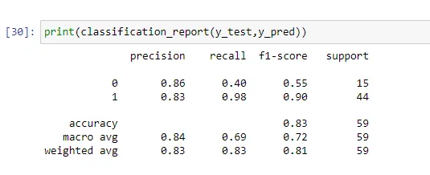

Which feature has the highest importance score among all features?

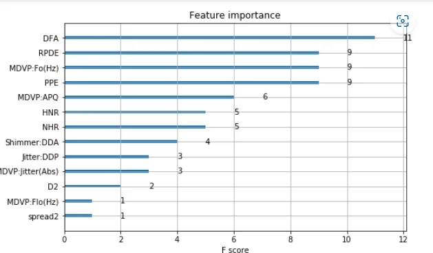

Feature DFA has been given the highest importance score among all the features. Features like 'MDVP:Shimmer', 'MDVP:Shimmer(dB)', 'Shimmer:APQ3' and 'MDVP:Jitter(Abs)' have been given the lowest importance score among all the features.

References:

1. 'Exploiting Nonlinear Recurrence and Fractal Scaling Properties for Voice Disorder Detection', Little MA, McSharry PE, Roberts SJ, Costello DAE, Moroz IM. BioMedical Engineering OnLine 2007, 6:23 (26 June 2007)
2. [Brain Disorders: Causes, Symptoms, and Diagnosis (healthline.com)](https://www.healthline.com/health/brain-disorders#types)
