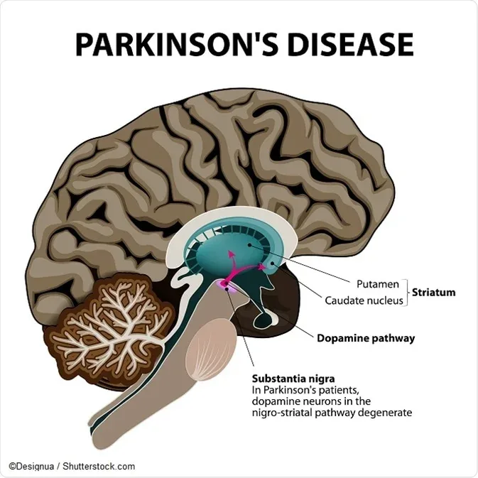
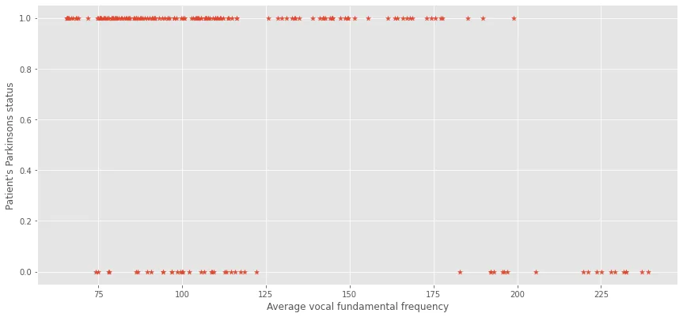
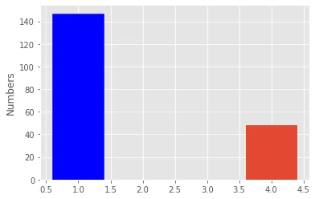
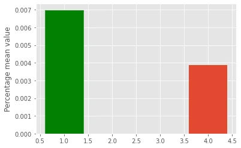
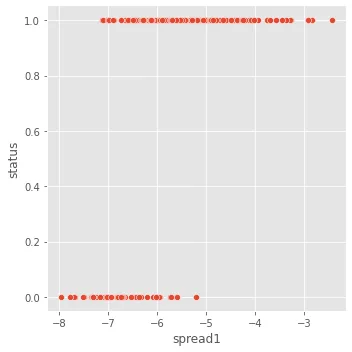
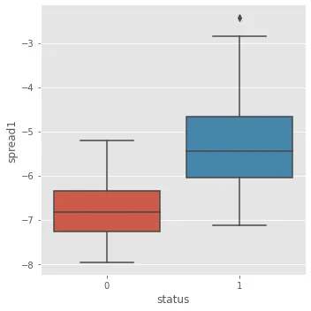

Parkinson's disease is a brain disorder that causes unintended or uncontrollable movements, such as shaking, stiffness, and difficulty with balance and coordination. Symptoms usually begin gradually and worsen over time. As the disease progresses, people may have difficulty walking and talking.

Source: [**https://www.nia.nih.gov**](https://www.nia.nih.gov)



**Source:**

The dataset was created by Max Little of the University of Oxford, in collaboration with the National Centre for Voice and Speech, Denver, Colorado, who recorded the speech signals. The original study published the feature extraction methods for general voice disorders.

**Data Set Information:**

This dataset is composed of a range of biomedical voice measurements from 31 people, 23 with Parkinson's disease (PD). Each column in the table is a particular voice measure, and each row corresponds one of 195 voice recording from these individuals ("name" column). The main aim of the data is to discriminate healthy people from those with PD, according to "status" column which is set to 0 for healthy and 1 for PD.

The data is in ASCII CSV format. The rows of the CSV file contain an instance corresponding to one voice recording. There are around six recordings per patient, the name of the patient is identified in the first column.For further information or to pass on comments, please contact Max Little (littlem '@' robots.ox.ac.uk).

Further details are contained in the following reference -- if you use this dataset, please cite:
Max A. Little, Patrick E. McSharry, Eric J. Hunter, Lorraine O. Ramig (2008), 'Suitability of dysphonia measurements for telemonitoring of Parkinson's disease', IEEE Transactions on Biomedical Engineering (to appear).

**Attribute Information:**

Matrix column entries (attributes):
name - ASCII subject name and recording number
MDVP:Fo(Hz) - Average vocal fundamental frequency
MDVP:Fhi(Hz) - Maximum vocal fundamental frequency
MDVP:Flo(Hz) - Minimum vocal fundamental frequency
MDVP:Jitter(%),MDVP:Jitter(Abs),MDVP:RAP,MDVP:PPQ,Jitter:DDP - Several measures of variation in fundamental frequency
MDVP:Shimmer,MDVP:Shimmer(dB),Shimmer:APQ3,Shimmer:APQ5,MDVP:APQ,Shimmer:DDA - Several measures of variation in amplitude
NHR,HNR - Two measures of ratio of noise to tonal components in the voice
status - Health status of the subject (one) - Parkinson's, (zero) - healthy
RPDE,D2 - Two nonlinear dynamical complexity measures
DFA - Signal fractal scaling exponent
spread1,spread2,PPE - Three nonlinear measures of fundamental frequency variation.

```python
import pandas as pd
import numpy as np
import matplotlib.pyplot as plt
import seaborn as sns
plt.style.use('ggplot')
```

```python
# Load dataset
df = pd.read_csv("https://archive.ics.uci.edu/ml/machine-learning-databases/parkinsons/parkinsons.data")
df.head()
```

```python
df.shape
df.info()
df.describe()
```

In this post, we attempt to answer three (3) questions from the dataset, which are:-

1. Does the MDVP:Flo correlates with the Status of patients?
2. Does the jitter percentage of patients indicate their status?
3. What does the effect of Spread1?

```python
# Does the MDVP:Flo correlates with the Status of patients?
from scipy.stats import pearsonr
MDVP_flo_status, _ = pearsonr(df['MDVP:Flo(Hz)'], df['status'])
MDVP_flo_status
```

```python
 -0.3802004307012717
```

The value indicates the weakly negative relation between the variables. If MDVP:Flo(Hz) increases the status decrease. If MDVP:Flo(Hz) decreases status increases.

```python
fig, ax = plt.subplots()
fig.set_size_inches(14.5, 6.5)
ax.scatter(df['MDVP:Flo(Hz)'], df['status'], marker="*")
ax.set_xlabel("Average vocal fundamental frequency")
ax.set_ylabel("Patient's Parkinsons status")
plt.show()
```



Notice how patients with an Average Vocal Fundamental Frequency (Hz) higher than 190 fall into the categories of those who are healthy while those below 190 are largely grouped among patients with Parkinson's disease.

**This graph indicates that the distribution follows a logistic regression model.**

```python
# Does the jitter percentage of patients indicate their status?
parkinsons_patient_bool = df['status'] == 1
parkinsons_patients = df[parkinsons_patient_bool]
healthy_patients = df[~parkinsons_patient_bool]
print(len(parkinsons_patients))
print(len(healthy_patients))
```

```python
147
48
```

```python
fig, ax = plt.subplots()
patients_number = ax.bar([1, 4], [len(parkinsons_patients), len(healthy_patients)])
ax.set_ylabel("Numbers")
patients_number[0].set_color('b')
plt.show()
```



```python
parkinsons_patients_jitter_mean = parkinsons_patients['MDVP:Jitter(%)'].mean()
healthy_patients_jitter_mean = healthy_patients['MDVP:Jitter(%)'].mean()
print(parkinsons_patients_jitter_mean)
print(healthy_patients_jitter_mean)
```

```python
0.006989251700680272
0.0038660416666666665
```

```python
fig, ax = plt.subplots()
patients_number = ax.bar([1, 4], [parkinsons_patients_jitter_mean, healthy_patients_jitter_mean])
ax.set_ylabel("Percentage mean value")
patients_number[0].set_color('g')
plt.show()
```



Patients with higher percentage values for jitter MDVP:Jitter(%) are Parkinson's disease patients, therefore higher percentage values indicate early stages of Parkinson's disease.

```python
# EDA on speread1
sns.relplot(x="spread1" ,y='status',data=df, kind="scatter")
plt.show()
sns.catplot(x='status', y='spread1', kind='box', data=df)
```





## Let's build a Supervised Learning Model that predicts the presence of neurodegenerative disease in an individual from the dataset.
**Using XGBoost Classifier as this problem is a binary classification problem, the target variable i.e. "status" being either True: 1 or False: 0.**

```python
# model building
import xgboost as xgb
from sklearn.model_selection import train_test_split
from sklearn.metrics import mean_squared_error, accuracy_score
```

```python
# drop irrelevancolimn
df.drop('name', 1, inplace=True)

# Create the features and target value
X = df.drop("status", 1)
y = df['status'].astype('bool')
```

```python
X_train, X_test, y_train, y_test = train_test_split(X, y, test_size=0.2, random_state=123)
xgb_cl = xgb.XGBClassifier(objective="binary:logistic", max_depth=3, n_estimators=10, seed=123)
xgb_cl.fit(X_train, y_train)
y_preds = xgb_cl.predict(X_test)
accuracy_score(y_test, y_preds)
```

```python
0.9487179487179487
```

We've built a binary classification machine learning model with XGBoost to predict the status of a patient from similar datasets with an accuracy of 95%.

GitHub Link: [Click Here](https://github.com/abubinfahd/Data-Insight/blob/main/Machine%20Learning/Prediction_of_Neurodegenerative_Diseases.ipynb)
