1. Feature Enineering/Data Pre-Processing
2. Modeling

In first step we must load the data and extract the features

```python
%matplotlib inline
import numpy as np
import seaborn as sns
import matplotlib.pyplot as plt
import pandas as pd
dataset = pd.read_csv("parkinsons.csv")
dataset.head()
```

*# Checking null values*

```python
dataset.info()
```

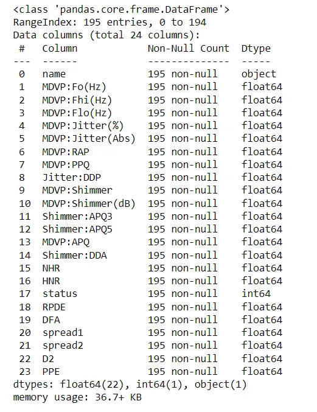

***# Displaying the shape and datatype for each attribute***

```python
print(dataset.shape)
dataset.dtypes
```

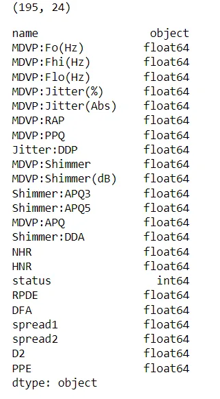

***# Dispalying the descriptive statistics describe each attribute***

```python
dataset.describe()
```

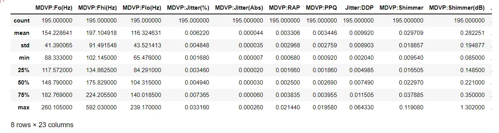

***Univariate Analysis***

```python
status_value_counts = dataset['status'].value_counts()
print("Number of Parkinson's Disease patients: {} ({:.2f}%)".format(status_value_counts[1], status_value_counts[1] / dataset.shape[0] * 100))
print("Number of Healthy patients: {} ({:.2f}%)".format(status_value_counts[0], status_value_counts[0] / dataset.shape[0] * 100))
```

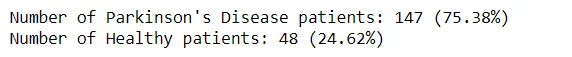

```python
sns.countplot(dataset['status'].values)
plt.xlabel("Status value")
plt.ylabel("Number of cases")
plt.show()
```

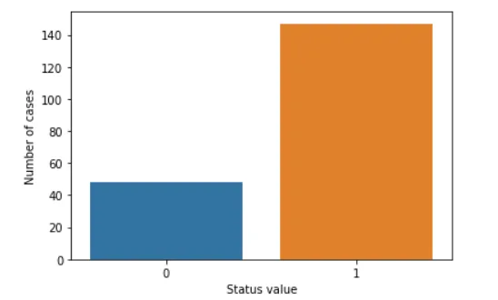

***Average vocal fundamental frequency MDVP:Fo(Hz)***

```python
diseased_freq_avg = dataset[dataset["status"] == 1]["MDVP:Fo(Hz)"].values
healthy_freq_avg = dataset[dataset["status"] == 0]["MDVP:Fo(Hz)"].values

plt.boxplot([diseased_freq_avg, healthy_freq_avg])
plt.title("Average vocal fundamental frequency MDVP:Fo(Hz) Box plot")
plt.xticks([1, 2], ["Parkinson's Disease Cases", "Healthy Cases"])
plt.show()
```

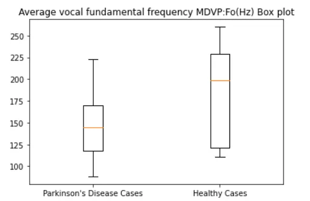

```python
plt.figure(figsize=(10,5))
sns.distplot(diseased_freq_avg, hist=True, label="Parkinson's Disease Cases")
sns.distplot(healthy_freq_avg, hist=True, label="Healthy Cases")
plt.title("Average vocal fundamental frequency MDVP:Fo(Hz) Distribution plot")
plt.legend()
plt.show()
```

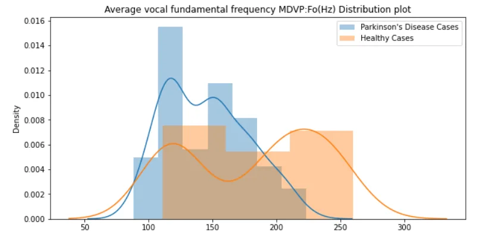

***Maximum vocal fundamental frequency MDVP:Fhi(Hz)***

```python
diseased_freq_max = dataset[dataset["status"] == 1]["MDVP:Fhi(Hz)"].values
healthy_freq_max = dataset[dataset["status"] == 0]["MDVP:Fhi(Hz)"].values

plt.boxplot([diseased_freq_max, healthy_freq_max])
plt.title("Maximum vocal fundamental frequency MDVP:Fhi(Hz) Box plot")
plt.xticks([1, 2], ["Parkinson's Disease Cases", "Healthy Cases"])
plt.show()
```

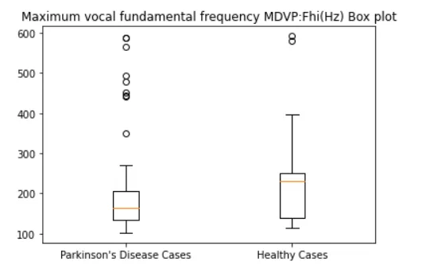

```python
plt.figure(figsize=(10,5))
sns.distplot(diseased_freq_max, hist=True, label="Parkinson's Disease Cases")
sns.distplot(healthy_freq_max, hist=True, label="Healthy Cases")
plt.title("Maximum vocal fundamental frequency MDVP:Fhi(Hz) Distribution plot")
plt.legend()
plt.show()
```

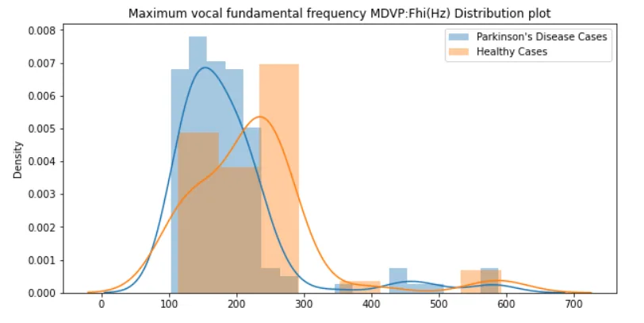

***Visualising Descriptive Statistics***

To find the values of the correlation coefficients, we can use the heat map.

In this step, we will remove the least important correlation coefficient columns. We can remove unrelated features, it will minimize the accuracy of an algorithm. It will be better if we take relevant feature columns, then we can get good accuracy.

```python
import seaborn as sb
corr_map=dataset.corr()
sb.heatmap(corr_map,square=True)
```

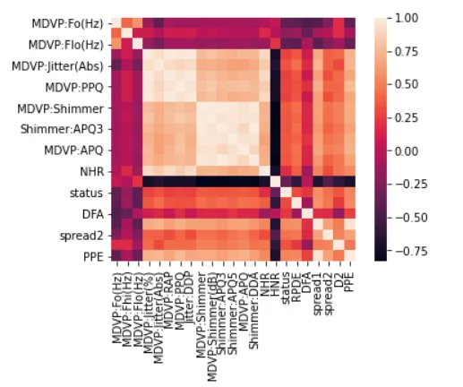

***visualise the heat map with correlation coefficient values for pair of attributes.***

```python
import matplotlib.pyplot as plt
import numpy as np

k=10

cols=corr_map.nlargest(k,'status')['status'].index

# correlation coefficient values
coff_values=np.corrcoef(dataset[cols].values.T)
sb.set(font_scale=1.25)
sb.heatmap(coff_values,cbar=True,annot=True,square=True,fmt='.2f',
           annot_kws={'size': 10},yticklabels=cols.values,xticklabels=cols.values)
plt.show()
```

in the result we got coerrelation of the top 10coefficient values for each pair of values.

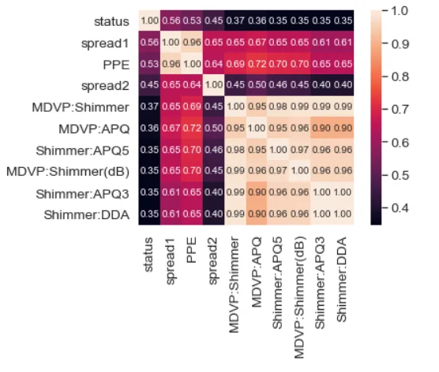

***correlation coefficient values in each attributes.***

```python
correlation_values=dataset.corr()['status']
correlation_values.abs().sort_values(ascending=False)
```

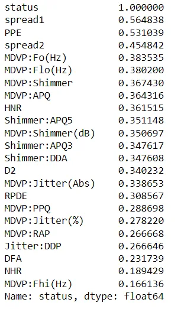

**Modeling**

In this model, we will use Pipleline, GridSearchCV for the iterative method on the LogisticRegression model to find the best accuracy and to refine the "C" parameter.

and we will use StandardScaler to scale the inputs. The data is clean, so there is no need for prior data cleaning.

from sklearn.model_selection import train_test_split, GridSearchCV

from sklearn.linear_model import LogisticRegression

from sklearn.metrics import classification_report

from sklearn.preprocessing import StandardScaler

from sklearn.pipeline import Pipeline

```python
# Create data set
y = dataset["status"]
X = dataset.drop(["name", "status"], axis=1)

# Setup the pipeline
steps = [('scaler', StandardScaler()),
         ('logreg', LogisticRegression())]

pipeline = Pipeline(steps)

# Create the hyperparameter grid
parameters = {'logreg__C': np.logspace(-2, 8, 15)}

# Creating train and test sets
X_train, X_test, y_train, y_test = train_test_split(X, y, test_size=0.3, random_state=102)

# Instantiate the GridSearchCV object: cv
cv = GridSearchCV(pipeline, parameters)

# Fit to the training set
cv.fit(X_train, y_train)

# Predict the labels of the test set: y_pred
y_pred = cv.predict(X_test)

# Compute and print metrics
print("Accuracy: {}".format(cv.score(X_test, y_test)))
print(classification_report(y_test, y_pred))
print("Tuned Model Parameters: {}".format(cv.best_params_))

# Visualizing the Model accuracy
fig=plt.figure()
fig.suptitle("Algorithms")
plt.boxplot(y_pred)
plt.show()
```

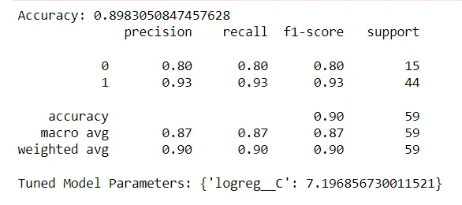

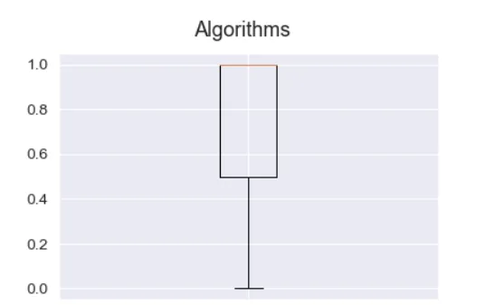

thank you for your attention

I hope you enjoyed this post

you can also find this code in my github account : [Code](https://github.com/rabebbenothmen/Data-Insight2021/tree/main/Assignments/8-%20Detection%20Parkinson%E2%80%99s%20disease)
