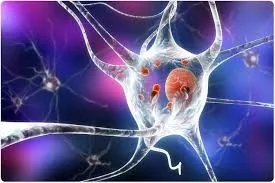
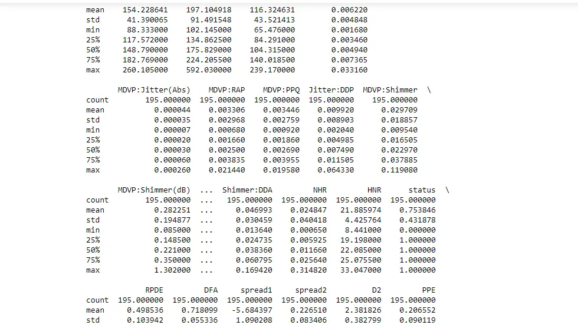
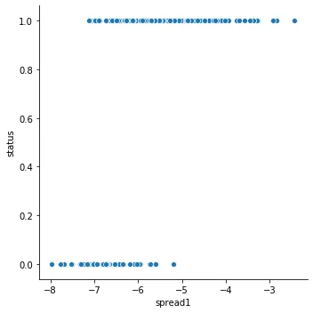
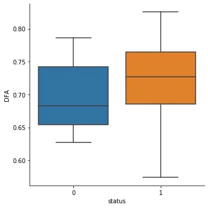
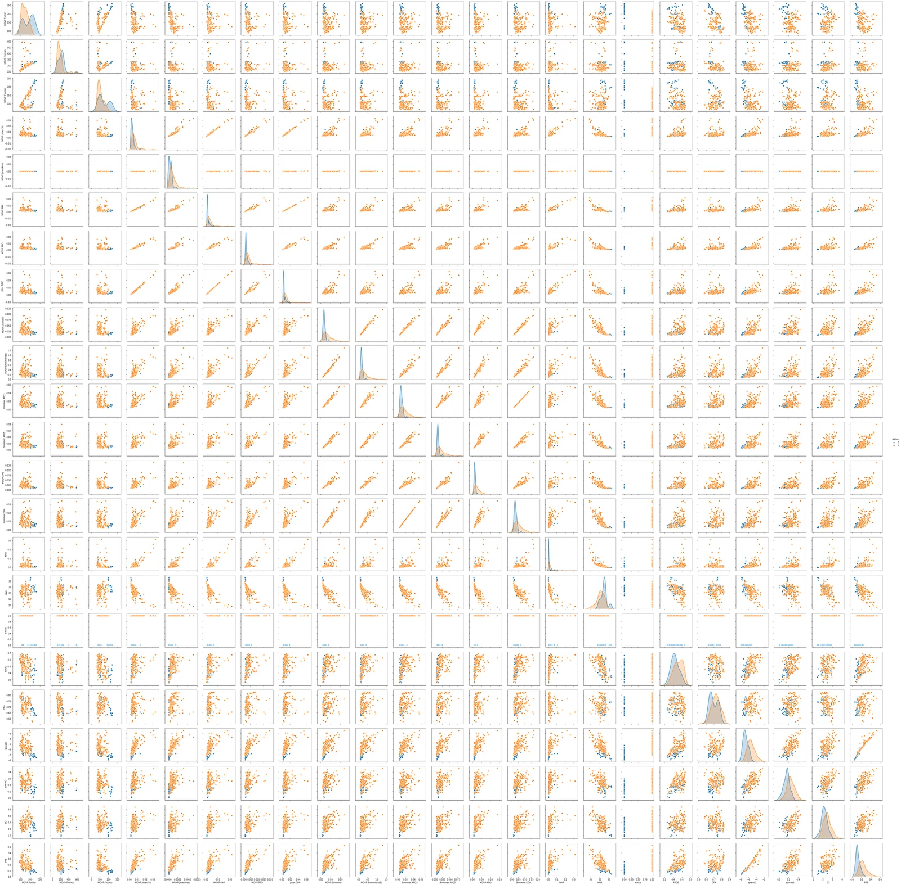

**INTRODUCTION TO DEGENERATIVE DISEASES**

Neurodegenerative diseases, most prevalent in aging populations, is a general term that stands for a bunch of diseases that are related to progressive damage of the nervous system cells, including neurons. Therefore, they affect many of the patient's body activities like balance, movement, breathing, heart function and so one. Most of them are genetic. But few ones can be caused either by human misbehavior like alcoholism or medical condition such as tumor, strokes and viruses. Sometimes the causes can be even unknown. These diseases are so serious and can even be life-threatening. Unfortunately they are incurable.

Nowadays, Neurodegenerative diseases affect millions of people worldwide. The most common are Alzheimer and Parkinson's diseases. In fact, according to a research paper from Harvard University, *"THE CHALLENGE OF NEURODEGENERATIVE DISEASES"* , 5 million Americans suffer from Alzheimer's disease and 1 million from Parkinson. This situation increases the curiosity of many researchers given that they want to understand the real causes of these diseases in order the treat and prevent them. While who are part of medical field try to find treatments that may help improve symptoms, relieve pain, and increase mobility, those who are evolving in the data science field try to find the perfect model to predict accurately the presence of a neurodegenerative disease in an individual. Earlier this detection is done, better it is for the identification of patients who must take part to clinical trial realized by neuroprotective agents to try and halt disease progression.

As future data scientist, we must also try to find a way to predict neurodegenerative diseases, as our colleagues have done. We will work especially on Parkinson's disease patient dataset created by Max Little of the University of Oxford. Let's jump into data to try answering these questions:

1. Can the measures of fundamental frequency variation distinguish a patient with Parkinson's disease from a healthy person?
2. Can the 'Signal fractal scaling exponent' distinguish a patient with Parkinson's disease from a healthy person?
3. Which model can accurately predicts the presence of Parkinson's disease in an individual?

## *Data collection, analysis tools and presentation of variables*

The dataset used in this article is the Oxford Parkinson's Disease Detection dataset, a dataset from UCI Machine Learning repository, created by Max Little of the University of Oxford, who recorded the speech signals, in collaboration with the National Centre for Voice and Speech, Denver and Colorado. This dataset consists of a series of biomedical measurements of the voice of 31 people23 with Parkinson's disease (PD). It aims to distinguish healthy individuals from patients with Parkinson's disease. Thus, each individual was recorded at least 6 times. Therefore, each column in the table is a particular voice measure, and each row corresponds one of 195 voice recording.

The target variable is **status** which is set to 0 for healthy and 1 for patient with Parkinson's disease patients.

The other variables are:

- **name**: It stands for ASCII subject name followed by recording number
- **MDVP:Fo(Hz)**: Average vocal fundamental frequency
- **MDVP:Fhi(Hz)**: Maximum vocal fundamental frequency
- **MDVP:Flo(Hz)**: Minimum vocal fundamental frequency
- **MDVP:Jitter(%), MDVP:Jitter(Abs), MDVP:RAP, MDVP:PPQ, Jitter:DDPSev**: Seral measures of variation in fundamental frequency
- **MDVP:Shimmer, MDVP:Shimmer(dB), Shimmer:APQ3, Shimmer:APQ5, MDVP:APQ, Shimmer:DDA**: Several measures of variation in amplitude
- **NHR, HNR**: Two measures of ratio of noise to tonal components in the voice
- **RPDE, D2**: Two nonlinear dynamical complexity measures
- **DFA**: Signal fractal scaling exponent
- **spread1, spread2, PPE**: Three nonlinear measures of fundamental frequency variation

The whole analysis is performed on Jupyther notebook.

After installing the necessary libraries, importing some necessary modules and packages and Parkinsons disease's datasets from Local files, we produce an Eploratory Analysis of our data.

## *Numerical data analysis*
```python
#Preview the dataset
print(dataset.head(3))
```


```python
#Summarize the data (1)
print(dataset.info())
```


```python
#Summarize the data (2)
print(dataset.describe())
```




Through the numerical data analysis that was done previously, we noticed the dataset has:

- No missing values
- 195 rows and 24 columns
- 22 columns with dtype float64,1 column with dtype int64 and 1 column with dtype object

## *Visual data analysis*
***1. EDA on the target variable***

```python
# Bar plot of the target variable 'status'
sns.countplot(x= 'status', data = dataset)
plt.xlabel('Status')
plt.ylabel('count')
plt.title('Distribution of people according to their status')

# Percentage of healthy people and patient with parkinson's disease
a = (dataset [dataset['status'] == 1]).shape[0]
b = (dataset [dataset['status'] == 0]).shape[0]
healthy_people = round(b*100/(a+b))
patient_withpd =  round(a*100/(a+b))
print ('The percentage of healthy people is {}'.format(healthy_people))
print ( "The percentage of patient with Parkinson's disease is {}".format(patient_withpd))
```


```python
The percentage of healthy people is 25
The percentage of patient with Parkinson's disease is 75
```

***2. EDA on the features***

We are going to consider only 2 features in this article: **spread1**, one of the measures of fundamental frequency variation, and **DFA**, the Signal fractal scaling exponent

***a) EDA on spread1***

```python
sns.relplot(x="spread1" ,y='status',data=dataset, kind="scatter")
plt.show()
sns.catplot(x='status', y='spread1', kind='box', data=dataset)
```




***b) EDA on DFA***

```python
sns.catplot(x='status', y='DFA', kind='box', data=dataset)
```



Let's create the pair plot of the attributes and compute the correlation between data in other to know much more.

```python
# creating pairplot of the attributes
sns.pairplot(dataset)
plt.show()

#correlation between the features and the target variable
d = dataset.corr()
print(d['status'])
```




Through the visual data analysis that was done previously, we noticed:

1. The highest measure of spread1 is observed in patients with Parkinson's disease than to healthy people and the lowest measure of spread1 tend to belong to healthy people than to patient with Parkinson's disease.
2. Both the highest and the lowest Signal fractal scaling exponent belong to Parkinson positive cases. It seems like there is no correlation between the target variable \*"status"\* and the feature \*"Signal fractal scaling exponent"\*
3. There is a moderate positive correlation between the features **spread1** and the target variable **status** and low positive correlation between the feature **DFA** and the target variable **status**

## Predictive model

Let's build the model that can predict the presence of a neurodegenerative disease in an individual

*It is a supervised learning case because there are labeled data.*

Before building models, it is essential to pre-process the data.

First of all, the data set will be divided into features and corresponding labels. Then, the resulting data set will be divided into training and test sets.

**P.S**: We are going to use 22 characteristics (we left the variable \*"name"\*),because machine learning algorithms only work on number.

```python
# Data preprocessing
features = dataset.loc[:,dataset.columns!='status'].values[:,1:]
labels=dataset.loc[:,'status'].values

#Scale the features to between -1 and 1
scaler=MinMaxScaler((-1,1))
x=scaler.fit_transform(features)
y=labels

# Split the dataset 80% train and 20% test
x_train,x_test,y_train,y_test=train_test_split(x, y, test_size=0.2, random_state=21)

#building a classifier
#Instantiate a XGBClassifier
model=XGBClassifier()

#fit the classifier to the training set
model.fit(x_train,y_train)
```

output[]: XGBClassifier(base_score=0.5, booster='gbtree', colsample_bylevel=1,

colsample_bynode=1, colsample_bytree=1, gamma=0, gpu_id=-1,

importance_type='gain', interaction_constraints='',

learning_rate=0.300000012, max_delta_step=0, max_depth=6,

min_child_weight=1, missing=nan, monotone_constraints='()',

n_estimators=100, n_jobs=0, num_parallel_tree=1,

objective='binary:logistic', random_state=0, reg_alpha=0,

reg_lambda=1, scale_pos_weight=1, subsample=1,

tree_method='exact', validate_parameters=1, verbosity=None)

```python
#predict the test set labels
y_pred = model.predict(x_test)
print(y_pred)

# Evaluate and print test-set accuracy
accuracy = accuracy_score(y_test, y_pred)*100
print(round(accuracy,1))
```

output[]

97.4

So, the xgbclassifier has learned from the training set and can predict the presence of Parkinson's disease in an individual with 97.4% accuracy.

## Final thoughts
Throughout the study we noticed:

- A moderate positive correlation between the feature **spread1** and the target variable **status**
- A low positive correlation between the feature **DFA** and the target variable **status**
- The XGBoost algorithm build a model that can predict the presence of Parkinson's disease in an individual with 97.4% accuracy.

***And Finally, Thank you for reading.***

***Please feel free to check the full analysis by clicking on this link*** <https://github.com/Nathalie-F/predicting-Neurodegenerative-diseases>

## Sources
[What are Neurodegenerative Diseases and How Do They Affect the Brain?](https://kids.frontiersin.org/article/10.3389/frym.2018.00070)

['Exploiting Nonlinear Recurrence and Fractal Scaling Properties for Voice Disorder Detection', Little MA, McSharry PE, Roberts SJ, Costello DAE, Moroz IM. BioMedical Engineering OnLine 2007, 6:23 (26 June 2007)](https://archive.ics.uci.edu/ml/machine-learning-databases/parkinsons/)

[Introduction to data visualization with seaborn](https://www.datacamp.com/courses/introduction-to-data-visualization-with-seaborn)
