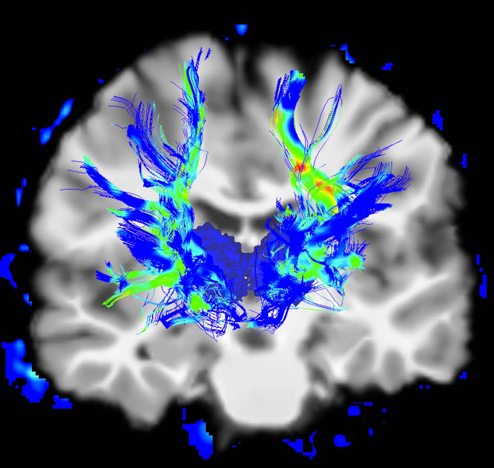
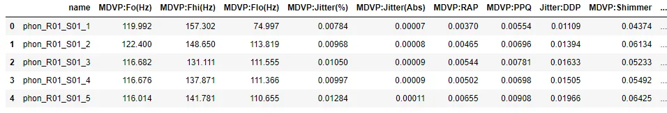
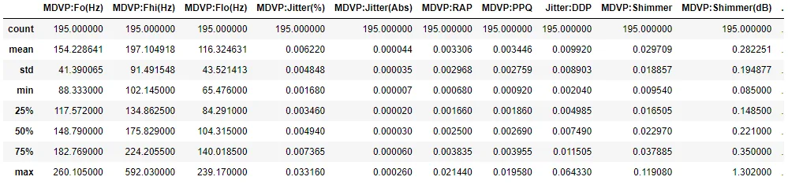
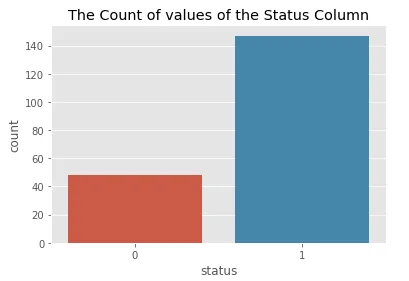
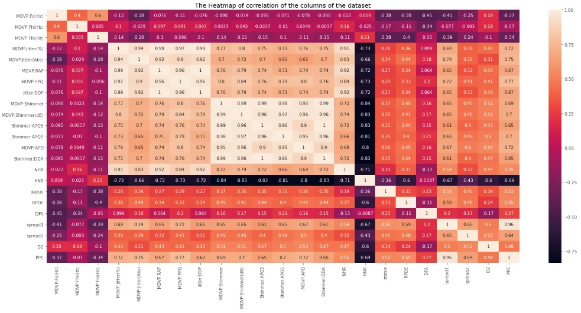

Parkinson's disease is a brain disorder that causes unintended or uncontrollable movements, such as shaking, stiffness, and difficulty with balance and coordination. Symptoms usually begin gradually and worsen over time. As the disease progresses, people may have difficulty walking and talking.



The dataset was created by Max Little of the University of Oxford, in collaboration with the National Centre for Voice and Speech, Denver, Colorado, who recorded the speech signals. The original study published the feature extraction methods for general voice disorders.

Source: [**https://www.nia.nih.gov**](https://www.nia.nih.gov/)

Data Set Information:

This dataset is composed of a range of biomedical voice measurements from 31 people, 23 with Parkinson's disease (PD). Each column in the table is a particular voice measure, and each row corresponds to one of 195 voice recordings from these individuals ("name" column). The main aim of the data is to discriminate healthy people from those with PD, according to the "status" column which is set to 0 for healthy and 1 for PD. The data is in ASCII CSV format. The rows of the CSV file contain an instance corresponding to one voice recording. There are around six recordings per patient, the name of the patient is identified in the first column.For further information or to pass on comments, please contact Max Little (littlem '@' robots.ox.ac.uk). Further details are contained in the following reference -- if you use this dataset, please cite Max A. Little, Patrick E. McSharry, Eric J. Hunter, Lorraine O. Ramig (2008), 'Suitability of dysphonia measurements for telemonitoring of Parkinson's disease', IEEE Transactions on Biomedical Engineering (to appear).

Attribute Information:

Matrix column entries (attributes):

name - ASCII subject name and recording number

1. MDVP: Fo(Hz) - Average vocal fundamental frequency

MDVP: Fhi(Hz) - Maximum vocal fundamental frequency

MDVP: Flo(Hz) - Minimum vocal fundamental frequency

2. MDVP: Jitter(%), MDVP: Jitter(Abs), MDVP: RAP, MDVP: PPQ, Jitter: DDP - Several measures of variation in fundamental frequency

3.MDVP:Shimmer,MDVP:Shimmer(dB),Shimmer:APQ3,Shimmer:APQ5,MDVP:APQ,Shimmer:DDA - Several measures of variation in amplitude

4. NHR, HNR - Two measures of the ratio of noise to tonal components in the voice

5. Status - The health status of the subject (one) - Parkinson's, (zero) - healthy

4. RPDE, D2 - Two nonlinear dynamical complexity measures

5. DFA - Signal fractal scaling exponent

6. spread1,spread2, PPE - Three nonlinear measures of fundamental frequency variation

Importing the necessary libraries:

```python
! pip install xgboost
import pandas as pd
import numpy as np
import matplotlib.pyplot as plt
import seaborn as sns
from sklearn.preprocessing import MinMaxScaler
from sklearn.preprocessing import StandardScaler
from sklearn.model_selection import train_test_split
from xgboost import XGBClassifier
from sklearn.metrics import accuracy_score
plt.style.use('ggplot')
```

Load dataset as a CSV file :

Accessing the five rows of the data, the data has a name column that shows the name codes of patients, a status column, and 22 other columns that represents the various voice measurements.

```python
# Load dataset
df = pd.read_csv("https://archive.ics.uci.edu/ml/machine-learning-databases/parkinsons/parkinsons.data")
df.head()
```



EDA:

The information from the data shows the voice recording measurement columns data types are float, the status column is an integer and the name column is an object. The data has no missing values. The data has 195 rows and 24 columns.

```python
df.info()
```

```python
<class 'pandas.core.frame.DataFrame'>
RangeIndex: 195 entries, 0 to 194
Data columns (total 24 columns):
 #   Column            Non-Null Count  Dtype
---  ------            --------------  -----
 0   name              195 non-null    object
 1   MDVP:Fo(Hz)       195 non-null    float64
 2   MDVP:Fhi(Hz)      195 non-null    float64
 3   MDVP:Flo(Hz)      195 non-null    float64
 4   MDVP:Jitter(%)    195 non-null    float64
 5   MDVP:Jitter(Abs)  195 non-null    float64
 6   MDVP:RAP          195 non-null    float64
 7   MDVP:PPQ          195 non-null    float64
 8   Jitter:DDP        195 non-null    float64
 9   MDVP:Shimmer      195 non-null    float64
 10  MDVP:Shimmer(dB)  195 non-null    float64
 11  Shimmer:APQ3      195 non-null    float64
 12  Shimmer:APQ5      195 non-null    float64
 13  MDVP:APQ          195 non-null    float64
 14  Shimmer:DDA       195 non-null    float64
 15  NHR               195 non-null    float64
 16  HNR               195 non-null    float64
 17  status            195 non-null    int64
 18  RPDE              195 non-null    float64
 19  DFA               195 non-null    float64
 20  spread1           195 non-null    float64
 21  spread2           195 non-null    float64
 22  D2                195 non-null    float64
 23  PPE               195 non-null    float64
dtypes: float64(22), int64(1), object(1)
memory usage: 36.7+ KB
```

The statistical summary of the dataset shows for example, MDVP:Fo(Hz)has a mean of 154.2, the standard deviation is 41.3 and the maximum value is 260.1

```python
df.describe()
```



The Count of values of the Status Column:

```python
# status column value counts
print(df.status.value_counts())
sns.countplot(x='status',data=df)
plt.title('The Count of values of the Status Column')
plt.show()
```

```python
1    147
0     48
Name: status, dtype: int64
```



The status column shows there are 48 healthy patients and 147 PD patients.

Correlation Between the numeric columns:

The higher the correlation between two columns shows how closely related they are. The heatmap() function of the Seaborn library visualizes the correlation matrix of data for feature selection. Each data value represents a color. The color of the matrix is dependent on the value. The lighter color indicates that the correlation is low and the darker color is for high correlation.

```python
fig,ax=plt.subplots(figsize=(25,11))
sns.heatmap(df.corr(),annot=True)
plt.title("The Heatmap of correlation of the columns of the dataset")
plt.show()
```



Highly correlated features bring the same information to the model. Since two highly correlated features mean one is closely associated with the other, having all two features will cause a significant problem when fitting your model.

Therefore we need to remove features that have a high correlation with one another.

```python
labels= df["status"]
features= df.drop(["name", "status"], axis=1)
```

Splitting and Preparing data for modeling:

Since we have categorized our data into labels and features above, we instantiate the Standard Scaler and fit and transform our features dataset.

```python
scaler=MinMaxScaler((-1,1))
X=scaler.fit_transform(features)
y=labels
```

Split the scaled features and labels into 80% training and 20% testing dataset.

```python
X_train,X_test,y_train,y_test= train_test_split(X,labels,test_size=0.2,random_state=111)
```

Using the XGBoost Classifier from the xgboost model, we fit our training data.

```python
model = XGBClassifier()
model.fit(X_train,y_train)
```

Model Prediction and Evaluation:

Perform prediction using the model by testing it on new data (X_test data).

```python
y_pred = model.predict(X_test)
accuracy = accuracy_score(y_test, y_pred)
accuracy
```

```python
0.9743589743589743
```

Using accuracy score metrics from Sklearn to test the accuracy of our model. The accuracy of our model is 97%

[Github Repository](https://github.com/mahmudmursi/Predicting-Parkinson-s-Disease)
