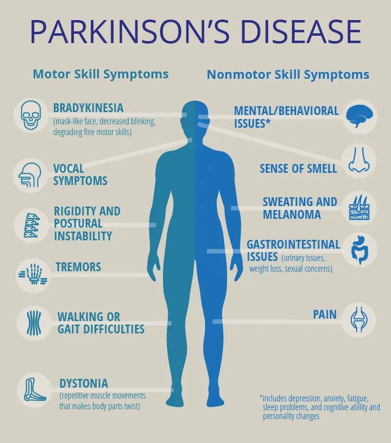
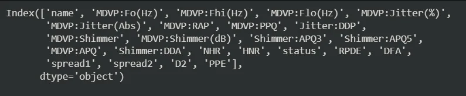
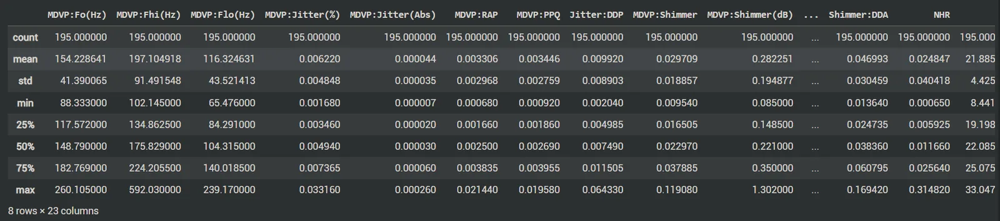
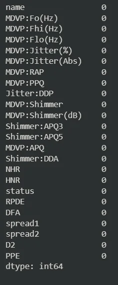
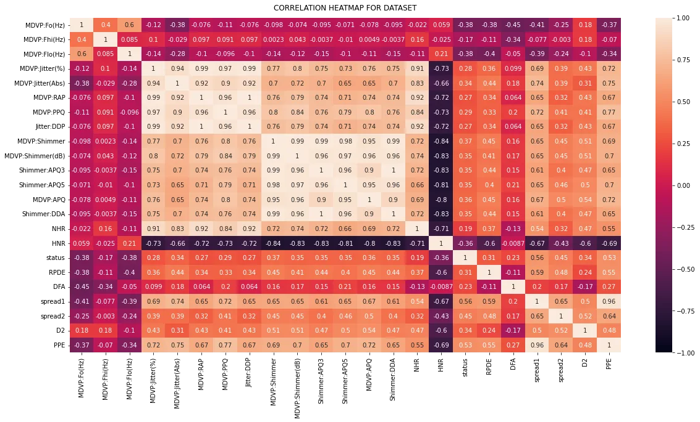
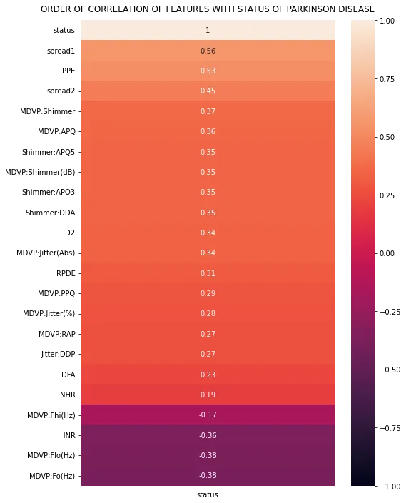
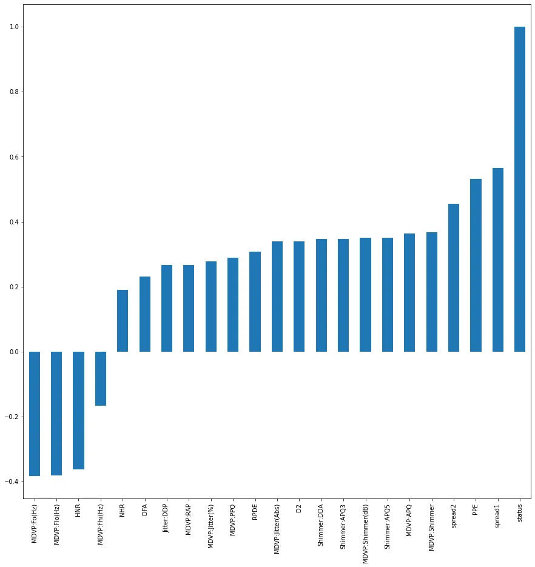

## Introduction
The progressive degradation of the nervous system's structure and function characterizes the diverse group of conditions known as **neurodegenerative diseases**. Neurogenerative illnesses develop when nerve cells in the brain or peripheral nervous system gradually lose their functionality and eventually perish. Neurodegenerative disorders include:

Alzheimer's disease, Ataxia, Huntington's disease, Parkinson's disease, Motor neuron disease, multiple system atrophy, progressive supranuclear palsy, amongst others.

## Parkinson's Disease
Parkinson's disease is a condition in which parts of the brain become progressively damaged over many years. The 3 main symptoms of the Parkinson's disease are:

1. involuntary shaking of particular parts of the body
2. slow movement
3. stiff and inflexible muscles

Some other wide range of physical and psychological symptoms include:

1. depression and anxiety
2. memory problems
3. insomnia
4. anosmia
5. balance problems.

**This blog uses a machine learning model to help predict the presence of a neurogenerative disease.**

## Exploratory Data Analysis
To understand the dataset more, some analysis were performed to know more about the dataset after going through the metadata. The steps carried out are as follows:

1. Listing the columns of the dataset to know what columns we are dealing with.

```python
#Listing the columns in the dataset
df.columns
```

**Output:**



2. Describing the dataset

```python
#Showing the description of the dataset
df.describe()
```

**Output:**



3. Dataset information

```python
#Giving information about the dataset on the datatypes of columns
df.info()
```

**Output:**

4. Checking for availability of null values

```python
#Checking to see if any null values are available
df.isnull().sum()
```

**Output:**



5. Showing shape of the dataset

```python
#Showing shape of the dataset
df.shape
```

**Output:**

(195, 24)

6. Checking the correlation of the various columns of the dataset.

```python
# Increase the size of the heatmap.
plt.figure(figsize=(20, 10))

#Creating the heatmap
heatmap = sns.heatmap(df.corr(), vmin=-1, vmax=1, annot=True)

# Give a title to the heatmap. Pad defines the distance of the title from the top of the heatmap.
heatmap.set_title('CORRELATION HEATMAP FOR DATASET', fontdict={'fontsize':12}, pad=12);
```

**Output:**



The meaning of the various columns are as follows:

**MDVP** means Multidimensional Voice Program which has several parameters to assess the quality of the human voice.

1. **name** - ASCII subject name and recording number
2. **MDVP:Fo(Hz)** - Average vocal fundamental frequency
3. **MDVP:Fhi(Hz)** - Maximum vocal fundamental frequency
4. **MDVP:Flo(Hz)** - Minimum vocal fundamental frequency
5. **MDVP:Jitter(%),MDVP:Jitter(Abs),MDVP:RAP,MDVP:PPQ,Jitter:DDP** - Several measures of variation in fundamental frequency
6. **MDVP:Shimmer,MDVP:Shimmer(dB),Shimmer:APQ3,Shimmer:APQ5,MDVP:APQ,Shimmer:DDA** - Several measures of variation in amplitude
7. **NHR**, **HNR** - Two measures of ratio of noise to tonal components in the voice
8. **status** - Health status of the subject (one) - Parkinson's, (zero) - healthy
9. **RPDE**, **D2** - Two nonlinear dynamical complexity measures
10. **DFA** - Signal fractal scaling exponent
11. **spread1**, **spread2**, **PPE** - Three nonlinear measures of fundamental frequency variation

**Important Questions To Be Addressed**

1. What is the correlation of the various fields of the dataset and the Parkinson's disease or status of an individual?

2. Which top 3 factors should be closely checked to know that someone is actually a potential Parkinson's disease patient?

3. How accurate does the model help in predicting the status of a person's Parkinson's ailment?

**Addressing the Listed Questions**

1. What is the correlation of the various fields of the dataset and the Parkinson's disease or status of an individual?

```python
# Increase the size of the heatmap.
plt.figure(figsize=(8, 12))
#Creating the heatmap
heatmap = sns.heatmap(df.corr()[['status']].sort_values(by='status', ascending=False), vmin=-1, vmax=1, annot=True)
# Give a title to the heatmap. Pad defines the distance of the title from the top of the heatmap.
heatmap.set_title('ORDER OF CORRELATION OF FEATURES WITH STATUS OF PARKINSON DISEASE', fontdict={'fontsize':12}, pad=12);
```

Output:



From the above diagram, it can be seen that the **MDVP:Fo(Hz)** has a negative correlation with the **status** of the Parkinson's disease while **spread1** feature has the highest positive correlation with the **status** of the Parkinson's disease.

2. Which top 3 factors should be closely checked to know that someone is actually a potential Parkinson's disease patient?

```python
#Showing the correlation diagrammatically.
df.corr()['status'].sort_values().plot(kind='bar', figsize=(15, 15));
```

Output:



From the above diagram, taking into consideration the top 3 features that have a positive correlation with the **status** of Parkinson's disease, we have in increasing order, **spread2**, **PPE**, and **spread1**. Taking into consideration the top 3 features that have a negative correlation with **status** of Parkinson's disease, we have in increasing order, **HNR**, **MDVP:Flo(Hz)**, and **MDVP:Fo(Hz)**.

3. How accurate does the model help in predicting the status of a person's Parkinson's ailment?

This will involve building the model and training it then evaluating the metrics.

**Building The Model**

The model was built using XGBoost Classifier since the problem is a classification problem. The steps followed are:

1. Splitting the dataset into X and y values

```python
#Splitting the dataset into X and y values
X = df.drop(['status','name'], axis=1)
y = df[['status']]
```

2. Splitting the X and y values into X_train, X_test, y_train, and y_test

```python
#Splitting the X and y values into X_train, X_test, y_train, y_test
X_train, X_test, y_train, y_test = train_test_split(X, y, train_size=0.8, random_state=123)
```

3. Creating the model and training it and predicting with it

```python
#Creating the model and training it
model = xgb.XGBClassifier()
model.fit(X_train, y_train)

#Making the predictions
y_pred = model.predict(X_test)
```

4. Evaluating the model by checking:

- Accuracy

```python
#Checking the accuracy
accuracy_score(y_test, y_pred)
```

**Output:** 0.9230769230769231

- F1 score

```python
#Calculating the f1 score
f1_score(y_test, y_pred)
```

**Output:** 0.9491525423728815

- Precision

```python
#Calculating the precision score
precision_score(y_test, y_pred)
```

**Output:** 0.9333333333333333

- Recall

```python
#Calculating the recall score
recall_score(y_test, y_pred)
```

**Output:** 0.9655172413793104

The evaluation metrics of the model are:

1. **Accuracy** of 0.92
2. **F1 score** of 0.95
3. **Precision** of 0.93
4. **Recall** of 0.97

This gives an overview of how good the model is and hence can be used in hospitals and other health services to help in early detection and treatment of Parkinson's disease.

GitHub Link: <https://github.com/Jegge2003/neurodegen>
