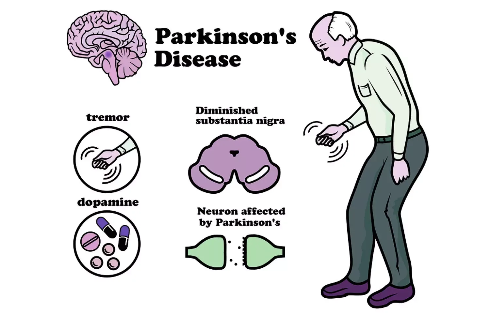
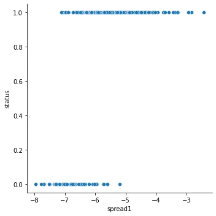
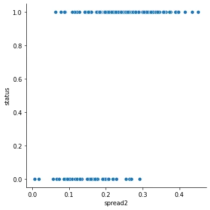
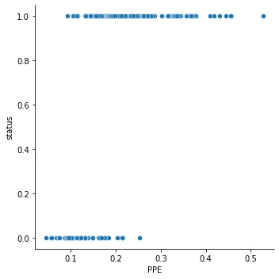

A diverse category of conditions known as neurodegenerative diseases are characterized by the progressive degradation of the nervous system's structure and function. Dementias are illnesses that impair mental functioning and are both incurable and devastating.



Parkinson's disease
Parkinson's disease is a degenerative neurological system disorder that primarily affects middle-aged and elderly adults and is characterized by tremor, muscle rigidity, and sluggish, clumsy movement. It is connected to the brain's basal ganglia atrophy and a lack of the neurotransmitter dopamine.

Neurodegenerative disorders, which are most common in aging populations, are a catch-all term for a group of diseases characterized by gradual damage to nervous system cells, particularly neurons. As a result, they have an impact on a variety of bodily functions such as balance, movement, respiration, heart function, and so forth. Almost all of them are inherited. However, a small number of them can be brought on by either disease or bad behavior on the part of humans, such as drinking or tumors, strokes, and viruses. The causes can at times even be a mystery. These ailments can potentially endanger life because of how bad they are. They cannot be cured, which is unfortunate.

Importing Parkinsons disease's datasets

loading the training dataset into a DataFrame

```python
# Load the dataset dataset=pd.read_csv('parkinsons.data')
```

**Exploratory Data Analysis**

Numerical data analysis

In order to comprehend the structure of our data, let's examine the dataset and perform some exploratory data analysis. We do this by utilizing the describe(), info(), and head() methods in pandas.

```python
#Preview the dataset
print(dataset.head(3)
```

```python
#Summarize the data (1)
print(dataset.info())
```

```python
#Summarize the data (2)
print(dataset.describe())
```

The dataset has the following characteristics, which were identified by the prior examination of the numerical data:

- No values are missing.
- 24 columns and 195 rows
- 22 columns with the float64 data type, one with the int64 data type, and one with the object data type.

**Visual data analysis**
EDA on target variable

```python
# Bar plot of the target variable 'status'
sns.countplot(x= 'status', data = dataset)
plt.xlabel('Status')
plt.ylabel('count')
plt.title('Distribution of people according to their status')

# Percentage of healthy people and patient with parkinson's disease
a = (dataset [dataset['status'] == 1]).shape[0]
b = (dataset [dataset['status'] == 0]).shape[0]
healthy_people = round(b*100/(a+b))
patient_withpd =  round(a*100/(a+b))
print ('The percentage of healthy people is {}'.format(healthy_people))
print ( "The percentage of patient with Parkinson's disease is {}".format(patient_withpd))
```

The percentage of healthy people is 25
The percentage of patient with Parkinson's disease is 75


More persons than healthy people have Parkinson's disease.

spread1

```python
sns.relplot(x="spread1" ,y='status',data=dataset, kind="scatter")plt.show()
sns.catplot(x='status', y='spread1', kind='box', data=dataset)
```



The largest measure of spread1 is seen in Parkinson's disease patients compared to healthy individuals, while the lowest value of spread1 is seen in healthy individuals compared to Parkinson's disease patients.

spread2

```python
sns.relplot(x="spread2" ,y='status',data=dataset, kind="scatter")
plt.show()

sns.catplot(x='status', y='spread2', kind='box', data=dataset)
```



More Parkinson Positive cases than Parkinson Negative cases tend to have the highest measure of spread2, whereas more healthy people than Parkinson Positive cases likely to have the lowest level of spread2.

PPE

```python
sns.relplot(x="PPE" ,y='status',data=dataset, kind="scatter")
plt.show()

sns.catplot(x='status', y='PPE', kind='box', data=dataset)
```



We found that Parkinson Positive cases typically have higher PPE levels than Parkinson Negative cases.

DFA

```python
sns.relplot(x="DFA" ,y='status',data=dataset, kind="scatter")
plt.show()

sns.catplot(x='status', y='DFA', kind='box', data=dataset)
```


Parkinson positive examples have both the greatest and lowest Signal fractal scaling exponents. It appears that there is no relationship between the feature "Signal fractal scaling exponent" and the target variable "status."

In order to learn more, let's make a pairplot of the attributes and compute the correlation between the data.

```python
# creating pairplot of the attributes
sns.pairplot(dataset)
plt.show()

#correlation between the features and the target variable
d = dataset.corr()
print(d['status'])
```

It has a:

- The features PPE, spread1, spread2, and the target variable status have a moderately positive connection.
- low positive correlation between the target variable state and the feature DFA

**Predictive model**

Let's create a model that can anticipate whether a person will have a neurodegenerative disease.
Because there are labels and labeled data present, it is a supervised learning case.
The goal variable "status" has the following categories: patients with Parkinson's disease (=1) and healthy individuals (=0). The learning problem is categorization since we want to predict a category for the data.

**Data preprocessing**

Pre-processing the data is crucial before creating models.
The data set will first be split into features and their accompanying labels. After that, training and test sets will be created from the resulting data set.
Fyi Because machine learning algorithms only function on numbers, we will employ 22 characteristics (we left the variable "name" alone).

```python
features = dataset.loc[:,dataset.columns!='status'].values[:,1:]
labels=dataset.loc[:,'status'].values
print(features)
print (labels)
```

To place the characteristics on a same scale before splitting the dataset into training and test sets, let's normalize the data so it spans from -1 and 1.

```python
#Scale the features to between -1 and 1
scaler=MinMaxScaler((-1,1))
x=scaler.fit_transform(features)
y=labels
```

```python
#Split the dataset 80% train and 20% test
x_train,x_test,y_train,y_test=train_test_split(x, y, test_size=0.2, random_state=21)
```

Building a classifier and fitting it to the data

```python
'''Train the model'''
#Instantiate a XGBClassifier
model=XGBClassifier()

#fit the classifier to the training set
model.fit(x_train,y_train)
```

Predicting the labels of new data points

```python
#predict the test set labels
y_pred=model.predict(x_test)
print(y_pred)
```

Computing the accuracy of the classifier's prediction.

```python
# Evaluate and print test-set accuracy
accuracy = accuracy_score(y_test, y_pred)*100
print(round(accuracy,1))
```

Consequently, the xgbclassifier has gained knowledge from the training set and now has 97.4% accuracy when predicting whether a person has Parkinson's disease.
