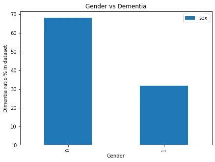
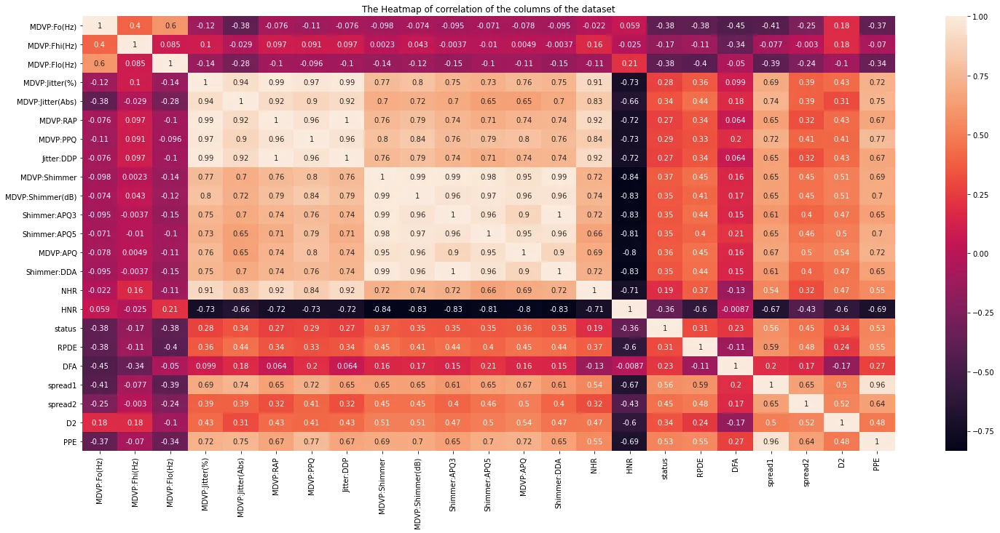

Creator: wanderluster | Credit: Getty Images/iStockphoto

Copyright: wanderluster

### Introduction

**Parkinson's disease** (**PD**), or simply **Parkinson's**, is a long-term degenerativedisorder of the central nervous system that mainly affects the motor system. The symptoms usually emerge slowly, and as the disease worsens, non-motor symptoms become more common.

The most common of the non-motor symptoms is the voice and speech changes. From there a new hope appeared by predicting Parkinson's changes by analysing voice data of subjects.

### Data

There are two groups of data that we can analyze both present as part of the project UCI ML Parkinson's dataset

First the key to understanding the meaning of the columns is:

**Name** - ASCII subject name and recording number

**1. MDVP:Fo(Hz)** - Average vocal fundamental frequency

**MDVP:Fhi(Hz)** - Maximum vocal fundamental frequency

**MDVP:Flo(Hz)** - Minimum vocal fundamental frequency

**2. MDVP:Jitter(%),MDVP:Jitter(Abs), MDVP:RAP, MDVP:PPQ, Jitter:DDP** - Several measures of variation in fundamental frequency

**3.MDVP:Shimmer,MDVP:Shimmer(dB),Shimmer:APQ3,Shimmer:APQ5,MDVP:APQ,Shimmer:DDA** - Several measures of variation in amplitude

**4. NHR, HNR** - Two measures of the ratio of noise to tonal components in the voice

**5. Status** - Health status of the subject (one) - Parkinson's, (zero) - healthy

**4. RPDE,D2** - Two nonlinear dynamical complexity measures

**5. DFA** - Signal fractal scaling exponent

**6. spread1,spread2,PPE** - Three nonlinear measures of fundamental frequency variation

Introduction

The assumption here that we can predict Parkinson's disease from voice alteration of the patient.

Exploratory Data Analysis

The first step after importing the necessary libraries is to start exploring the data to find out any missing values or to discover what are the necessary pre-processing steps that need to be taken.

```python
0   name              195 non-null    object
 1   MDVP:Fo(Hz)       195 non-null    float64
 2   MDVP:Fhi(Hz)      195 non-null    float64
 3   MDVP:Flo(Hz)      195 non-null    float64
 4   MDVP:Jitter(%)    195 non-null    float64
 5   MDVP:Jitter(Abs)  195 non-null    float64
 6   MDVP:RAP          195 non-null    float64
 7   MDVP:PPQ          195 non-null    float64
 8   Jitter:DDP        195 non-null    float64
 9   MDVP:Shimmer      195 non-null    float64
 10  MDVP:Shimmer(dB)  195 non-null    float64
 11  Shimmer:APQ3      195 non-null    float64
 12  Shimmer:APQ5      195 non-null    float64
 13  MDVP:APQ          195 non-null    float64
 14  Shimmer:DDA       195 non-null    float64
 15  NHR               195 non-null    float64
 16  HNR               195 non-null    float64
 17  status            195 non-null    int64
 18  RPDE              195 non-null    float64
 19  DFA               195 non-null    float64
 20  spread1           195 non-null    float64
 21  spread2           195 non-null    float64
 22  D2                195 non-null    float64
 23  PPE               195 non-null    float64
```

From the above there is no missing values in the data. Now we start to ask some questions.

Is there a relation between Gender and probability of Parkinson's in the sample?

```python
dem_gen = parkinsons_df['sex'].value_counts() * 100/len(parkinsons_df)
dem_gen = pd.DataFrame(dem_gen)
dem_gen.plot(kind='bar', figsize=(7,5))
plt.title('Gender vs Dementia')
plt.xlabel('Gender')
plt.ylabel('Dimentia ratio % in dataset')
plt.show()
```



Which feature is the most significant in predicting the disease?

To answer this we need to explore the correlation between the columns



The darker the colour the more effect the column value has on the status of the disease.

There are other questions that can be answered from the data like :

what is the age range of the diseased compared to the age range of the sample(distribution graph)

### predicting the data

In this we will use the XGBClassifier model and then measure the accuracy through the score attribute

```python
model = XGBClassifier()
model.fit(X_train,y_train)
y_pred = model.predict(X_test)
accuracy = accuracy_score(y_test, y_pred)
```

```python
accuracy
0.9743589743589743
```

The accuracy score is high enough to be able to predict the data correct enough.

### References

\* <https://en.wikipedia.org/wiki/Parkinson%27s_disease>

\* [my github](https://github.com/NeferTerry/Parkinsons-Prediction-through-analysing-Vocal-Changes)
