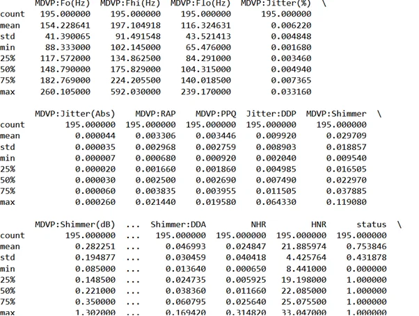
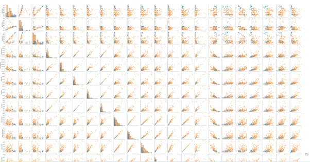
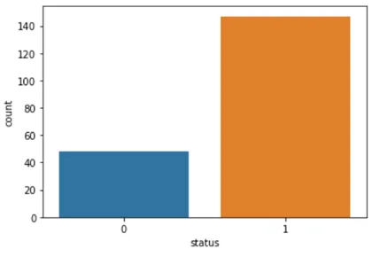
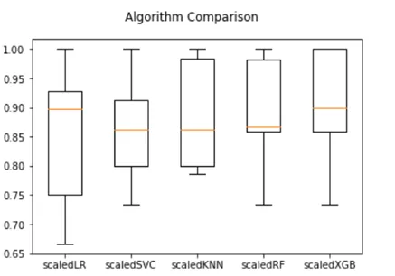
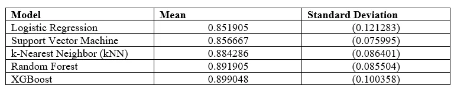
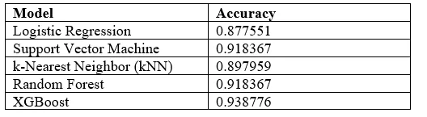

***Introduction***

[Parkinson's disease is a brain disorder that causes unintended or uncontrollable movements, such as shaking, stiffness, and difficulty with balance and coordination. Symptoms usually begin gradually and worsen over time. As the disease progresses, people may have difficulty walking and talking. The most prominent signs and symptoms of Parkinson’s disease occur when nerve cells in the basal ganglia, an area of the brain that controls movement, become impaired and/or die.](https://www.nia.nih.gov/health/parkinsons-disease)

[Approximately 60,000 Americans are diagnosed with PD each year. More than 10 million people worldwide are living with PD. The incidence of Parkinson's disease increases with age, but an estimated four percent of people with PD are diagnosed before age 50. The combined direct and indirect cost of Parkinson’s, including treatment, social security payments, and lost income, is estimated to be nearly $52 billion per year in the United States alone. Medications alone cost an average of $2,500 a year and therapeutic surgery can cost up to $100,000 per person.](https://www.parkinson.org/Understanding-Parkinsons/Statistics)

Judging from this grim outlook of things it is therefore important for us to build predictive models that can inform one that he has the disease, and help the patient to make informed decisions in combating the degenerative course of the body. To do this we will use Parkinson’s data which is found [here](https://www.parkinson.org/Understanding-Parkinsons/Statistics)

We will also employ 10-fold cross-validation to ascertain the accuracy of the models before testing them against the test set.

***Objectives***

The objectives of this analysis are to:

1. To carry out an exploratory data analysis

2. To model the data using the base classifiers such as the Logistic regression, Support Vector Machine, and the kNN models

3. To model the data using the ensemble models

***Analysis***

We use the following variables

Matrix column entries (attributes):

name - ASCII subject name and recording number

MDVP:Fo(Hz) - Average vocal fundamental frequency

MDVP:Fhi(Hz) - Maximum vocal fundamental frequency

MDVP:Flo(Hz) - Minimum vocal fundamental frequency

MDVP:Jitter(%),MDVP:Jitter(Abs),MDVP:RAP,MDVP:PPQ,Jitter:DDP - Several measures of variation in fundamental frequency

MDVP:Shimmer,MDVP:Shimmer(dB),Shimmer:APQ3,Shimmer:APQ5,MDVP:APQ,Shimmer:DDA - Several measures of variation in amplitude

NHR,HNR - Two measures of ratio of noise to tonal components in the voice

status - Health status of the subject (one) - Parkinson's, (zero) - healthy

RPDE,D2 - Two nonlinear dynamical complexity measures

DFA - Signal fractal scaling exponent

spread1,spread2,PPE - Three nonlinear measures of fundamental frequency variation

To conduct this analysis we will use the following packages:

```python
# Libraries
from sklearn.ensemble import RandomForestClassifier
from sklearn.metrics import accuracy_score
from sklearn.pipeline import Pipeline
from sklearn.model_selection import train_test_split
from sklearn.preprocessing import StandardScaler
from sklearn.linear_model import LogisticRegression
from sklearn.model_selection import KFold, GridSearchCV
from sklearn.ensemble import RandomForestClassifier
from sklearn.model_selection import cross_val_score
from sklearn.svm import SVC
from sklearn.neighbors import KNeighborsClassifier
from sklearn.metrics import classification_report
import xgboost
import pandas as pd
import numpy as np
import matplotlib.pyplot as plt
import seaborn as sns
import xgboost as xgb
```

We quickly look at the size of the data and the distribution of the variables. It can be observed that we have varied average metric for columns suggesting tha there will be a need for scaling the dataset. The wide differences between the (minimum and the 25 percentile) and (maximum and the 75th percentile) seem to suggest that there are outliers. The data will need to be scaled and the outliers to be removed.

```python
print(park_data.describe())
```



We can cement this conclusion by getting the pairs plot which is obtained via the seaborn library. We do this by the following command:

```python
sns.pairplot(park_data, hue='status', diag_kind = 'hist')
```



We can see a high level of correlation between some variables which cause multicollinearity issues to some models. Indeed the scatter plots also show elements of outliers. The histograms also show a degree of skewness for each independent variable. These issues are a source of problem for models.

Our target variable ‘status’ is of imbalanced, making the Area Under Curve (AUC) metric not suitable to compare the models. We will use the accuracy metric to compare our models. That being as it may, the individuals without the disease are fewer than those with the disease, this is shown below using the following code

```python
sns.countplot(park_data.status)
```



To help cure this problem, we will standardise the data, and this will give a sense of a normal distribution for our variables.

In selecting the variables we drop the target variable (‘status’), and the ‘name’ variable as it will not give any valuable information towards discriminating the target variable

```python
X = park_data.drop(['name', 'status'], axis=1)
y = park_data.status
```

We also select 75% of the data to be the train set and the rest which is 25% to be the test set. Indeed there are drawbacks of not having a validation set, however, due to the size of the data, we have to rely on only 2 sets.

To execute our final objective(s) that of the employment of the base classifiers and the ensemble classifiers, we use the following pipeline code which follows this line of thought <https://www.kaggle.com/code/rakesh2711/multiple-models-using-pipeline/notebook>, however we will twerk the code here and there to suite our needs:

```python
pipelines = []
pipelines.append(('scaledLR' , (Pipeline([('scaled' , StandardScaler()),('LR' ,LogisticRegression())]))))
pipelines.append(('scaledSVC' , (Pipeline([('scaled' , StandardScaler()),('SVC' ,SVC())]))))
pipelines.append(('scaledKNN' , (Pipeline([('scaled' , StandardScaler()),('kNN' ,KNeighborsClassifier())]))))
pipelines.append(('scaledRF' , (Pipeline([('scaled' , StandardScaler()),('RF' ,RandomForestClassifier())]))))
pipelines.append(('scaledXGB' , (Pipeline([('scaled' , StandardScaler()),('XGB' ,xgb.XGBClassifier())]))))

model_name = []
results = []
for pipe ,model in pipelines:
    kfold = KFold(n_splits=10, random_state=263, shuffle=True)
    cross_results = cross_val_score(model , X_train ,y_train ,cv =kfold , scoring='accuracy')

    model_scaled = model.fit(X_train, y_train)
    y_pred = model_scaled.predict(X_test)
    accuracy = accuracy_score(y_test, y_pred)

    results.append(cross_results)
    model_name.append(pipe)
    msg = "%s: %f (%f)" % (model_name, cross_results.mean(), cross_results.std())
    acc = "%s: %f" % (model_name, accuracy)

    print(msg)
    print(acc)


# Compare different Algorithms
fig = plt.figure()
fig.suptitle('Algorithm Comparison')
ax = fig.add_subplot(111)
plt.boxplot(results)
ax.set_xticklabels(model_name)
plt.show()
```



Basically the code does the following:

1. Create a model vector

2. The models are scaled using the Standard Scaler function

3. Execute a 10-fold cross validation experiment

4. Get the mean and standard deviation for the 10 sets of data for each model

5. Plot a graph for this information for each model

We can tabularise the information as follows



We can also employ the models in predicting and finding the accuracy of each model



We can come to the conclusion of saying, the XGBoost is the best classifier in both the train and test set, achieving an accuracy of 94%.

Improvement can be done by executing hyperparameter tuning. The code for this analysis is found [here](https://github.com/Matshisela/Predicting-the-Parkinson-s-disease-using-Machine-learning-models)
