Parkinson's disease (PD), or simply Parkinson's, is a long-term degenerative disorder of the central nervous system that mainly affects the motor system. As the disease worsens, non-motor symptoms become more common.The symptoms usually emerge slowly.Early in the disease, the most obvious symptoms are shaking, rigidity, slowness of movement, and difficulty with walking.Thinking and behavioral problems may also occur. Dementia becomes common in the advanced stages of the disease. Depression and anxiety are also common, occurring in more than a third of people with PD. Other symptoms include sensory, sleep, and emotional problems.The main motor symptoms are collectively called "parkinsonism", or a "parkinsonian syndrome".

The cause of Parkinson's disease is unknown, but is believed to involve both genetic and environmental factors.

**About the data**

The dataset used for this analysis and prediction was created by Max Little of the University of Oxford, in collaboration with the National Centre for Voice and Speech, Denver, Colorado, who recorded the speech signals.

The data set has 195 samples. Each row of the data set consists of voice recording of individuals with name and 23 attributes of biomedical voice measurements. The main aim of the data is to discriminate healthy people from those with Parkinson's Disease, according to "status" column which is set to `0` for healthy and `1` for individual affected with Parkinson's Disease.

**Exploratory data analysis and visualization**

Let's get started with importing relevant packages for the analysis

```python
import warnings
warnings.filterwarnings('ignore')
import pandas as pd
import matplotlib.pyplot as plt
import seaborn as sns
import numpy as np
from sklearn.preprocessing import StandardScaler
from sklearn.model_selection import train_test_split
from imblearn.over_sampling import RandomOverSampler
from sklearn.metrics import roc_auc_score
from sklearn.metrics import accuracy_score
from sklearn.metrics import f1_score
import lightgbm
import xgboost as xgb
```

Next we import the data in order to start the analysis

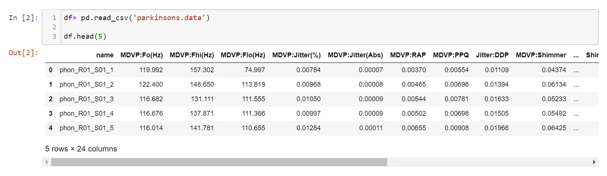

It is important to note that all features are numeric but two i.e Name and status(target), and no null variables are present. We therefore will be going straight to analysis since little or not data preparation is required

**Univariate Analysis**

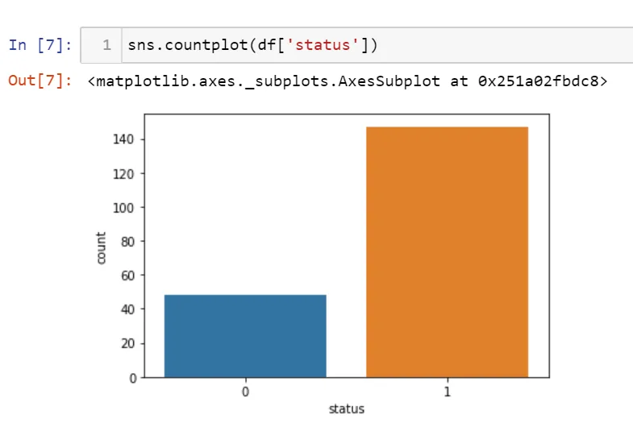

We note that the target variable is skewed towards people with parkinson's disease. In this case since the data set is imbalanced we will undertake measures to try and balance it with synthetic samples through over sampling or under sampling.

**Bivariate Analysis**

Since all features are numeric we will employ box plots to investigate the relation ship between features and the target variable.

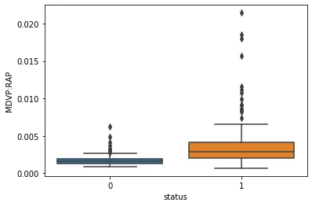

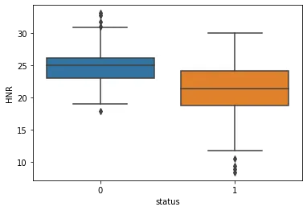

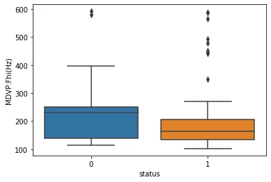

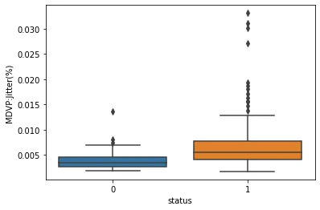

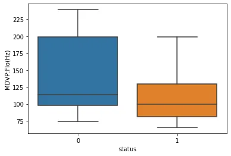

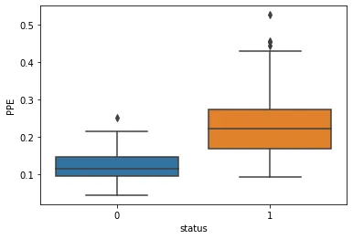

From the Bivariate Analysis we note that all features are significant with regards to our target variable, and as such all features will be used in futher endeavours.

Next we look at a pair plot to investigate the relation ship between the variables.

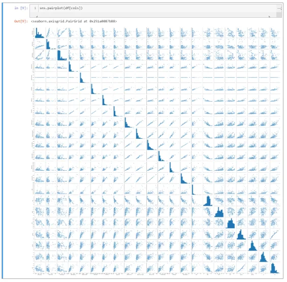

We note that almost all features are positively correlated with each other. The feature HNR is negatively correlated with the other features. The feature MDVP:Jitter(Abs) has a horizontal line and as such is not correlated with the other variables.

From the analysis we were able to detect the following relationships;

**1.** From the Analysis it can be observed that the higher ones HNR the lower the risk of having parkinsons disease on the other hand the lower the NHR the lower the risk of having parkinsons disease.

This can be seen from the charts below.

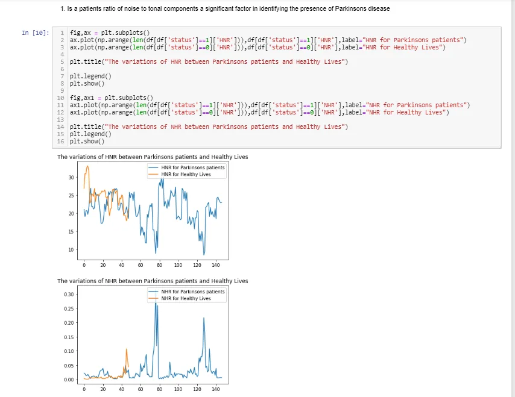

From the analysis we were able to note that vocal fundamental frequency is usually normal with the range 100 and 300 and a vocal fundamental frequency out of that range on average could point to presence of the Parkinsons disease. This is illustrated with the charts below.

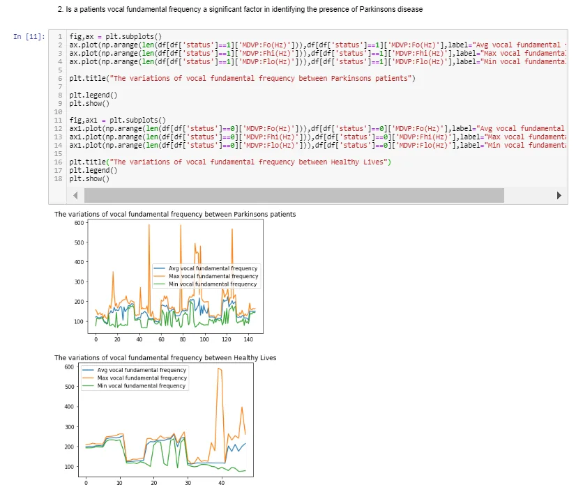

**Machine learning Predictions**

Next let's look at predicting the presence of parkinson's disease from the dataset we have been provided with.

**1. Data pre-processing**

During this step we will perform a number of steps.

First we will drop all unnecessary columns from our data


Next we will normalize or scale our data to ensure the model does not give more importance to certain features solely based on the features having larger numbers.

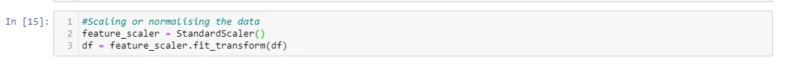

We then make a train test split to ensure we train and validate our model on different samples. We also perform over sampling using the Random over sampler model from imblearn package

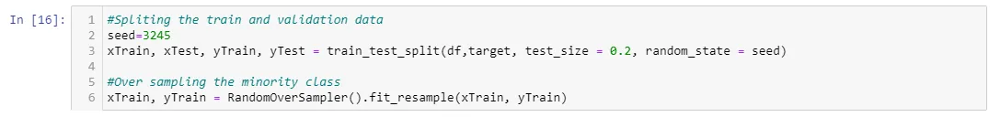

**2. Modelling**

We instantiate or model, make predictions and validate our model

We chose the xgboost algorithm since it has a reputation in providing excellent results for classification problems.

The various steps are shown below.

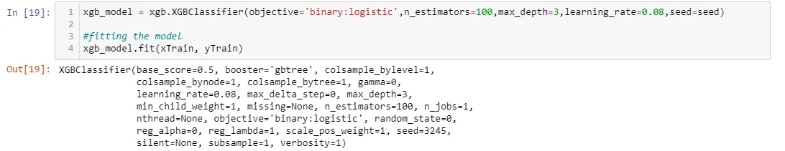


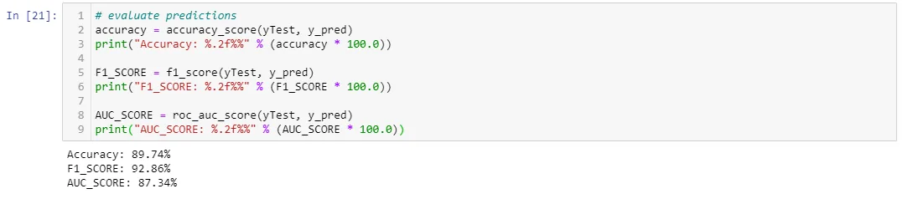

We were able to get an accuracy score of about 90% , an AUC score of over 87% and an F-score of about 93%. This means our model is predicting both the majority and minority classes well and it would fit well on unseen data.

Th Full code can be found on my github channel using the link below

<https://github.com/ussozi/data_insights_Parkinsons_disease_analysis>

**References**

1.'Exploiting Nonlinear Recurrence and Fractal Scaling Properties for Voice Disorder Detection', Little MA, McSharry PE, Roberts SJ, Costello DAE, Moroz IM. BioMedical Engineering OnLine 2007, 6:23 (26 June 2007)

2. Max A. Little, Patrick E. McSharry, Eric J. Hunter, Lorraine O. Ramig (2008), 'Suitability of dysphonia measurements for telemonitoring of Parkinson's disease', IEEE Transactions on Biomedical Engineering (to appear).
