Among various life-threatening diseases, heart disease has garnered great attention in medical research. The diagnosis of heart disease is a challenging task, which can offer an automated prediction about the patient's heart condition so that further treatment can be effective. The diagnosis of heart disease is usually based on the patient's signs, symptoms and physical examination. Several factors increase the risk of heart diseases, such as smoking habits, body cholesterol level, family history of heart disease, obesity, high blood pressure, and lack of physical exercise.

A major challenge faced by health care organizations, such as hospitals and medical centres, is the provision of quality services at affordable costs. The quality service implies diagnosing patients properly and administering effective treatments. The available heart disease database consists of both numerical and categorical data. Before further processing, cleaning and filtering are applied to these records in order to filter the irrelevant data from the database. The proposed system can determine exactly hidden knowledge, i.e., patterns and relationships associated with heart disease, from a historical heart disease database. It can also answer the complex queries for diagnosing heart disease; therefore, it can be helpful to health care practitioners to make intelligent clinical decisions. Results showed that the proposed system has its unique potency in realizing the objectives of the defined mining goals.

The health care industries collect huge amounts of data that contain some hidden information, which is useful for making effective decisions. Some advanced data mining techniques are used to provide appropriate results and make effective decisions on data. In this study, an effective heart disease prediction system (EHDPS) and heart disease risk level. The system uses 13 medical parameters such as age, sex, blood pressure, cholesterol, and obesity for prediction. The EHDPS predicts the likelihood of patients getting heart disease. It enables significant knowledge, eg, relationships between medical factors related to heart disease and patterns, to be established.

We would work with the heart disease prediction data found in the UCI repository. Below is an actual link to the data that we will be working. We would explore various machine learning techniques that could be used for predictions and gain a good understanding of them through important metrics such as accuracy, precision and recall. Other metrics are also present and are important that we would be exploring, which could be seen at the end of the project.

We see that there are some features that we would be considered for the machine learning model. Some of the actual features that we would be considering are as follows:-

1. age
2. sex
3. chest pain type (4 values)
4. resting blood pressure
5. serum cholesterol in mg/dl
6. fasting blood sugar > 120 mg/dl
7. resting electrocardiographic results (values 0,1,2)
8. maximum heart rate achieved
9. exercise-induced angina
10. old peak = ST depression induced by exercise relative to rest
11. the slope of the peak exercise ST segment
12. number of major vessels (0-3) coloured by fluoroscopy
13. that: 3 = normal; 6 = fixed defect; 7 = reversible defect

We would be limiting ourselves to working with a small dataset to gain an understanding of the overall workflow of machine learning. Once we understand the workflow of machine learning, we can explore other datasets and follow the same procedure for large datasets as the process stays the same.

Importing the necessary libraries:

```python
import numpy as np
import pandas as pd
import matplotlib.pyplot as plt
import seaborn as sns
from sklearn.metrics import accuracy_score, f1_score, precision_score, recall_score, roc_auc_score, log_loss
from sklearn.model_selection import train_test_split
from sklearn.neighbors import KNeighborsClassifier
from sklearn.preprocessing import StandardScaler
from sklearn.svm import SVC
from sklearn.preprocessing import Normalizer
from sklearn.linear_model import LogisticRegression
from sklearn.naive_bayes import GaussianNB
from sklearn.ensemble import RandomForestClassifier
```

Reading the [dataset](https://www.kaggle.com/johnsmith88/heart-disease-dataset) as a CSV file:

We would be first reading the data before we implement the operations. We would read data that is simple to understand and contains minimal features. Since our data is stored in the Data folder, we would have to manually type it as we are not working in that directory. We have to move one step away from the directory to the data folder, and then we have to read the values present in the heart.csv file. We would use pandas library which is great for reading data and files such as csv and excel.

```python
df = pd.read_csv(r'F:\PHD\heart.csv')
```

Printing the head of the data:

We would now look at the dataframe we have just read and stored in df. We would check the first five rows to ensure we work well with the data and get a feel. We see 13 features in the data, and the 14th feature is the target variable we would have to predict later while performing machine learning operations. The head() would give us the first five rows in the dataframe.

```python
df.head()
```

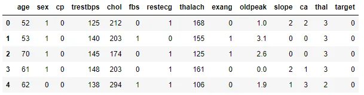

Getting the information:

One might have a question about whether the dataframe is complete. We have info() which comes to the rescue. This would give a total number of non-null values for all dataset features and their type. We have considered a dataframe that is very simple to analyze and process to understand and implement the machine learning models. Therefore, we have a dataset that does not contain any null values, as seen below. In real life, however, there is a lot of data processing before we can get it to this format without null values and in the form of mathematical vectors. We see that there are 303 entries or data points that we would be working on and performing machine learning operations.

```python
df.info()
```

```python
<class 'pandas.core.frame.DataFrame'>
RangeIndex: 1025 entries, 0 to 1024
Data columns (total 14 columns):
 #   Column    Non-Null Count  Dtype
---  ------    --------------  -----
 0   age       1025 non-null   int64
 1   sex       1025 non-null   int64
 2   cp        1025 non-null   int64
 3   trestbps  1025 non-null   int64
 4   chol      1025 non-null   int64
 5   fbs       1025 non-null   int64
 6   restecg   1025 non-null   int64
 7   thalach   1025 non-null   int64
 8   exang     1025 non-null   int64
 9   oldpeak   1025 non-null   float64
 10  slope     1025 non-null   int64
 11  ca        1025 non-null   int64
 12  thal      1025 non-null   int64
 13  target    1025 non-null   int64
dtypes: float64(1), int64(13)
memory usage: 112.2 KB
```

Understanding how the data is spread:

In addition to the above operation performed, we also have to see how the values are spread out in the form of mathematical vectors to get a solid understanding of the data. We have to observe the mean and standard deviation (std). Moreover, we also must know the minimum and maximum values for every feature we are considering at this point. Therefore, we would use describe(), which would give us all the above values for all the features we have considered. I just used 'T' after describe to make it easy for us to read the table and get to know the features well.
We see that a few categorical features are represented as mathematical vectors rather than having those categories. It is because machine learning algorithms do not process information in the form of text. We always have to ensure that when we give the input to machine learning algorithms, we have to convert all the features into mathematical vectors.
Some of the interesting features present in the dataset are age and cholesterol. In general, we see that old people with high cholesterol levels have a higher chance of getting heart diseases. It need not be true always, but that is what is assumed for the most part. Therefore, we can say that by looking at the features and the values present in them, we might be able to understand how the machine learning algorithms would emphasise these features.

```python
df.describe()
```

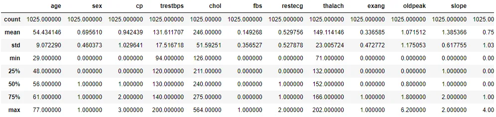

Countplot for output variable 'Target':

We would be using seaborn, a library in python that is mostly used for amazing visualizations and plots. There is another library called matplotlib, but it is pretty much limited in terms of functionality. Moreover, some plots might not look appealing to the observer. Thus, we would be sticking towards seaborn plots. We would be using the most used plot type called countplot. We would consider one feature, ' target', and we would count the total for each category in the feature. Since there can only be 2 categories, one having heart disease and the other not having heart disease, we get just 2 bars and their count for each category in that feature. We see that more people have heart disease in the dataset than those who didn't have heart disease. It is always good to draw plots and understand the data rather than represent those data points in the form of tables or mathematical values. We set the value of x as the target variable, and the y is automatically equal to the count since we use the countplot.

```python
sns.countplot(df['target'])
```

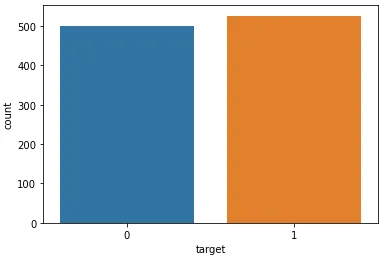

Countplot for feature 'Sex':

Similarly, we would also consider the feature 'sex' and count the number for each categorical feature. In addition to the one we did above, we will make a small change here. We would also be using hue = 'target'. What this does for each categorical value in a feature is it would also divide those based on whether they are targets or not. Therefore, we would also get the total count per category for the 'sex' feature. In addition, we would also get divided bars showing the hue as 'target'. We observe from the data that out of the dataset, we could find that most of the females had heart disease. In addition, we could also find that more men were selected in the dataset than women. We could also observe that most men did not have heart disease out of the male category. Therefore, we were able to better understand our data distribution with the help of countplot and also use additional features of it such as hue. A legend was created as we used the hue as 'target'.

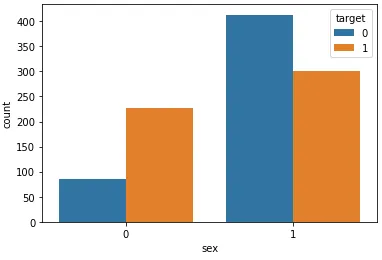

Heatmap to understand correlation:

Here comes the most interesting part. We see below a heatmap which is nothing but a correlation matrix which is depicted graphically. One of the most important things we need to find in our dataset is whether some of the features correlate. If most of the features are correlated with each other, there is no need to add all those features but just one feature representing them all. This would ensure that the time it takes to run the machine learning algorithms would reduce and improve the code's efficiency. Thus, we have to consider the correlation matrix and plot it using seaborn plots such as heatmap just to understand the data.
The first line is basically used to set the size of the plot that we would be taking into consideration. I tried not using line 1 just to see how the plot looks in the notebook. I could find that the plot was quite small and thus thought of adding the first line and arranging the size of the plot.
In line 2, we have the heatmap, and we have to drop the feature 'target' as it is no longer needed for plotting a heatmap. After dropping that value, we have to get the correlation, which we did using corr(). Moreover, we have to plot the heatmap and get their annotations so that it becomes easier for us to understand and learn from the plot. Thus, annot is set to true to get those correlation values for a different set of features.
In the heatmap, we see a diagonal line which has a value of 1. We can say that those values are highly correlated. Basically, if we compare the same features, we see that they should be correlated. That is why we have the white diagonal line. One important thing to mention is that there is a scale just beside the heatmap. The higher the correlation, the lighter would be the colour of the box.
From the heatmap, we see that thali and slope features are correlated. In addition, we also find that there is a correlation between cp and thali. Moreover, we also see a good correlation between oldpeak and exacting. All the remaining features are not as correlated as the features above. Even the features we considered correlated are not as correlated as to consider them dependent on each other. Therefore, we do not have the freedom to drop features as every feature is important and independent.

```python
plt.figure(figsize = (15, 15))sns.heatmap(df.drop(['target'], axis = 1).corr(), annot = True)
```

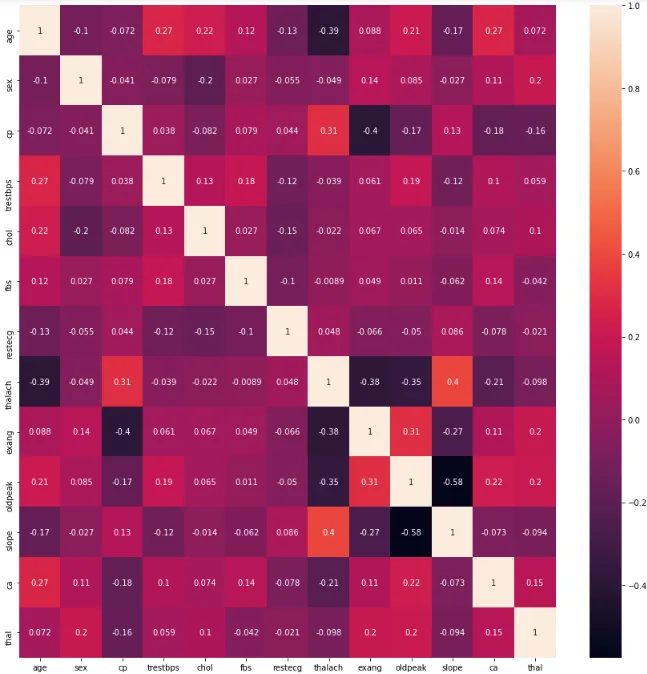

Regression plot for features:

Since we see in the above diagram that there is a negative correlation between features age and thali, let us plot and understand how the relationship actually is using the seaborn's regression plot feature.
We understand that there is a downward direction regression line as the correlation is negative. Therefore, we can come to an understanding that in our dataset, as the value of thalach decreases, there would be an increase in age or vice-versa. One thing to remember is that correlation is not equal to causation. This means that having a lower age does not cause thalach to be more or vice-versa. It is one of the most important distinctions that one must understand.

```python
sns.regplot(x = 'age', y ='thalach', data = df, color = 'green')
```

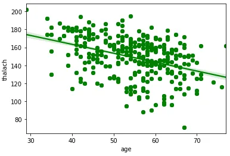

We would once again be checking the head of our dataframe just to get to know the features and the values associated with them. It is useful to check in between just to see the type of values present per feature. This is a tool to keep in handy whenever needed.

```python
df.head()
```

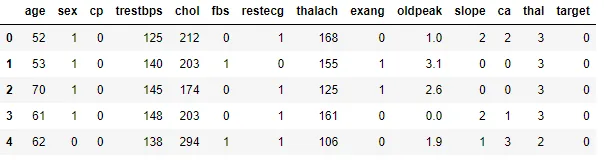

Pairplot for the data points:

Seaborn also has pairplot which would give us the relationships between different combinations of features and plot them all together so that an observer can understand the overall relationship between different sets of features. For the time being, we just restricted ourselves to taking just a few features that are not categorical. We took features such as age, trestbps, chol, thalach, oldpeak and target as these values have a bit of high variance (spread of values) in our dataset. Another thing to mention is that there is an option in seaborn called palette, which would allow us to customize our colours for the plots. One can check them out in seaborn documentation.

```python
sns.pairplot(df[['age', 'trestbps', 'chol', 'thalach', 'oldpeak', 'target']], hue = 'target', palette = 'CMRmap')
```

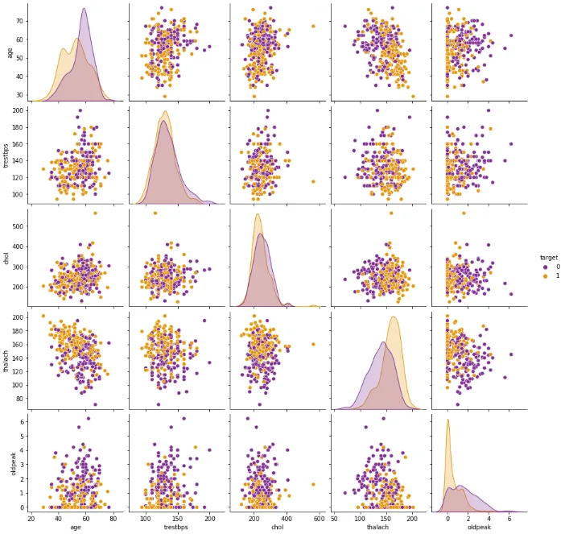

Regression plot for features:

We also saw in the pairplot that there was a good correlation but not a significant correlation between age and cholesterol. One of the most useful observations is that when we consider the plot between age and cholesterol, we tend to find a positive correlation between them. What this means is that when we try to consider the points, we would be able to draw a regression line that has a positive slope. One thing to remember again is that correlation is not equal to causation. Therefore, having higher cholesterol does not cause people to be of higher age and vice-versa. There might be a correlation in many graphs, but that does not always mean that correlation equals causation in the datasets.

```python
plt.figure(figsize = (8, 8))sns.regplot(data = df, x = 'age', y = 'chol', color = 'black')
```

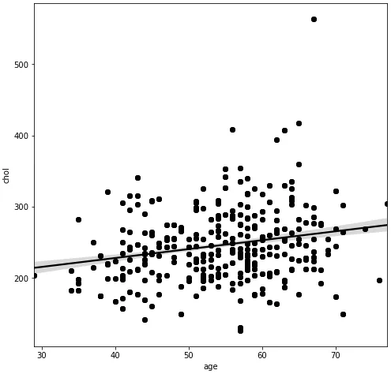

Boxplot for feature 'Cholesterol':

One of the most useful plots in seaborn is the boxplot which would give us the spread of the values in particular numerical features that we are interested in working in the dataset. We see some useful features to consider that could be used for the boxplots. One such feature in the dataset is cholesterol. We see how the feature cholesterol has values spread about the mean.
We can see from the boxplot that there is a right shift in the values as seen from the boxplot box. The start of the box and the end of the box signify the 25th percentile and the 75th percentile values in the plot. We also see that some points are considered outliers somewhere around the cholesterol values of 350 or above. Outliers are points that are way below or above the standard deviation of the dataset.

```python
plt.figure(figsize = (8, 8))
sns.boxplot(data = df, x = 'chol')
```

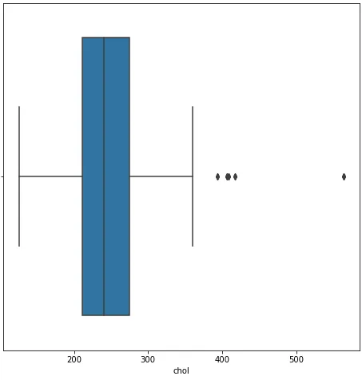

Boxplot for feature 'Thalach':

We would also be studying another feature in the dataset, ' thalach'. We see from the boxplot that the values of thalach are more spread toward the left. We have a mean of about 150 (the line in the centre of the box). We see the 25th percentile values are somewhere around 130 while the 75th percentile values are about 170. There is an outlier at the beginning of the box, which is lower than a value of 80. In addition, there is a maximum point of about 200 in the dataset, as seen from the right outer edge of the boxplot.

```python
plt.figure(figsize = (8, 8))
sns.boxplot(data = df, x = 'thalach', color = 'green')
```

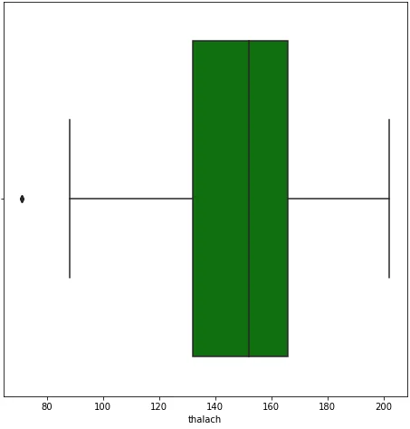

Boxplot for feature 'Age':

We always consider age in real life for some of the important medical applications as it could be one of the factors that could be a dealbreaker. Thus, we would be looking at age, which is an important feature we must consider using different colours for different boxplots so that there is no confusion about the features that were used in the boxplots. We see that the average age of the people who are present in the dataset is about 56 years (approx). In addition to this, the 25th percentile age is about 48 years, while the 75h percentile age is about 62 years. We also see that the minimum age that we consider in our dataset is about 30 years of age. In comparison, the maximum age that we have considered is about 80 years (approx), as signified by the outer edges of the boxplot.,This data is typical of the real-world dataset that we must be considered for application. We generally don't see young people suffering from heart disease as can be seen from the boxplot in our dataset. Most of the age ranges for heart disease would be from 50 to 60 years of age. We plot the boxplot and see that most of the values are typical of the actual real-world scenario.

```python
plt.figure(figsize = (8, 8))
sns.boxplot(data = df, y = 'age', color = 'yellow')
```

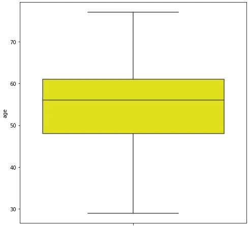

Standardization and Normalization:

One of the most important operations that we must perform before we give the complete dataset to the machine learning model would be either to scale the features or normalize them so that we would not run into errors in the process. Therefore, we would be transforming the features and converting them so that it would be easier for the machine learning models to perform the machine learning operations and give us the right outputs and improve the overall performance of the model.

```python
scaler = StandardScaler()                              #Creating an instance of the StandardScaler()
scaler.fit(X_train)                                    #Fitting the input train values
X_train_scaled = scaler.transform(X_train)             #Transforming the values and storing in X_train_scaled
X_test_scaled = scaler.transform(X_test)
normalizer = Normalizer()                              #Creating an instance of the Normalizer()
normalizer = Normalizer()                              #Creating an instance of the Normalizer()
normalizer.fit(X_train)                                #Fitting the input train values
X_train_normalized = normalizer.transform(X_train)     #Transforming the values and storing in X_train_normalized
X_test_normalized = normalizer.transform(X_test)
```

K Nearest Neighbors (KNN):

Since we have understood the data and did some operations and divided the dataset, it is now time to move to the most important part of the application which is to use machine learning algorithms for prediction. We would be using the K nearest neighbours algorithm for prediction. It is very important to understand the theory behind machine learning so that we do the hyperparameter tuning later rather than just using random values in the dataset.

One of the hyperparameter in k nearest neighbor is the number of nearest neighbors. We have selected the value to be equal to 3 as can be seen from the cell below.

What we need to do before we use the machine learning algorithm is to create an instance of it and then, we have to fit the training data values and then use predict which is later used after this cell.

We have 2 types of data that we must be considering right now. The first type of data is the standardized data where the input values are standardized. On the other hand, there is some other type of data where the input features are normalized. We have to consider those values and get the predictions separately so that we could compare at last which one was the right step for a particular machine learning model.

```python
neigh1 = KNeighborsClassifier(n_neighbors = 3)          #Creating an instance of KNeighborsClassifier()
neigh1.fit(X_train_scaled, y_train)                     #Fitting the model with X_train_scaled and y_train
neigh2 = KNeighborsClassifier(n_neighbors = 3)          #Creating an instace of KNeighborsClassifier()
neigh2.fit(X_train_normalized, y_train)
```

Since we have already fit the values, it is time for us to get the predictions for the machine learning algorithms. We would store those predictions in y_test_predict_scaled and y_test_predict_normalized so that they would be used for comparison with y_test, which are nothing but the actual output lables that we know.

```python
y_test_predict_scaled = neigh1.predict(X_test_scaled)                   #Getting the predicted output of the fit models
y_test_predict_normalized = neigh2.predict(X_test_normalized)
```

Random Forest Classifier:

We would be using one more machine learning algorithm called random forest classifier. This machine learning model has a few hyperparameters that must be tuned in order to get the most accurate result. I just found out that the best values that we would be using right would be the max_depth which is assigned the value 10 and random state which we would be giving the value to be 100. We would do the same thing where we first fit the model and then, we use the predict which will help us get the predictions.

```python
clf1 = LogisticRegression(random_state = 100)
clf2 = LogisticRegression(random_state = 100)
clf1.fit(X_train_scaled, y_train)
clf2.fit(X_train_normalized, y_train)
y_test_predict_scaled = clf1.predict(X_test_scaled)
y_test_predict_normalized = clf2.predict(X_test_normalized)
```

Barplot for metrics with standardized features:

Now comes the time for the visualization we have been waiting for after appending the values to the lists we have created. Here, we see that there are 5 models that we have used for the predictions. We have loaded the required metrics in the lists that were created above. One thing to keep in mind is that the output of the metrics would be in the range of 0-1.
For the sake of simplicity, I multiplied those values by 100 so that the difference in the values is more apparent and could be easily spotted in the graphs that are shown below. Therefore, the y axis would be more like a percentage rather than values ranging between 0-1. We are using the barplots to make the comparison between metrics easily understood and interpretable. We also have a legend showing the different metrics we have considered for the machine learning models. I have also increased the fontsize just to ensure that the results are very clear along with axis and the title.
Let us now talk about the barplot that we see below. This is a barplot for the output of the machine learning models when the input values are standardized. We might get a different result for the output if the input values we give to the machine learning models are normalized. Now we see from the graph that logistic regression, naive Bayes and random forest classifier are the most accurate models in terms of how the model did on the test set. One thing to keep in mind, though, is that when we consider just the accuracy, there might be a possibility of the machine learning model not performing well yet though it has high accuracy.

ROC score is one of the useful metrics for the machine learning models. Therefore, we see that Naive Bayes has a good ROC value followed by logistic regression. Most of all the values in the dataset, we see that the Naive Bayes model did the best in terms of all the metrics. That is still open to debate as we do not know the most important metric for the classification problem we are solving at this point. I believe that the f1 score is best when considering the robustness of the machine learning model in many machine learning applications. F1 score would actually take into consideration both the recall and the precision of the models under comparison when doing the machine learning operations. Our different machine learning models find that the f1 score for the naive Bayes model is the best. Thus, it would be good to use the naive Bayes model to predict a patient's chances of heart disease.

```python
# knn, logisticregression, naivebayes, randomforestclassifier model values are plotted
models = ['KNN', 'Logistic Regression', 'Naive Bayes', 'Random Forest Classifier']
models = np.arange(len(models))
plt.figure(figsize = (20, 20))           #Increasing the size of the figure so that it is clear
plt.yticks(fontsize = 20)                #Increasing the fontsize of the y axis just to make it clear
#getting a barplot between models and accurcy_scaled list and multiplying those with 100 to make it clear in graph
plt.bar(models, [i * 100 for i in accuracy_scaled], width = 0.15)
#Performing the same operations for other lists so that we would draw them later
plt.bar(models + 0.15, [i * 100 for i in f1_score_scaled], width = 0.15)
plt.bar(models + 0.15 * 2, [i * 100 for i in precision_score_scaled], width = 0.15)
plt.bar(models + 0.15 * 3, [i * 100 for i in recall_score_scaled], width = 0.15)
plt.bar(models + 0.15 * 4, [i * 100 for i in roc_auc_score_scaled], width = 0.15)
plt.legend(['Accuracy Scaled', 'F1 Score Scaled', 'Precision Score Scaled', 'Recall Score Scaled', 'ROC AUC score Scaled'], fontsize = 15)
plt.xticks([i + 0.25 for i in range(4)], ['KNN', 'Logistic Regression', 'Naive Bayes', 'Random Forest Classifier'], fontsize = 20)
plt.xlabel('Machine Learning Models', fontsize = 20) #Creating a label for the x-axis
plt.ylabel('Percentage', fontsize = 20)  #Creating a label for the y-axis
plt.title('Final scaled output results for machine learning models', fontsize = 30) #Adding a title with modified font size
```

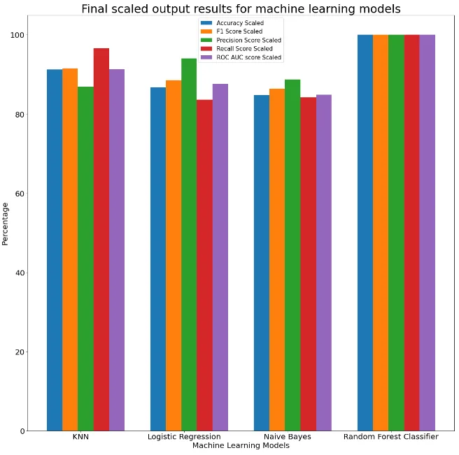

Barplot for metrics with normalized features:

We would also do the same visualization for the normalized input that we have generated previously. We would compare the results for this normalized input and plot the important machine learning metrics in the form of a bargraph.
One thing that strikes out when we consider the plot below is that logistic regression has a very high precision score.
This means that when we consider the precision, out of all the points that were predicted to be positive, how many values are actually positive? In our problem, we see that out of all the patients who were classified as having heart disease, what percentage of them were rightly classified? Using logistic regression, we found the precision is about 95 per cent. It turns out that the model did very well in precision, and it would be a useful indicator to test whether the patient has heart disease with a precision of about 95 per cent.
In general, the naive Bayes machine learning model did really well in terms of the output metrics that we have considered. KNN model did not perform well as compared to the other models. Therefore, normalized values given to the KNN algorithm in our problem did not work well, and it would not be wise to give a very large dataset to this machine learning model as it could not perform well on the small dataset. If the models perform well on a small dataset, it would be reasonable to assume that those models might have an upper hand when the number of data points we consider is very large or that are close to real-world datasets.

```python
# knn, logisticregression, naivebayes, randomforestclassifier model values are plotted
models = ['KNN', 'Logistic Regression', 'Naive Bayes', 'Random Forest Classifier']
models = np.arange(len(models))
plt.figure(figsize = (20, 20))
plt.yticks(fontsize = 20)
plt.bar(models, [i * 100 for i in accuracy_normalized], width = 0.15)
plt.bar(models + 0.15, [i * 100 for i in f1_score_normalized], width = 0.15)
plt.bar(models + 0.15 * 2, [i * 100 for i in precision_score_normalized], width = 0.15)
plt.bar(models + 0.15 * 3, [i * 100 for i in recall_score_normalized], width = 0.15)
plt.bar(models + 0.15 * 4, [i * 100 for i in roc_auc_score_normalized], width = 0.15)
plt.legend(['Accuracy Normalized', 'F1 Score Normalized', 'Precision Score Normalized', 'Recall Score Normalized', 'ROC AUC score Normalized'], fontsize = 15)
plt.xticks([i + 0.3 for i in range(4)], ['KNN', 'Logistic Regression', 'Naive Bayes', 'Random Forest Classifier'], fontsize = 20)
plt.xlabel('Machine Learning Models', fontsize = 20)
plt.ylabel('Percentage', fontsize = 20)
plt.title("Final normalized results for machine learning models", fontsize = 30)
```

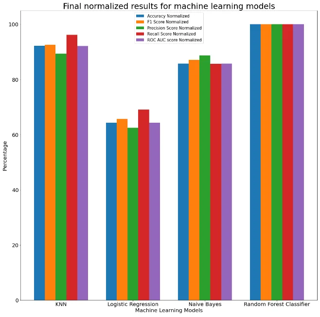

Conclusion:

1. We've learned to use the various machine learning models, compare some of the most useful metrics for different models, and understand them thoroughly through bar graphs.
2. We also learned how to read the data and perform various operations such as standardization and normalization.
3. We also worked on how to print some rows in the data, understand if there are any null values, and get a solid understanding of how the data values are spread along with their percentile values and counts.
4. We've learned to plot various machine learning plots that are important and also understood the data by using various plots and features.
5. We found that through data visualization, we could see that the rows and features of the data we considered were typical of the actual datasets we use in real life.
6. We saw a good amount of correlation between a few important features and learned them in detail with the help of scatterplots.

[Github Repository](https://github.com/mahmudmursi/Heart-Disease-Prediction)
