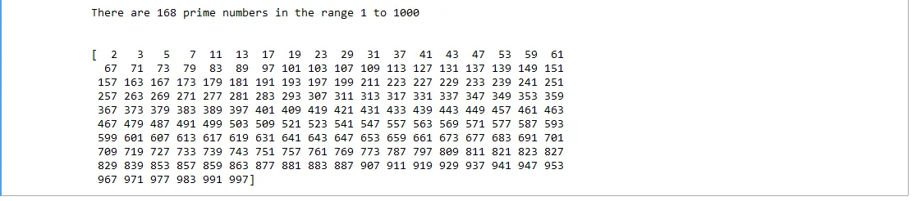

## Table of Contents

1. Introduction

2. Import Relevant Packages

3. Define to Check if Number is Prime

4. Check for Prime Numbers in a Range

## 1. Introduction

A prime number is a natural number that is greater than 1 which has only two factors; 1 and itself. For example, 3 is a prime number as the only factors it has are 1 and 3 (itself). On the other hand, 9 is not a prime number because besides 1 and 9 as factors, it has 3 as a factor as well.

Prime numbers have a number of applications in mathematics and computing including cryptography.

We develop a program in python that is able to identify the prime numbers within a given range of numbers. The program takes in a range of numbers as input and returns a list of prime numbers within that range as well as the count of the total prime numbers within the range.

## 2. Import Relevant Packages

We use the numpy arrays and numpy functions in the program and as such we import the numpy package

## 3. Define Function to Check if Number is Prime

Define a function that takes in a number and determines whether it is a prime number of not.

The function starts by first listing all the numbers from 1 up to the number in a numpy array. For example, if we want to determine whether 8 is prime, we will list numbers from 1 up to 8 in a numpy array. These are all the possible numbers that could be factors of a given number.

The modulus (mod) of the number against each of the possible factors is then checked and the results stored in a numpy array called mod. Any factor from the possible factors array will produce a mod of zero. As such the mod array is lopped through to count the zeros in the array. Since we need only to have at least three factors to determine that a number is not prime, the looping through the mod array is broken if we get at least three zeros in the mod array.

Next, we check whether we have a count of at least three to determine if a number is prime or not. Since 1 is not prime, we check the count for when the number is greater than one and determine whether it is prime or not. If the number is prime we return True and if not we return False.

The following is the complete function that accepts a number and checks whether it is prime or not.

## 4. Check for Primes in a Range of Numbers

We start by first defining the range of numbers within which we want to check which numbers are prime and how many of those are. The following code allows for the user to define start number and end number for the range.

Next, put the list of all the numbers within the range in a numpy array called num_range. This represents all the numbers that we want to check if they are prime.

Initialize an empty list called prime_list that will store the prime numbers.

Loop through the num_range array and check if the elements are prime by using the is_prime function. If a number is prime, it is then appended to a list which prime_list.

Use the following code to print out the number of prime numbers within the range as well as the print out of the primes.

The following is an output for the number of primes within the range 1 to 1000:

## Github Link for the Code

The notebook for the complete code can be found on the following [github link.](https://github.com/Musonda2day/Prime-Numbers-Indentifier)
