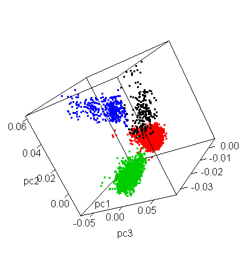
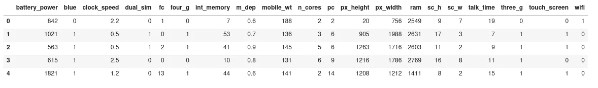
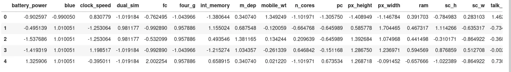
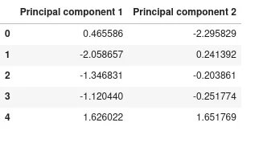
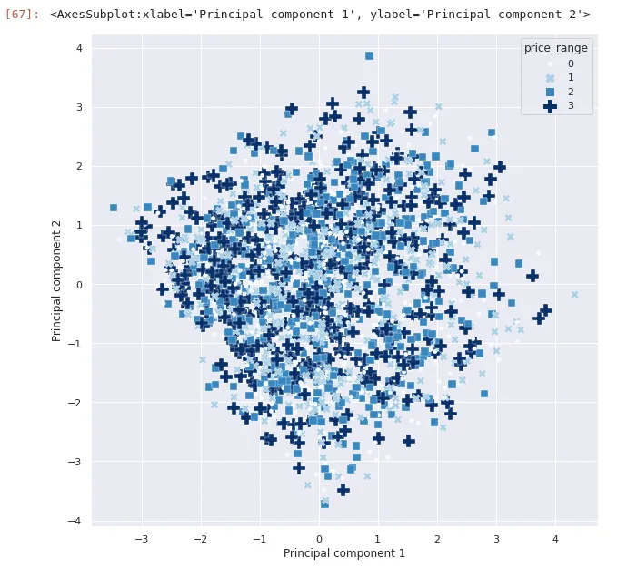
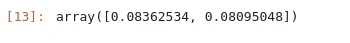
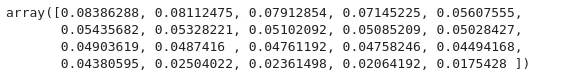

In a machine learning workflow, we generally have to deal with high-dimensional datasets. But most of the time, many features in those datasets don't have any big impact on our model performance and can demand us a lot of resources to train it. It's where come out the **dimensionality reduction.**

Many techniques have been developed to deal with high-dimensional data. Among those techniques, we can cite **Non-Negative Matrix Factorization(NMF), t-SNE, and Principal Component Analysis(PCA).**

PCA is the most popular dimensionality reduction technique out there. There are a lot of mathematical concepts behind it like covariance matrix, eigenvectors, eigenvalues, and so on. In this blog post, we will just focus on the practical aspect of PCA with the library scikit-learn and the [mobile Price classification](https://www.kaggle.com/datasets/iabhishekofficial/mobile-price-classification) dataset as a case study.

Let's present the dataset. The Mobile Price classification dataset is a dataset for a supervised machine learning task. The aim of this dataset is to aid to predict the price range of a mobile phone base on its characteristics ( battery power, dual SIM, internal storage, etc). it has 21 features and 2000 samples.

Principal Component Analysis is a method that rotates the dataset in such a way the rotated features are statistically uncorrelated. This rotation is often followed by selecting only a subset of the new features according to how important there are for explaining the data.



*A Representation of how Principal Components can be Visualised*

In general, there are many principal components as original features. This means that for our mobile price classification, we will have 21 principal components.

Principal component analysis can be used to visualize high dimensional data or to transform the data in such a way it can speed up our machine learning algorithm.

## PCA for Data visualization
The mobile price classification dataset has 21 features and then it's impossible to visualize those features in a scatter plot for example. All visualization should be made in 1D, 2D, or 3D space. The first step before applying PCA is to standardize our data. It's what we call [**feature scaling**](https://www.datainsightonline.com/post/feature-scaling-what-is-it)**.**

Standardization here is to transform our data to have a 0 mean and a unit standard deviation. Using scikit-learn, we will use the **StandardScaler** method.

```python
from sklearn.preprocessing import StandardScaler

# Separate data with target
X, y = data.drop(columns='price_range'), data[['price_range']]

# Create standardScaler and transform the data
X_scaled = StandardScaler().fit_transform(X)

# Create a dataframe with the result of scaled data
pd.DataFrame(X_scaled, columns=X.columns).head()
```

**Original Dataset**



**Scaled dataset**



### Projection to 2-dimensional space

The original data has 21 dimensions and will be projected to 2-dimensional space. You should note that the resulting principal component doesn't have a particular meaning, just the two main directions of variation of data. It's what we call **feature extraction** because we combine existing features to form new features without losing data like in feature selection.

```python
from sklearn.decomposition import PCA

# Instanciate PCA to only keep two dimension
pca = PCA(n_components=2)

# Fit and transform data
pca_result = pca.fit_transform(X_scaled)

# Create a dataframe for the resulting data
principal_df=pd.DataFrame(pca_result, columns=["Principal component 1","Principal component 2"])
principal_df.head()
```



Now we concatenate those axes with the target variable and draw the scatter plot.

```python
import seaborn as sns

final_df = pd.concat([principal_df, y], axis=1)

sns.set(rc={"figure.figsize":(10,10)})
sns.scatterplot(x="Principal component 1", y="Principal component 2", data=final_df, hue="price_range", style="price_range",size="price_range", sizes=(20,200), palette='Blues')
```



We can now visualize the plot of our 21-dimensional data in 2-dimensional space. But one question come to mind, **what is the proportion of data represented by each component?**

To answer this question, let's print the explained variance ratio for each principal component to see what proportion of our entire dataset is represented by each component.

```python
pca.explained_variance_ratio_
```



We can observe that the first component represents **8.36%** and the second one represents **8.09%,** in other words, the two components represent **16.45%** of the whole dataset.

## PCA for dimensionality reduction

We'll continue here with the same dataset as the previous. Here there are two approaches to applying PCA with the scikit-learn library. The first approach is to calculate the variance ratio for all components before choosing the number of components to keep and in the second one, we just precise the percentage of representation of our data we want and scikit-learn determine the number of components needs to have this value.

### First approach: Calculate the variance ratio of all component

To do that, we instantiate PCA without parameters, fit it to scale data and print the explained variance ratio.

```python
pca = PCA()
pca.fit(X_scaled)
pca.explained_variance_ratio_
```



We have 20 principal components and this array presents the percentage of representation of data represented by each component. With this, we can decide the number of components to keep to reach a certain percentage of representation.

### Second approach: Specify the percentage we want

The second approach consists to give the percentage of representation of data we want and let the method determine the number of components needs to reach this percentage. For example, if we want the number of components that can represent 90% of the data, we can do it like this:

```python
pca = PCA(0.90)
pca.fit(X_scaled)
pca.n_components_
```

The number of components here is **16.** So we only need to keep 16 components to reach this percentage.

## Wrap up!
In this blog post, we have explained to you how to apply PCA with the machine learning library scikit-learn. We saw that PCA is the most popular dimensionality reduction technique out there used both to visualize the high dimensional data in 2D or 3D space and to reduce the dimension of data to speed up machine learning algorithm without too much impact on the model performance. Here, we have used a dataset with 21 dimensions but PCA works well with the datasets with millions of dimensions. To know more about the PCA method offered by scikit-learn and various parameters, [check-out documentation](https://scikit-learn.org/stable/modules/generated/sklearn.decomposition.PCA.html). You can find the code used in this blog [here](https://github.com/tderick/Principal-Component-analysis-with-Python/blob/main/PCA%20demonstration%20with%20Mobile%20Price%20Classification%20dataset.ipynb).
