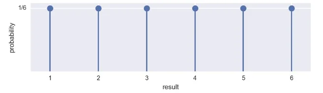
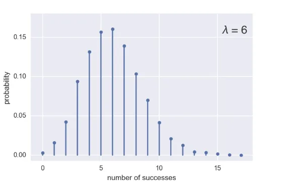
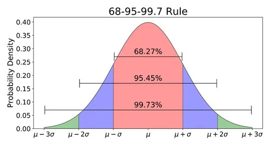
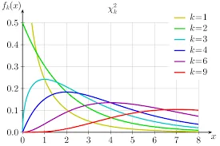

When we talk about distribution, we know that it is a mathematical description of outcomes. that describes all the possible values and likelihoods that a random variable can take. In this article, we will go through the meaning of probability distribution and some examples of it.

As we said Probability distributions indicate the likelihood of an event or outcome so it is connected with the values of the random variable. For that we have 2 types of probability distributions based on the type of the variable we are dealing with:

o  Discrete probability distributions for discrete variables

o  Probability density functions for continuous variables

let's go through each of them with some examples for them.

## Discrete probability distributions:
To illustrate this, let’s start with a simple example:

A person rolling a die once. The outcomes are discrete because only certain values may be attained; you cannot roll a 3-point-7 with a die. Each result has the same, or uniform probability, 1/6. For this reason, the PMF(probability mass function) associated with this story is called the Discrete Uniform PMF. Now the PMF is a property of a discrete probability distribution.



this describes the previous distribution as uniform distribution.

We have discrete probability distributions that can be used to model different types of data e.g. binomial distribution and Poisson distribution and more.

**Binomial distribution:**

We have different examples for the binomial distribution such as flipping a coin which is a very famous example. In the coin example the number r of successes (heads) in n trials with probability p of success. So we can extract the parameters of the binomial distribution as np.

Suppose we will perform 4 coin flips with a probability of success of 0.5, let’s see this in code:

```python
np.random.binomial(4,0.5)
```

```python
2
```

the binomial distribution has some properties like:

- we have only two possible outcomes.
- We have n number of independent trials
- Each trial is independent so one trial does not affect other trials’ probabilities.

**Poisson distribution:**

The probability distribution describes probabilities for counts of events that occur in specified observation space. In the Poisson process, The timing of the next event is completely independent of when the previous event happened. Many real-life processes behave in this way such as Natural birth in a given hospital, hit on a website during a given hour.

If we look at the **PMF** of the Poisson distribution, it will look like that:



Notice that Poisson distribution is a limit of the Binomial distribution for low probability of success and a large number of trials, i.e. for rare events. The Poisson distribution is defined by a single parameter, lambda (λ), which is the mean number of occurrences.

If we want to sample from a Poisson distribution in code it will be:

```python
np.random.poisson(6,size=5)
```

```python
array([8, 5, 5, 6, 4])
```

the size argument here denotes to number of samples.

## Probability density functions for continuous variables:
If we are dealing with continuous variables e.g. height, weight, and temperature, the probability distribution, in this case, will be as the probability density function.

The probability continuous distributions have many types of distributions e.g. normal distribution, chi-square distribution and more.

**Normal distribution:**

It is considered one of the most common distributions. It is symmetric distribution so its mean is equal to the median and mode. It is defined by 2 parameters which are the mean and the standard deviation which measures the dispersion of the data.



Let’s get a sample from a normal distribution in code:

```python
np.random.normal(133, 8, size=10)
```

```python
array([145.37119855, 134.94874584, 134.91875092, 126.35345432,
       143.29521209, 126.50402905, 137.14764952, 139.47768039,
       144.75889827, 123.42018563])
```

**Chi-square distribution:**

It is a continuous distribution with values ranging from 0 to infinity as it does not take any negative value. its shape is determined through its degrees of freedom. The chi-square distribution approaches the normal distribution as the degrees of freedom get larger.



Resources used: [here](https://statisticsbyjim.com/basics/probability-distributions/)

That was part of Data Insight's Data Scientist program.
