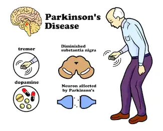

*Sourced from www.shutterstock.com/670212961*

## INTRODUCTION

Parkinson's disease (PD) is one of the most common neurodegenerative diseases in the world. It is estimated to affect 930,000 people in the United States by 2020. Neurodegenerative diseases are a heterogeneous group of disorders that are characterized by the progressive degeneration of the structure and function of the nervous system. They are incurable and debilitating conditions that cause problems with mental functioning also called dementias.

Neurodegenerative diseases affect millions of people worldwide. In addition to PD is Alzheimer’s disease as the most common neurodegenerative diseases. 5.4 million estimated Americans were living with Alzheimer’s disease in 2016.

Idiopathic Parkinson’s disease (IPD) is known as a chronic neurodegenerative disorder that may lead to producing dysphonic voice due to probable neurogenic interruptions in the laryngeal nerve paths. It is also a progressive movement disorder resulting from the loss of nerve cells in the brain that produce a substance called dopamine.

For this blog, the analysis and ML model, the focus would be on Parkinson’s disease (IPD) as a chronic neurodegenerative disorder that may lead to producing dysphonic voice due to probable neurogenic interruptions in the laryngeal nerve paths because of the data set used for the analysis and ML model.

**THE DATA SET USED**

The data set was created by Max Little of the University of Oxford, in collaboration with the National Centre for Voice and Speech, Denver, Colorado, who recorded the speech signals. It consists of 195 rows and 24 columns. Each column represents particular voice measure of an individual with first column been the name.

***FEATURES/ATTRIBUTES (COLUMNS) DESCRIPTION***

The attributes (columns) and their description as used in the Data set are as follows:

1. MDVP:Fo(Hz) - Average vocal fundamental frequency
2. MDVP:Fhi(Hz) - Maximum vocal fundamental frequency
3. MDVP:Flo(Hz) - Minimum vocal fundamental frequency
4. MDVP:Jitter(%) - MDVP jitter in percentage
5. MDVP:Jitter(Abs) - MDVP absolute jitter in ms
6. MDVP:RAP - MDVP relative amplitude perturbation
7. MDVP:PPQ - MDVP five-point period perturbation quotient
8. Jitter:DDP - Average absolute difference of differences between jitter cycles
9. MDVP:Shimmer - MDVP local shimmer
10. MDVP:Shimmer(dB) - MDVP local shimmer in dB
11. Shimmer:APQ3 - Three-point amplitude perturbation quotient
12. Shimmer:APQ5 - Five-point amplitude perturbation quotient
13. MDVP:APQ11 - MDVP 11-point amplitude perturbation quotient
14. Shimmer:DDA - Average absolute differences between the amplitudes of consecutive periods
15. NHR - Noise-to-harmonics ratio
16. HNR - Harmonics-to-noise ratio
17. RPDE - Recurrence period density entropy measure
18. D2 - Correlation dimension
19. DFA - Signal fractal scaling exponent of detrended fluctuation analysis
20. Spread1 - Two nonlinear measures of fundamental
21. Spread2 - Frequency variation
22. PPE - Pitch period entropy
23. Name - ASCII subject name and recording number
24. Status - Health status of the subject (one (1)) - Parkinson's, (zero (0)) - healthy

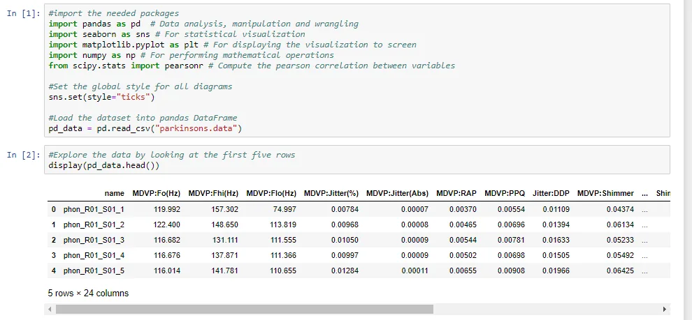

Figure 1 – First few rows of the loaded data set

Summary statistics on the data showed no missing or null values however, some extreme values for some features (columns) which is best observed by a graph. Below is the Seaborn boxplot of some features.

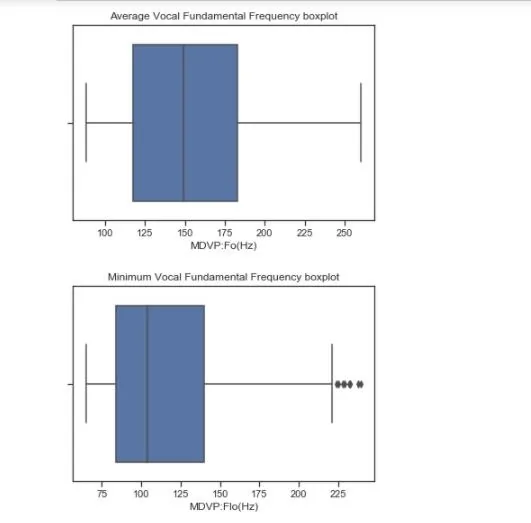

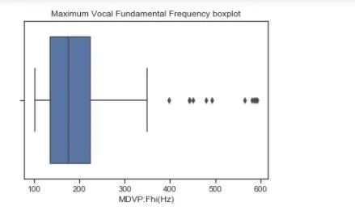

From the above visualizations, there are some outliers for the maximum and minimum vocal fundamental frequencies (i.e. MDVP:Fhi(Hz) and MDVP:Flo(Hz)) respectively. This therefore calls for feature re scaling during the pre-processing phase of the model building.

Having outliers in a data set affect the performance of a model trained on such data, therefore, there was the need to re-scale the data set. Having outliers in a data set affect the performance of a model trained on such data, therefore there was the need to re-scale the data set.

Value count of the “status” feature of the data set show that 147 subjects observed were having the Parkinson’s disease while only 48 were without the disease. Below is the graphical representation:

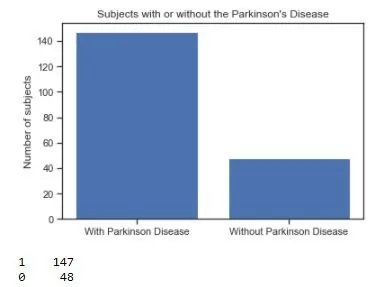

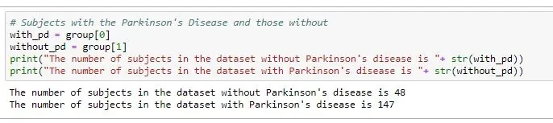

The following questions drove the analysis and the machine learning model building:

1. Is there any feature that correlates with the target feature?

Using the Pearson Correlation Coefficient, it came to the fore that features 'spread1' (Two nonlinear measures of fundamental) and 'PPE' (Pitch period entropy) have a notable correlation with the target feature (status) with Pearson correlation coefficient of 0.56 and 0.53 respectively. Since there is correlation between the target feature and some features. Further analysis is needed to find more about feature correlation.

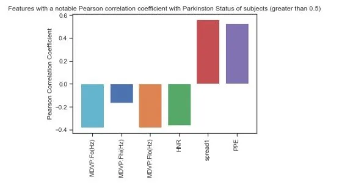

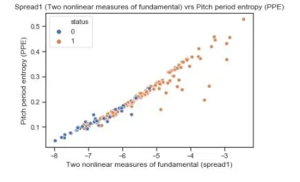

2. Do features correlates with each other?

This question was prompted by spread1 and PPE. The reason being there these the only features that correlates?

Apart from the already known features that correlates notably, there were some other features.

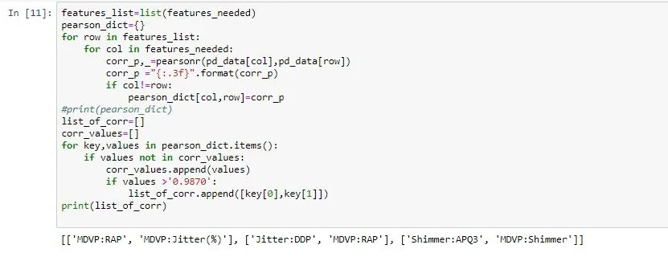

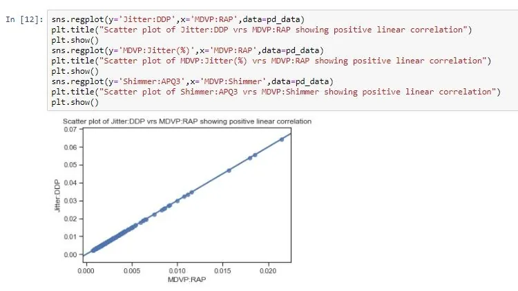

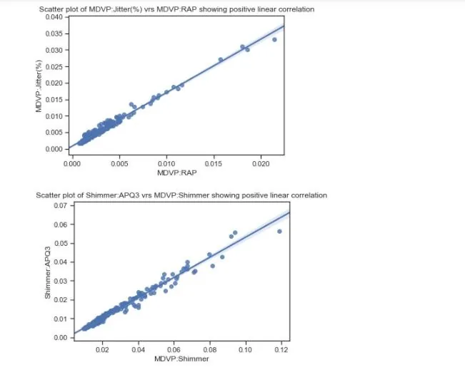

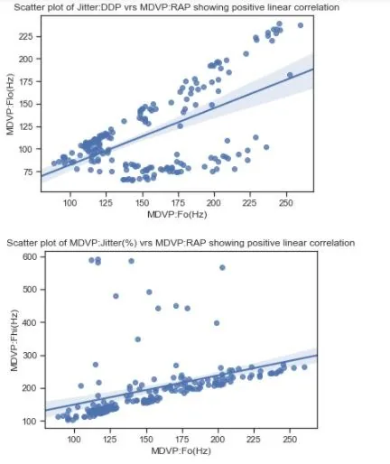

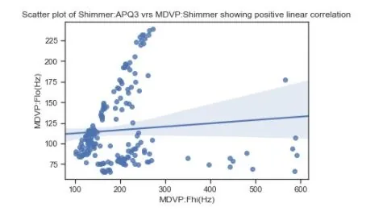

It is evident that features consisting of vocal fundamental frequencies such as MDVP:Fo(Hz), MDVP:Fhi(Hz) and MDVP:Flo(Hz) do not have notable correlations among themselves and negative corelation with features from the fundamental frequency perturbations as well as noise-to-harmonics ratio.

However, features with fundamental frequency perturbations and noise-to-harmonics ratio have high values for Pearson Correlation coefficient greater than 0.9. MDVP:RAP and MDVP:Jitter(%), Jitter:DDP and MDVP:RAP, and Shimmer:APQ3 and MDVP:Shimmer are the most correlated features (Pearson correlation coefficient > 0.987).

With the features having linear correlation existing among some of them, there is the need to 'de-correlates' them. This will reduce the data set to its "bare bones", thereby discarding any noisy feature and moreover will improve the performance of the model which will be built since the problem is a classification problem and noisy data would affect model training and subsequently model performance.

The ‘de-correlation’ was performed using the Principal Component Analysis (PCA) sub-module of the 'sklearn.decomposition' module.

3. What is number of features required to approximate the data set well?

The above sub-module also aids in determining the required number of features which can approximate the data set well.

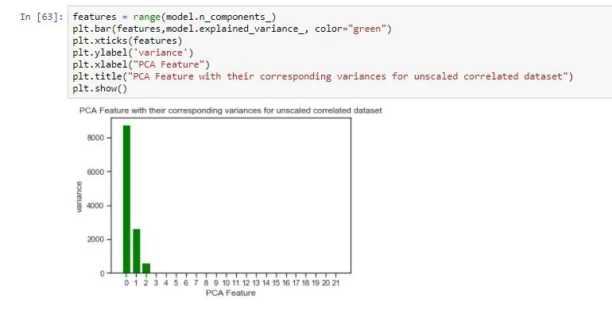

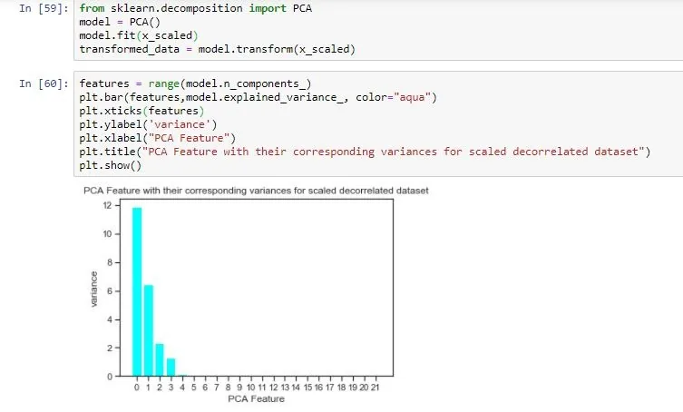

Intrinsic dimension determines the number of features that a data set requires to approximate it. Intrinsic dimension works on PCA through identifying and counting the number of features with high variance.

When the data set is not scaled and has correlated features, the number of PCA features with significant variance is 3 however, with scaled and de-correlated data set, the number of PCA features with significant variance is 5. Therefore, we can conclude that the number of features required to approximate the data set well is 5.

5. What is the most important feature (predictor) for the target variable?

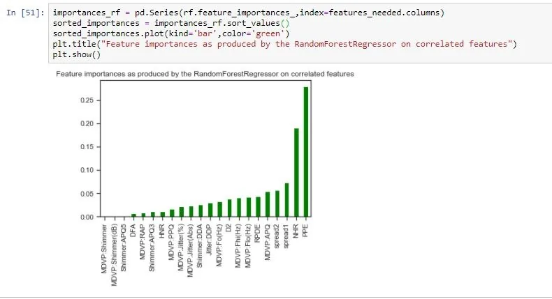

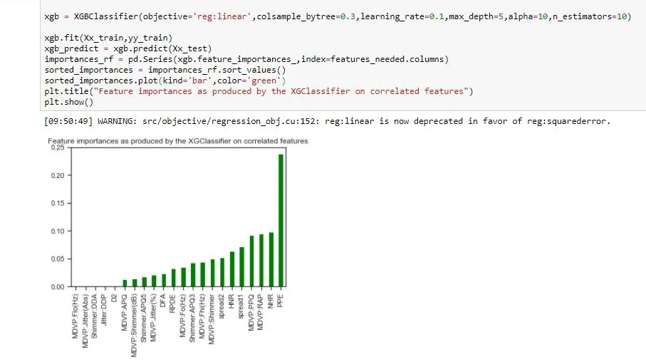

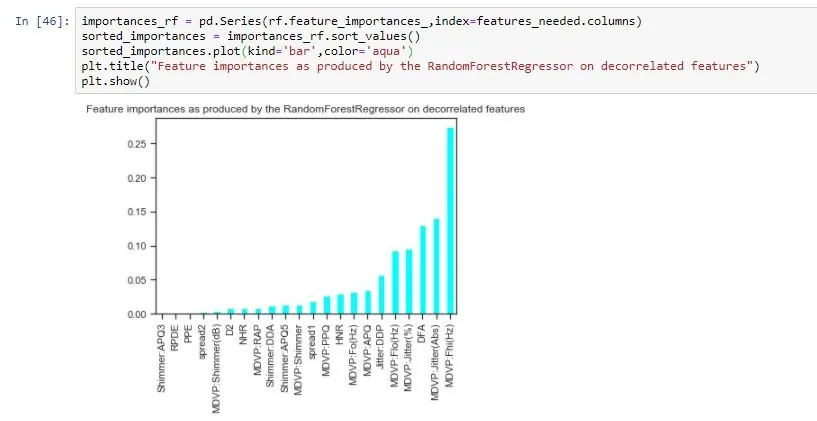

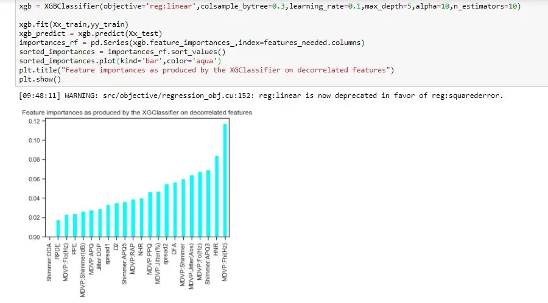

From the above graphs, it can be observed that different features are produced in each specific group denoted by color (i.e. green and aqua). The reason is that both graphs were produced by two different data sets correlated (green) and de-correlated (aqua) and this is the cause of confusion and re-enforce the need to de-correlate features if they correlate for better model performance.

Since focus has been on scaling and de-correlating this data set, we conclude that the most important feature among all the features used for predicting occurrence of Parkinson's disease in a subject is DVP:Fhi(Hz) - Maximum vocal fundamental frequency. However, that of the unmodified data set is PPE

Specifically, this finding is based on scaling and de-correlating of the data set hence different approach will produce different result. To sure consistency, two models were used in determining the most importance feature, XGBClassifier and RandomForestRegressor.

THE MODEL ITSELF

The model was trained using the LogisticRegression linear model from sklearn. The choice for this model is its incredibly easiness to implement and its training efficiency. As usual the data set used was scaled and moreover de-correlated. Without hyper tuning the parameters, the model performed considerably well with a score of 0.8909 (89.09%).

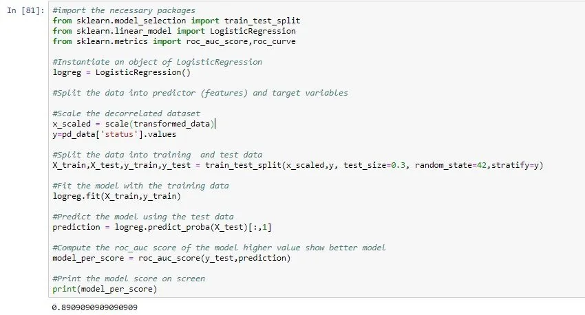

And this score prompted me to check the performance of the model on un-scaled data with correlated features. Unsurprisingly, as expected the model performance score was 0.8621 (86.21%).

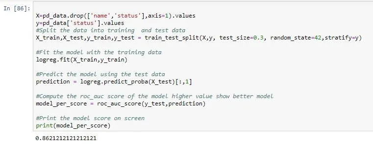

Then the model was hyper tune using the GridSearchCV module from sklearn library. The focal parameters were 'C' and 'penalty', which were given the options of -5,8,15 and “l1” & “l2” respectively. The options for the 'C' parameter was coded with the help of numpy’s logspace method (i.e. np.logspace()). The best parameters were C – 0.4394 and penalty – “l1” with the score of 0.8256 (82.56%) for modified data set (i.e. scaled and de-correlated).

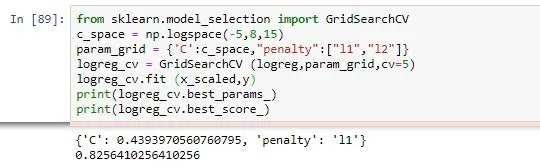

Whiles the unmodified data set best parameters were C – 0.4394 and penalty – “l2” with the score of 0.8153 (81.53%).

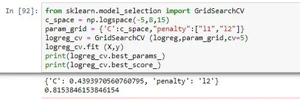

Then the hyper tuned model now performed better for the modified data, thus 0.8955 (89.55%) with parameters, C – 0.4394 and penalty – “l1” but surprisingly that of the unmodified data reduced to 0.8530 (85.30%) with parameters, C – 0.4394 and penalty – “l2” from 0.8621 (86.21%).

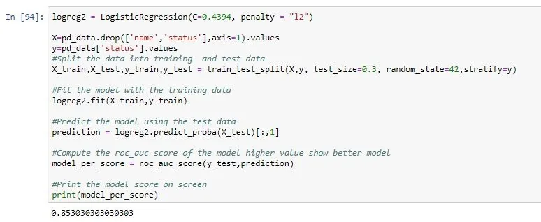

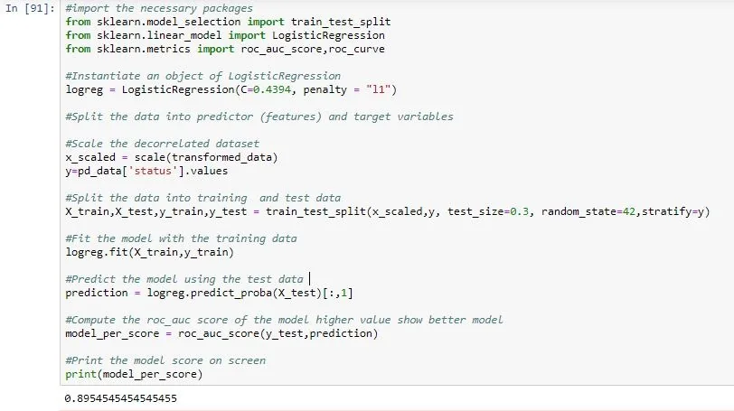

Meanwhile, if the penalty parameter for the unmodified data is also set to ‘l1’ the model saw an increase in performance to 86.36% from 86.21%.

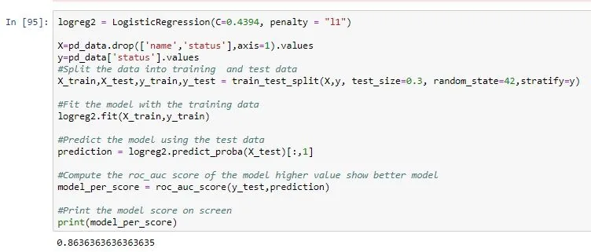

More surprisingly thing that got me was changing the only the penalty parameter of the model to “l2” on the modified data and guess what the model performance is now 0.9 (90%).

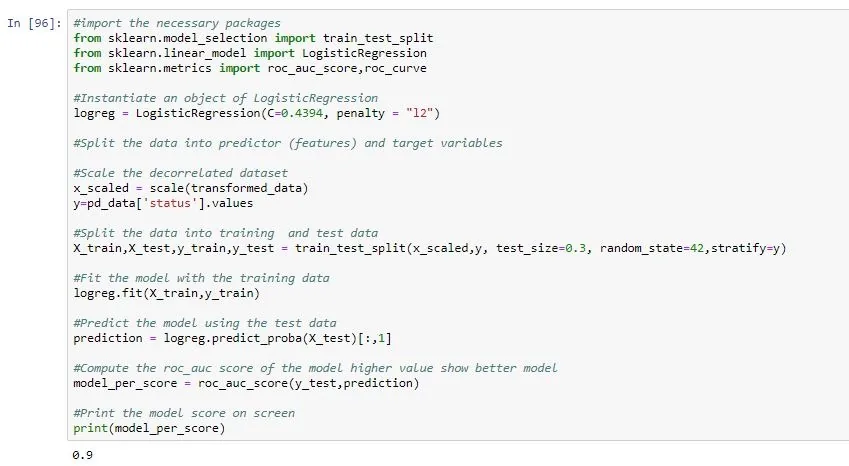

Lastly, the model achieved 0.81 on cross validation performance measure which is good indication for the model’s ability to generalize to unseen data.

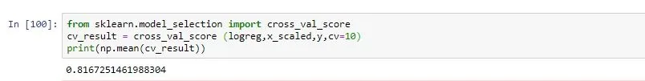

**FINDINGS**

The following were the findings of the analysis and model building on the data set:

1. Some features in the data set correlates especially fundamental frequency perturbations and noise-to-harmonics ratio have high values for Pearson Correlation coefficient greater than 0.9. MDVP:RAP and MDVP:Jitter(%), Jitter:DDP and MDVP:RAP, and Shimmer:APQ3 and MDVP:Shimmer are the most correlated features (Pearson correlation coefficient > 0.987). But others do not correlate.

2. Feature ‘spread1’ (Two nonlinear measures of fundamental)' and 'PPE (Pitch period entropy)' correlates with the target variable.

3. Scaling and de-correlating the data set improve the performance of the model significantly.

4. For this data set to be approximated well, only five features is required if and only if the data is scaled and de-correlated.

5. The most important feature in the data set for predicting Parkinson’s disease is the MDVP:Fhi(Hz) - Maximum vocal fundamental frequency.

6. The model perform better with parameters C= 0.4394 and penalty = 'l2'

**RECOMMENDATIONS**

From the analysis and the development of the model, is recommended that:

1. Before the data-set is used to build any machine learning model, it must be scaled, standardized or normalized since without these would affect the model performance.

2. If one wants to reduce the number of features and still approximate the data set well, they should consider five features.

3. Correlating features must be de-correlated before a machine learning model is built because correlated features affect model performance.

4. The best parameters for LogisticRegression model on this data set is C=0.4394 and penalty = 'l2'

**LIST OF REFERENCES**

Yunfeng Wu, Pinnan Chen, Yuchen Yao, Xiaoquan Ye, Yugui Xiao, Lifang Liao, Meihong Wu, and Jian Chen (2017). Dysphonic Voice Pattern Analysis of Patients in Parkinson’s Disease Using Minimum Interclass Probability Risk Feature Selection and Bagging Ensemble Learning Methods*. Computational and Mathematical Methods in Medicine* Volume 2017, Article ID 4201984, 11 pages <https://doi.org/10.1155/2017/4201984>

<https://archive.ics.uci.edu/ml/datasets/Parkinsons>

Data Insight - Data Scientist Program, 2020. Project: Predicting Neurodegenerative diseases.
