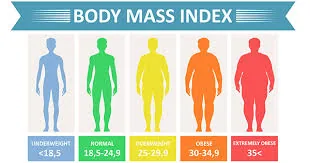

**Introduction**

**Body mass index** (**BMI**) is a value derived from the mass (weight) and height of a person. The BMI is defined as the body mass divided by the square of the body height , and is expressed in units of kg/m2, resulting from mass in kilograms and height in meters.

**BMI Categories:** The BMI is a convenient used to broadly categorize a person as *underweight*, *normal weight*, *overweight*, or *obese* based on tissue mass (muscle, fat, and bone) and height. Major adult BMI classifications are underweight (under 18.5 kg/m2), normal weight (18.5 to 24.9), overweight (25 to 29.9), and obese (30 or more)

**Python Program to calculate BMI**

**Firstly,** you have to enter your weight in kilograms and your height in meters.

```python
weight = float(input("please enter your weight in kilograms "))
height = float(input("please enter your height in meters "))
```

**Then**, calculate the BMI from the formula:

```python
BMI = weight /(height**2)
```

**Finally**, calculate your BMI and show your BMI category.

```python
# Conditions to find out BMI category
if BMI <= 18.5:
    print("Your BMI is", BMI,"You are underweight")
elif (BMI>= 18.5 and BMI < 24.9):
    print("Your BMI is",BMI,"You are healthy")

elif ( BMI >= 24.9 and BMI < 30):
    print( "Your BMI is",BMI," You are overweight")

elif ( BMI >=30):
    print("Your BMI is" ,BMI,"You are Suffering from Obesity")
```

**Example of the output of the program:**

```python
please enter your weight in kilograms 55
please enter your height in meters 1.5
Your BMI is 24.444444444444443 You are healthy
```
