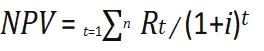
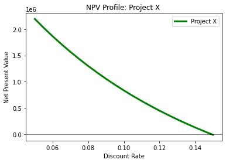

[**What Is Net Present Value (NPV)?**](https://www.investopedia.com/terms/n/npv.asp)

- Net present value, or NPV, is used to calculate the current total value of a future stream of payments.
- If the NPV of a project or investment is positive, it means that the discounted present value of all future cash flows related to that project or investment will be positive, and therefore attractive.
- To calculate NPV, you need to estimate future cash flows for each period and determine the correct discount rate.

[**Net Present Value (NPV) Formula**](https://www.investopedia.com/terms/n/npv.asp#:~:text=Net%20Present%20Value%20(NPV)%20Formula)



**where:**

*R**t* = Net cash inflow/outflows during a single period

*t**i* = Discount rate/return that could be earned in alternative investments

*t* = Number of timer periods

## Calculating NPV with Python

let us consider project (**X**) with following specifications:

life time = 15 years

initail investments = 2000000 $

final project value = 1000000 $

project_cash_flow = [ - 2000000, 0 , 0 , 250000, 250000, 500000, 500000, 750000, 750000, 500000, 500000, 500000, 500000, 500000, 1000000]

discount_rate = [0.05, 0.055, 0.06, 0.065, 0.07, 0.075, 0.08, 0.085, 0.09, 0.095, 0.1, 0.105, 0.11, 0.115, 0.12, 0.125, 0.13, 0.135, 0.14, 0.145, 0.15]

we decide to perform a Net Present Value (NPV) analysis to determine the profitability of the project

##### Importing the python packages
```python
import matplotlib.pyplot as plt
import matplotlib.pyplot as plt​
```

**Input Data**

```python
project_cash_flow= [-2000000, 0, 0, 250000, 250000, 500000, 500000, 750000, 750000, 500000, 500000, 500000, 500000, 500000, 1000000]

discount_rate = [0.05, 0.055, 0.06, 0.065, 0.07, 0.075, 0.08, 0.085, 0.09, 0.095, 0.1, 0.105, 0.11, 0.115, 0.12, 0.125, 0.13, 0.135, 0.14, 0.145, 0.15]
```

**Function to calculate NPV**

```python
def calculate_npv(rate, cash_flow):
    npv = 0
    for t in range(len(cash_flow)):
        npv += cash_flow[t]/(1+rate)**t
    return npv

npvs_a = list()
for rate in discount_rate:
  npv_a = calculate_npv(rate,project_a)
  npvs_a.append(npv_a)
```

**Graphical Representation**

```python
plt.plot(discount_rate,npvs_a, linewidth = 3.0, color = "green", label = "Project X")
plt.axhline(y=0, linewidth = 0.5, color = "black")
plt.title('NPV Profile: Project X')
plt.xlabel('Discount Rate')
plt.ylabel('Net Present Value')
plt.legend()
plt.show()
```

**Output Graph**


