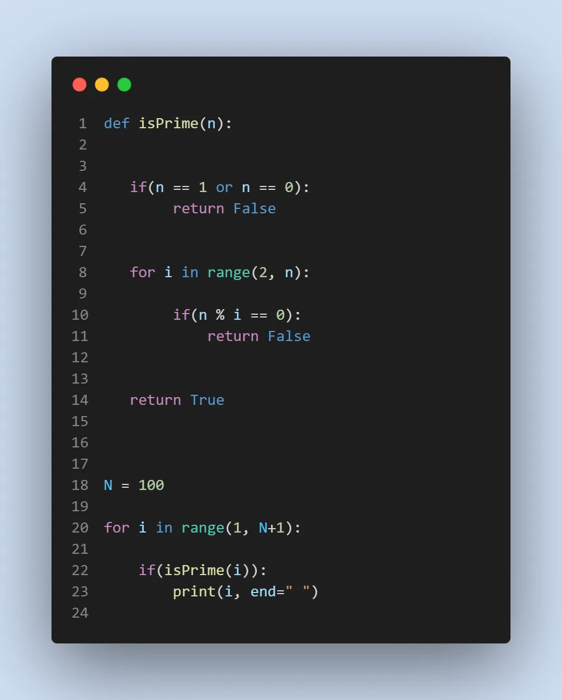
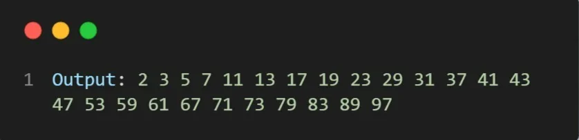

[#prime](https://www.datainsightonline.com/blog/hashtags/prime) [#from1toN](https://www.datainsightonline.com/blog/hashtags/from1toN) [#python](https://www.datainsightonline.com/blog/hashtags/python)

**Given a number** ***N*****, the task is to print the prime numbers** ***from 1 to N.***

**Examples:**

```python
Input: N = 10
Output: 2, 3, 5, 7
```

**Algorithm ( Steps):**

- First, take the number N as input.
- Then use a for loop to iterate the numbers from 1 to N
- Then check for each number to be a prime number. If it is a prime number, print it

**Approach:** *Now, according to* the *formal definition, a number ‘n’ is prime if it is not divisible by any number other than 1 and n. In other words, a number is prime if it is not divisible by any number from 2 to n-1*

**Implementation:**

1. Create a function called **isPrime** that takes a parameter **n**

def isPrime(n):

2. Since **0 and 1** is not prime return **false**

if(n == 1 or n == 0):
  return False

3. Run a loop from **2 to n-1,** if the number is divisible by **i**,
 then **n** is **not a prime number**.

for i in range(2, n):

   if(n % i == 0):
   return False

4. otherwise, **n** **is prime number.**

```python
            return True
```

***The function is created.....***

5. Take an N numbers.

N = 100

6. check for every number from 1 to N

```python
     for i in range(1, N+1):
```

7.  check if the current number is prime and print it.

```python
	    if(isPrime(i)):
             print(i, end=" ")
```

**Source Code:**

[Github](https://github.com/amrahmed-swe/DataInsight_Assignments/blob/main/Prime.py)

**Code:**



**Output:**


