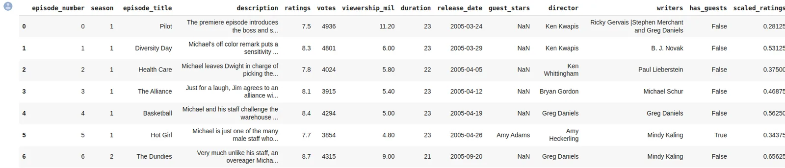
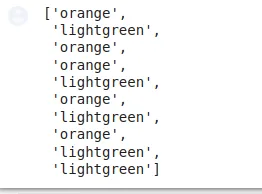
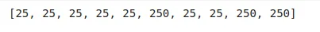
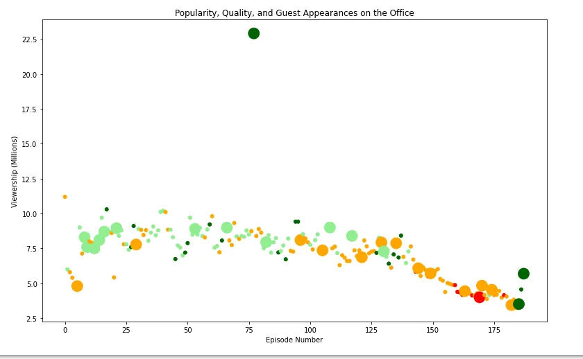

In this project, we will take a look at a dataset of The Office episodes, and try to understand how the popularity and quality of the series varied over time.

To do so, we will use the following dataset: datasets/office_episodes.csv, which was downloaded from Kaggle [here](https://www.kaggle.com/nehaprabhavalkar/the-office-dataset).

This dataset contains information on a variety of characteristics of each episode. In detail, these are:

**datasets/office_episodes.csv**

- **episode_number:** Canonical episode number.
- **season:** Season in which the episode appeared.
- **episode_title:** Title of the episode.
- **description:** Description of the episode.
- **ratings:** Average IMDB rating.
- **votes:** Number of votes.
- **viewership_mil:** Number of US viewers in millions.
- **duration:** Duration in number of minutes.
- **release_date:** Airdate.
- **guest_stars:** Guest stars in the episode (if any).
- **director:** Director of the episode.
- **writers:** Writers of the episode.
- **has_guests:** True/False column for whether the episode contained guest stars.
- **scaled_ratings:** The ratings scaled from 0 (worst-reviewed) to 1 (best-reviewed).

We will start by reading our data and explore it

# Read in the CSV as a DataFrame
import pandas as pd
office_episodes = pd.read_csv("datasets/office_episodes.csv")

# Print the first ten rows of the DataFrame
office_episodes[:10]

The output will be like the following

**Task 1 :**

Create a matplotlib **scatter plot** of the data that contains the following attributes:

- Each episode's **episode number plotted along the x-axis**
- Each episode's **viewership (in millions) plotted along the y-axis**
- A **color scheme** reflecting the **scaled ratings** (not the regular ratings) of each episode, such that:

  - Ratings < 0.25 are colored "red"
  - Ratings >= 0.25 and < 0.50 are colored "orange"
  - Ratings >= 0.50 and < 0.75 are colored "lightgreen"
  - Ratings >= 0.75 are colored "darkgreen"

- A **sizing system**, such that episodes with guest appearances have a marker size of 250 and episodes without are sized 25
- A **title**, reading "Popularity, Quality, and Guest Appearances on the Office"
- An **x-axis label** reading "Episode Number"
- A **y-axis label** reading "Viewership (Millions)"

# Create a color_scheme list
colors = []

# Iterate over rows of office_episodes to input color name to the colors list
for lab, row in office_episodes.iterrows():
 if row['scaled_ratings'] < 0.25:
 colors.append("red")
 elif 0.25 <= row['scaled_ratings'] < 0.50:
 colors.append("orange")
 elif 0.50 <= row['scaled_ratings'] < 0.75:
 colors.append("lightgreen")
 else:
 colors.append("darkgreen")
The output will be like that:

# Inspect the first 10 values in the list
colors[:10]

# Create a sizing system:
# episodes with guest appearances have a marker size of 250
# episodes without are sized 25

sizes = []

for lab, row in office_episodes.iterrows():
 if row['has_guests'] == True:
 sizes.append(250)
 else:
 sizes.append(25)

# Inspect the first 10 values in the list
sizes[:10]

The output will be like that:

# Import matplotlib.pyplot under its usual alias and create a figure
import matplotlib.pyplot as plt
fig = plt.figure(figsize=(11,7))

# Create a scatter plot
plt.scatter(office_episodes["episode_number"], office_episodes["viewership_mil"], c = colors, s = sizes)

# Create a title
plt.title('Popularity, Quality, and Guest Appearances on the Office')

# Create an x-axis and an y-axis
plt.xlabel('Episode Number')
plt.ylabel('Viewership (Millions)')

# Show the plot
plt.show()

The output will be like that:

**Task 2 :**

Provide the name of one of the guest stars (hint, there were multiple!) who was in the most watched Office episode. Save it as a string in the variable top_star (e.g. top_star = "Will Ferrell").

# The highest view
highest_view = max(office_episodes["viewership_mil"])

# Filter the Dataframe row that has the most watched episode
most_watched_dataframe = office_episodes.loc[office_episodes["viewership_mil"] == highest_view]

# Top guest stars that were in that episode
top_stars = most_watched_dataframe[["guest_stars"]]
top_stars

The output will be like that:

Save it as a string in the variable top_star

top_star = 'Jack Black'

Please refer to the complete code from [here](https://github.com/MarehanRefaat/Data-Insights/blob/main/Projects/Investigating%20Netflix%20Movies%20and%20Guest%20Stars%20in%20The%20Office.ipynb)
