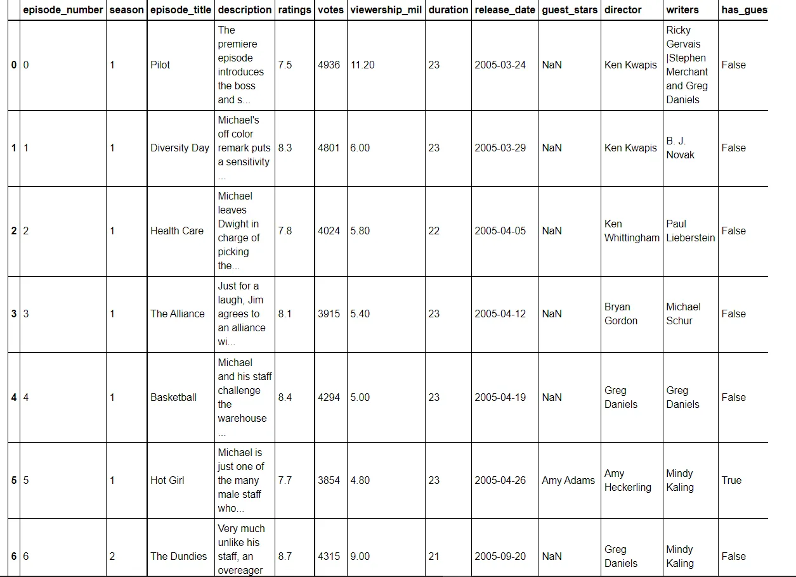
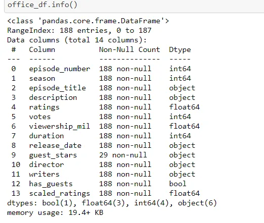
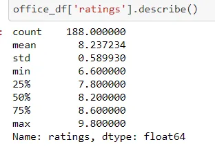
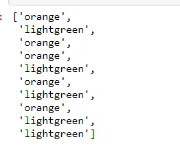
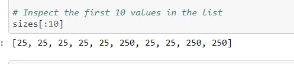
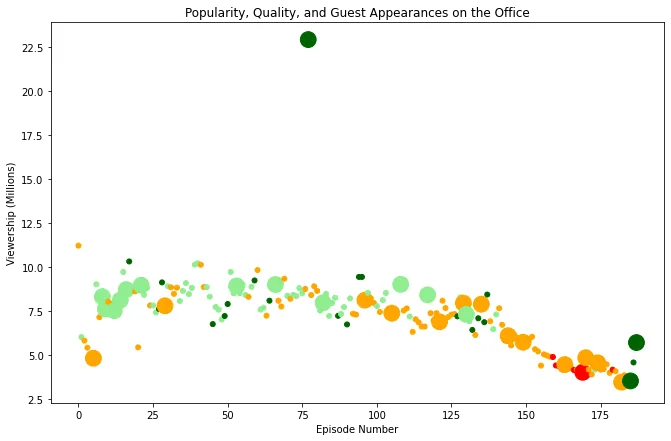

**The Office!** is an American mockumentary sitcom television series that depicts the everyday work lives of office employees in the Scranton, Pennsylvania, branch of the fictional Dunder Mifflin Paper Company. It has ten different variants across the world, including an Israeli version (2010-13), a Hindi version (2019-), and even a French Canadian variant (2006-2007). Of all these iterations (including the original), the American series has been the longest-running, spanning 201 episodes over nine seasons.

In this project, we will take a look at a dataset of The Office episodes, and try to understand how the popularity and quality of the series varied over time. To do so, we will use the following dataset:

datasets/office_episodes.csv, which was downloaded from Kaggle [here](https://www.kaggle.com/nehaprabhavalkar/the-office-dataset).

This dataset contains information on a variety of characteristics of each episode. In detail, these are:

**datasets/office_episodes.csv**

- **episode_number:** Canonical episode number.
- **season:** Season in which the episode appeared.
- **episode_title:** Title of the episode.
- **description:** Description of the episode.
- **ratings:** Average IMDB rating.
- **votes:** Number of votes.
- **viewership_mil:** Number of US viewers in millions.
- **duration:** Duration in number of minutes.
- **release_date:** Airdate.
- **guest_stars:** Guest stars in the episode (if any).
- **director:** Director of the episode.
- **writers:** Writers of the episode.
- **has_guests:** True/False column for whether the episode contained guest stars.
- **scaled_ratings:** The ratings scaled from 0 (worst-reviewed) to 1 (best-reviewed).


## Reading the Dataset and Importing Libraries

#### Step 1 [Code and Output]: Importing Dataset and** **Reading First Ten DataFrame
Importing all the required libraries which are used for training and visualization. For this project we will be importing two libraries pandas and matplotlib.

```python
# Use this cell to begin your analysis, and add as many as you would like!
import pandas as pd
import matplotlib.pyplot as plt

#To see the large view of the data
plt.rcParams['figure.figsize'] = [11, 7]

# Read data from CSV
office_df = pd.read_csv('datasets/office_episodes.csv')

# Print the first ten rows of the DataFrame
office_df.head(10)
```



##### About Dataset
The office episodes dataset which consists of 12 columns and 188 rows scrapped from IMDB. And we have to check how guest star appearances affected the episodes viewership.


***The Office aired on NBC from March 24, 2005, to May 16, 2013, spanning a total of nine seasons.***

***[Reference: Click here*** <https://en.wikipedia.org/wiki/The_Office_%28U.S._TV_series%29>***]***

## Explanatory Data Analysis(EDA)

In EDA, we summarize the main characteristics of the dataset. In this project we will preform not null analysis,check data type of the columns and see the basic statistical value of the column 'rating'.

#### Step 2 [Code and Output] : Check for Null Value and Data Type
```python
# verify that data is imported with valid dtypes and check non-null values
office_df.info()
```



Here, we can see that there is no null value and there is total 14 columns.

Now, we will see the statistical value i.e. mean, median, standard deviation of the column 'rating'.

#### Step 3 [Code and Output]: Statistical Value of the Column Rating.
```python
#Check some basic statistical details
office_df['ratings'].describe()
```



Here, we can see that the column rating had 188 rows.

#### Step 4 [Code and Output]: Based on Scaled Rating, Defining color** **Schema
```python
# Define color for each value based on scaled rating to visualize it
cols=[]
for ind,row in office_df.iterrows():
    if row['scaled_ratings']<0.25:
         cols.append('red')
    elif row['scaled_ratings']<0.50:
         cols.append('orange')
    elif row['scaled_ratings']<0.75:
         cols.append('lightgreen')
    else:
         cols.append('darkgreen')

    # Inspect the first 10 values in the list
    cols[:10]
```



Here, we can the first 10 values color schema. In this project, we will be creating a scatter plot of the data that contains specified attributes, so to make the visual more understandable we have defined the color schema.

For each episode a color scheme reflecting the scaled ratings is defined as follows:

- Red- if the scaled ratings are less than 0.25
- Orange- if the scaled ratings are more than 0.25 and less than 0.5
- Light Green- if the scaled ratings are more than 0.5 and less than 0.75
- Dark Green- if the scaled ratings are more than 0.75

#### Step 5 [Code and Output]: Marking the Guest Appearance and** **Non-Guest Appearance
```python
#Specifying a list so the visualization shows a larger size for episodes in which there were guests
sizes=[]
for ind,row in office_df.iterrows():
     if row['has_guests']==False:
        sizes.append(25)
     else:
        sizes.append(250)

# Inspect the first 10 values in the list
sizes[:10]
```



Here, we have marked the episodes with guest appearances and non-guest appearance. The episodes with guest is marked with the size of 250 and episodes without guest is marked with the size of 25.

#### Step 6 [Code and Output] : Checking the columns cols and sizes
```python
office_df['colors'] = cols
office_df['sizes'] = sizes

office_df.info()
```


Here, we had defined two columns cols an sizes in step 3 and 4 respectively. In this step we check the data type(Dtype) of cols and sizes which is object and int64 respectively.

#### Step 7 [Code and Output] : Plotting the Number of Viewers(in** **millions) of each episode
```python
#Only guest star apperances and non-guest star apperances
non_guest_df = office_df[office_df['has_guests'] == False]
guest_df = office_df[office_df['has_guests'] == True]
```

```python
#Plotting number of viwers in million per eposide numberfig = plt.figure()

# Create a scatter plot
plt.scatter(x=office_df['episode_number'],
            y=office_df['viewership_mil'],
            c= cols,
            s= sizes)

# Create a title
plt.title("Popularity, Quality, and Guest Appearances on the Office")

# Create an x-axis and an y-axis
plt.xlabel("Episode Number")
plt.ylabel("Viewership (Millions)")

# Show the plot
plt.show()
```



#### Step 8 [Code and Output] :Plotting Guest Appearance in Different** **Episodes
```python
# Plotting non-guest starring episodes datafig = plt.figure()
 plt.scatter(x=non_guest_df['episode_number'],
             y=non_guest_df['viewership_mil'],
             c= non_guest_df['colors'],
             s= non_guest_df['sizes'])

# Plotting guest starring episodes data
plt.scatter(x= guest_df['episode_number'],
            y= guest_df['viewership_mil'],
            c=  guest_df['colors'],
            s= guest_df['sizes'],
            marker = '*')

# Create a title
plt.title("Popularity, Quality, and Guest Appearances on the Office")

# Create an x-axis and an y-axis
plt.xlabel("Episode Number")
plt.ylabel("Viewership (Millions)")

# Show the plot
plt.show()
```


Here, we have plotted guest appearance and non guest appearance in the different episodes. To make the plot more understandable the guest starrer episodes are represented by a star('\*').

#### Step 9 [Code and Output] :Guest in Different Episode
```python
# The highest view
highest_view = max(office_df["viewership_mil"])

# Filter the Dataframe row that has the most watched episode
most_watched_dataframe = office_df.loc[office_df["viewership_mil"] == highest_view]

# Top guest stars that were in that episodetop_stars = most_watched_dataframe[["guest_stars"]]top_stars
```


To end our analysis and deliver the conclusion we obtain a list of the guest stars who brought in the maximum viewership by appearing in an episode.

Hence we can conclude that most of the episodes with guest stars had a good rating for most of the episodes, however, some of them had a significantly good rating. Still there are quite a few episodes with just a safe rating even with guest stars appearing in them. An observation which is quite noticeable is the episode with viewership of more than 22.5 million, it might seem like an outlier caused by inconsistency in the data but it is in fact accurate.

Let's revise what we did:

1. Read a CSV file as DataFrame.
2. Inspected the resulting DataFrame.
3. Generated a series of plot, increasing complexity.
4. Used a combination of lists and for loops to generate a series of colors and sizes for plot.
5. Explored customization options such as marker and plot labels.
6. Used plot to explore interesting data points.

Some interesting fact of The Office:

- The Office was by far the most popular show to stream on **Netflix** in **2018**. Viewers spent **52.1 billion** minutes streaming the completed NBC series.
- The cast and crew always wrote and shot more footage than they needed to. Many of the episodes could have been hour long.
- The original name for the show was *The American Workplace*. The documentary version of the show that comes out in the final is season is named *The Office: An American Workplace* as an homage.

[**Reference : Click here** <https://www.buzzfeed.com/hattiesoykan/facts-you-might-not-know-about-the-office>]

Well...that wasn't long!!!


Hope you enjoy reading. Thank You.

Link to the GitHub repository is [here](https://github.com/Tanushree28/Data-Insight-s-Data-Scientist-Program-2021/tree/master/The%20Office%20DataCamp%20Project). [Data-Insight-s-Data-Scientist-Program-2021/The Office DataCamp Project at master · Tanushree28/Data-Insight-s-Data-Scientist-Program-2021 (github.com)](https://github.com/Tanushree28/Data-Insight-s-Data-Scientist-Program-2021/tree/master/The%20Office%20DataCamp%20Project)

Regards,

Tanushree Nepal
