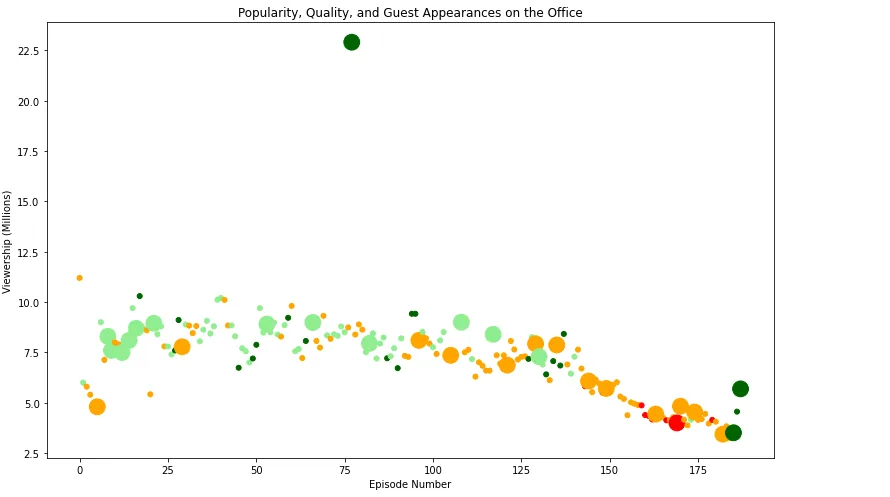

In this blog, I will show a tutorial on how to analyze data related to the known show "The Office" episodes.

First, I read the CSV and shows its info

```python
# Use this cell to begin your analysis, and add as many as you would like!
import pandas as pd
import matplotlib.pyplot as plt
plt.rcParams['figure.figsize'] = [11, 7]
office_df= pd.read_csv("datasets/office_episodes.csv")
office_df.head()
office_df.info()
```


Second, I create a matplotlib scatter plot for the data that contains specified attributes.

Therefore, for each episode a color scheme reflecting the scaled ratings :

- **Ratings < 0.25 are colored "red"**
- **Ratings >= 0.25 and < 0.50 are colored "orange"**
- **Ratings >= 0.50 and < 0.75 are colored "lightgreen"**
- **Ratings >= 0.75 are colored "darkgreen"**

```python
cols = []for ind,row in office_df.iterrows():if row["scaled_ratings"] < 0.25:cols.append("red")elif row["scaled_ratings"] < 0.50:cols.append("orange")elif  row["scaled_ratings"] <0.75:cols.append("lightgreen")else:cols.append("darkgreen")print(cols )
```

Third, I made a sizing system with a marker size **of 250 and episodes without are sized 25.**

```python
sizes = []
for ind,row in office_df.iterrows():
if row["has_guests"] == False :
sizes.append(25)
else:sizes.append(250)
print(sizes )
```

Then, I plot it with :

- A **title**, reading "Popularity, Quality, and Guest Appearances on the Office"
- An **x-axis label** reading "Episode Number"
- A **y-axis label** reading "Viewership (Millions)"

```python
fig = plt.figure()
plt.scatter(x = office_df["episode_number"], y = office_df["viewership_mil"], c = cols, s=sizes)
plt.title("Popularity, Quality, and Guest Appearances on the Office")
plt.xlabel("Episode Number")
plt.ylabel("Viewership (Millions)")
plt.show()
```



Finally, to show the most-watched Office episode :

```python
office_df[office_df["viewership_mil"] > 20]["guest_stars"]
```


