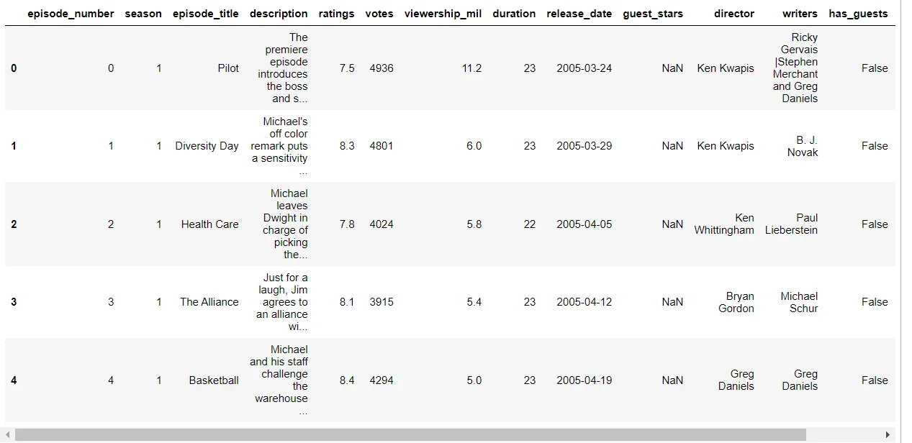
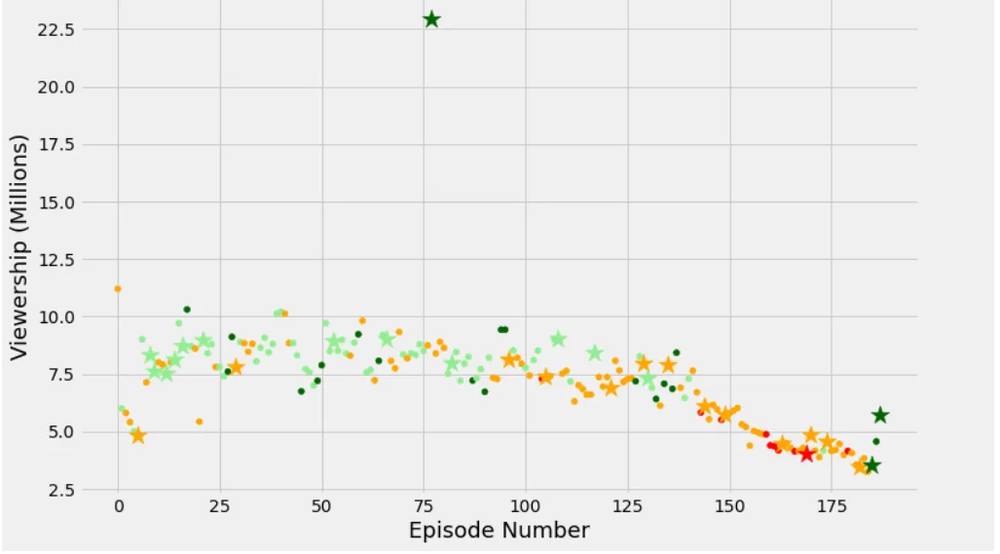

It's The Office! What began in 2001 as a British mockumentary series on office culture has subsequently spawned eleven different variants worldwide, including an Israeli version (2010-13), a Hindi version (2019-), and even a French Canadian variety (2006-2007). The American version has been the longest-running of all these adaptations (including the original), reaching 201 episodes over nine seasons.

In this notebook, we'll explore a dataset of The Office episodes to see how the show's popularity and quality changed over time. To do so, we'll utilize the dataset datasets/office episodes.csv, which can be found on Kaggle [here](https://www.kaggle.com/nehaprabhavalkar/the-office-dataset).

**datasets/office_episodes.csv**

- **episode_number:** Canonical episode number.
- **season:** Season in which the episode appeared.
- **episode_title:** Title of the episode.
- **description:** Description of the episode.
- **ratings:** Average IMDB rating.
- **votes:** Number of votes.
- **viewership_mil:** Number of US viewers in millions.
- **duration:** Duration in a number of minutes.
- **release_date:** Airdate.
- **guest_stars:** Guest stars in the episode (if any).
- **director:** Director of the episode.
- **writers:** Writers of the episode.
- **has_guests:** True/False column for whether the episode contained guest stars.
- **scaled_ratings:** The ratings scaled from 0 (worst-reviewed) to 1 (best-reviewed).

first I have to import the required libraries.

```python
%matplotlib inline
import pandas as pd
import matplotlib.pyplot as plt
```

**Read the CSV file**

```python
office_df = pd.read_csv('datasets/office_episodes.csv', parse_dates=['release_date'])
office_df.head(5)
```

These are some values of the dataset.



**Data Preprocessing**

Then I initialized two empty lists, and iterate through the DataFrame, and assign colours based on the rating.

```python
for ind, row in office_df.iterrows():
    if row['scaled_ratings'] < 0.25:
        cols.append('red')
    elif row['scaled_ratings'] < 0.50:
        cols.append('orange')
    elif row['scaled_ratings'] < 0.75:
        cols.append('lightgreen')
    else:
        cols.append('darkgreen')
```

then, I Iterated through the DataFrame, and assign a size based on whether it has guests

```python
for ind, row in office_df.iterrows():
    if row['has_guests'] == False:
        sizes.append(25)
    else:
        sizes.append(250)

# For ease of plotting, add our lists as columns to the DataFrame
office_df['colors'] = cols
office_df['sizes'] = sizes
```

In order to do that, I split the data into guest and non-guest data frames

using shown in the below code.

```python
non_guest_df = office_df[office_df['has_guests'] == False]
guest_df = office_df[office_df['has_guests'] == True]
```

after that, I created the two scatter plots with the episode number on the x-axis and the viewership on the y axis. first, a normal scatter plot for regular episodes are created. after that, a starred scatterplot for guest star episodes is created as shown in the below figure.

```python
plt.scatter(x=non_guest_df.episode_number, y=non_guest_df.viewership_mil, \
c=non_guest_df['colors'], s=25)

plt.scatter(x=guest_df.episode_number, y=guest_df.viewership_mil, c=guest_df['colors'], marker='*', s=250)
```



you can see the source code, [here](https://github.com/arunanuwantha97/Project-Investigating-Netflix-Movies-and-Guest-Stars-in-The-Office)
