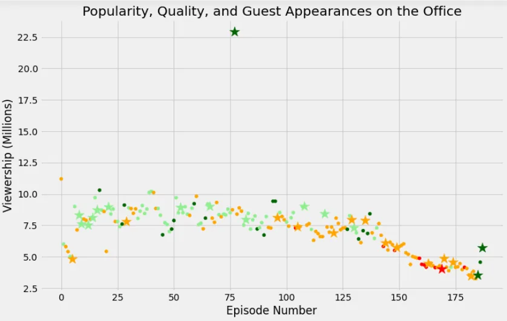

In this project, we will take a look at a dataset of The Office episodes, and try to understand how the popularity and quality of the series varied over time.

To do so, we will use the following dataset: datasets/office_episodes.csv, which was downloaded from kaggle [here](https://www.kaggle.com/nehaprabhavalkar/the-office-dataset).

In first time we must import this two libraries **pandas and matplotlib**

```python
import pandas as pd
import matplotlib.pyplot as plt
```

Now, to get the data and show its summary we use the code below:

```python
plt.rcParams['figure.figsize'] = [11, 7]
office_df = pd.read_csv('datasets/office_episodes.csv')
office_df.head()
```

**Output:**


In this project we want create a matplotlib scatter plot of the data that contains specified attributes, so before creating this nuage we must analyze the data.

for each episode a color scheme reflecting the scaled ratings :

- **Ratings < 0.25 are colored "red"**
- **Ratings >= 0.25 and < 0.50 are colored "orange"**
- **Ratings >= 0.50 and < 0.75 are colored "lightgreen"**
- **Ratings >= 0.75 are colored "darkgreen"**

```python
cols =[]

for ind, row in office_df.iterrows():
    if row['scaled_ratings'] < 0.25:
        cols.append('red')
    elif row['scaled_ratings'] < 0.50:
        cols.append('orange')
    elif row['scaled_ratings'] < 0.75:
        cols.append('lightgreen')
    else:
        cols.append('darkgreen')
cols
```

and a sizing system, such that episodes **with guest appearances have a marker size of 250 and episodes without are sized 25**

```python
sizes = []

for ind, row in office_df.iterrows():
    if row['has_guests'] == False:
        sizes.append(25)
    else:
        sizes.append(250)
sizes
```

Here we define each variable with its informations

```python
office_df['colors'] = cols
office_df['sizes'] = sizes

office_df.info()
non_guest_df = office_df[office_df['has_guests'] == False]
guest_df = office_df[office_df['has_guests'] == True]
```

Now we will plot the figure of the data as below with

- A **title**, reading "Popularity, Quality, and Guest Appearances on the Office"
- An **x-axis label** reading "Episode Number"
- A **y-axis label** reading "Viewership (Millions)"

```python
fig = plt.figure()
plt.style.use('fivethirtyeight')
plt.scatter(x= non_guest_df['episode_number'],
            y= non_guest_df['viewership_mil'],
            c=non_guest_df['colors'],
            s=non_guest_df['sizes']
           )

plt.scatter(x= guest_df['episode_number'],
            y= guest_df['viewership_mil'],
            c= guest_df['colors'],
            s= guest_df['sizes'],
            marker ="*"
           )

plt.title("Popularity, Quality, and Guest Appearances on the Office")
plt.xlabel("Episode Number")
plt.ylabel("Viewership (Millions)")
plt.show()
```



Finally, to show the most-watched Office episode we can use this code:

```python
office_df[office_df['viewership_mil'] == office_df['viewership_mil'].max()]['guest_stars']
```

**The result:**


Thank you for regarding!

You can find the complete source code here [Github](https://github.com/rabebbenothmen/Data-Insight2021/tree/main/Projects/3-Investigating%20Netflix%20Movies%20and%20Guest%20Stars%20in%20The%20Office)
