In this post, I explain my analyses of NAICS datasets.

The North American Industry Classification System

known as NAICS, an industry classification system.

IT is invented to provide solid definitions of the industrial structure of the United States, Mexico, and Canada and offer a common statistical framework to facilitate the analysis of the there economies.

First, I start by importing the Data_Output_Template file and LMO_Detailed_Industries_by_NAICS file.

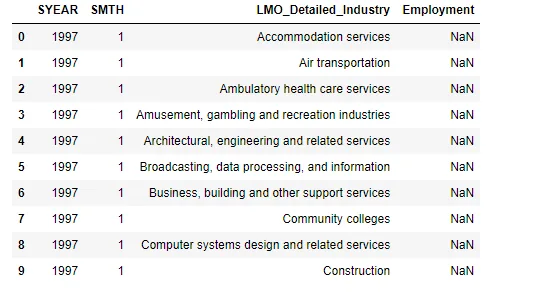

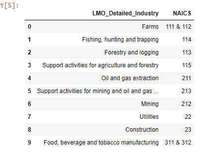

I see that this data need to be cleared and prepared for better analyze.

1. **Prepare Data**

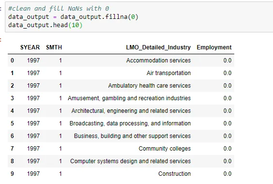

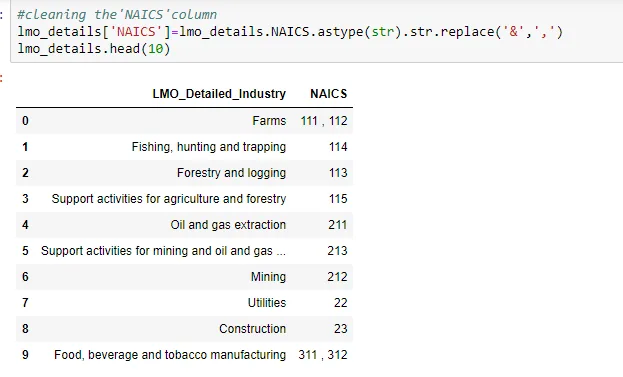

After clearing and organizing the data sets, I create new column in data_output and set column dtype as str.

```python
data_output["NAICS"] = ""
lmo_details["NAICS"] = lmo_details["NAICS"].astype(str)
```

Get a list of industries from data_output and also get NAICS codes from lmo_details and append to exact row in data_output

```python
#get NAICS codes from lmo_details and append to exact row in data_output
for industry in data_output_lmo_industries:
    #checks if any of the rows of the series has a true value, if true, then set that row value with the NAICS code
    if(lmo_details["LMO_Detailed_Industry"].isin([industry]).any()):
        data_output.loc[data_output["LMO_Detailed_Industry"] == industry, ["NAICS"]] \
        = lmo_details.loc[lmo_details["LMO_Detailed_Industry"] == industry, ["NAICS"]].values
```

Then, I made a list of RTRA Employment files from 1997 - 2018 and make sure to convert Employment column of data_output to type int64.

after preparing the data, now it is ready to get analysed.

I tried to answer the following questions:

1. How has construction evolved overtime?
2. compare the total employment rate of the industries against the construction industry
3. employment wise top 10 Industries.
4. How has the employment of Food services and drinking places staffs evolved over time?
5. How employment of Food services and drinking places has evolved over time, compared to the total employment across all industries?
6. How has employment in the construction industry and that of the Food services and drinking places evolved over time?

**Analyzing The Data**

1. **How has construction evolved over time?**

starting with slicing the data and getting the row of the construction industry.

```python
construction = data_output.loc[data_output["LMO_Detailed_Industry"] == "Construction"]
construction.info()
```

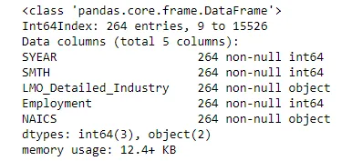

I grouped the construction employments into years and get each year's sum.

```python
construction_employment_by_year = construction.groupby(['SYEAR'])["Employment"].sum()
```

Plot this rate over the years

```python
fig1, ax1 = plt.subplots()
fig1.set_size_inches([20,7])
ax1.plot(construction_employment_by_year.index, construction_employment_by_year.values)
ax1.set_xticks(range(1997, 2019))
fig1.suptitle("Employment rate in the Construction Industry", fontsize=20)
plt.show()
```

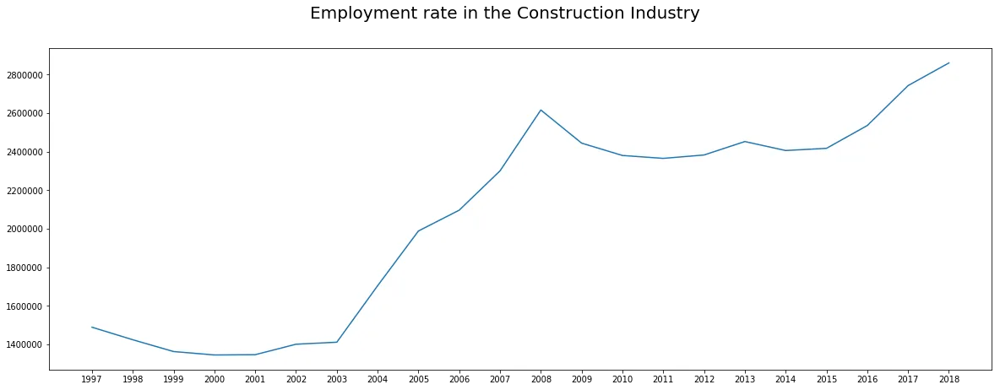

This plot shows that the construction industry gets a highly increased value with a peak in the growth rate from 2003.

**2. compare the total employment rate of the industries against the construction industry**

Fisrt, I start with finding how other industries in total grow and plot it.

```python
other_industriesA = data_output.loc[np.invert(data_output["LMO_Detailed_Industry"] == "Construction")]

#Group other industries employment data into years and get each year's sum
other_industriesA_employment_by_year = other_industriesA.groupby(['SYEAR'])["Employment"].sum()
```

```python
fig2, ax2 = plt.subplots()
fig2.set_size_inches([20,7])
ax2.plot(other_industriesA_employment_by_year.index, other_industriesA_employment_by_year.values)
ax2.set_xticks(range(1997, 2019))
fig2.suptitle("Other Industries employment rate (excluding the Construction industry)", fontsize=20)
plt.show()
```

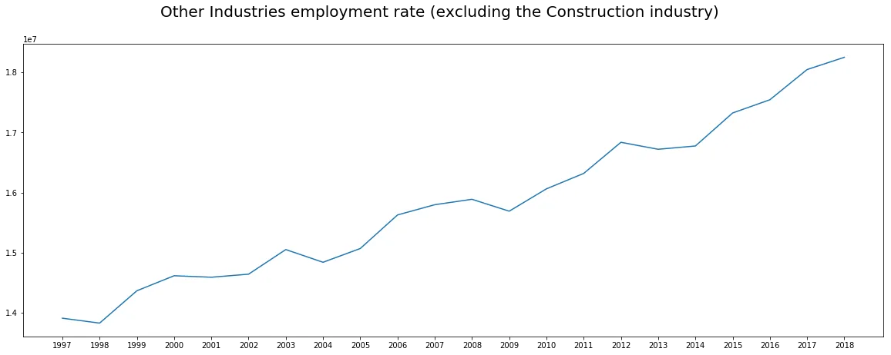

With this plot, we see that the growth in the total of other industries increased as the growth of the construction in dustry.

and plot the result of comparing:

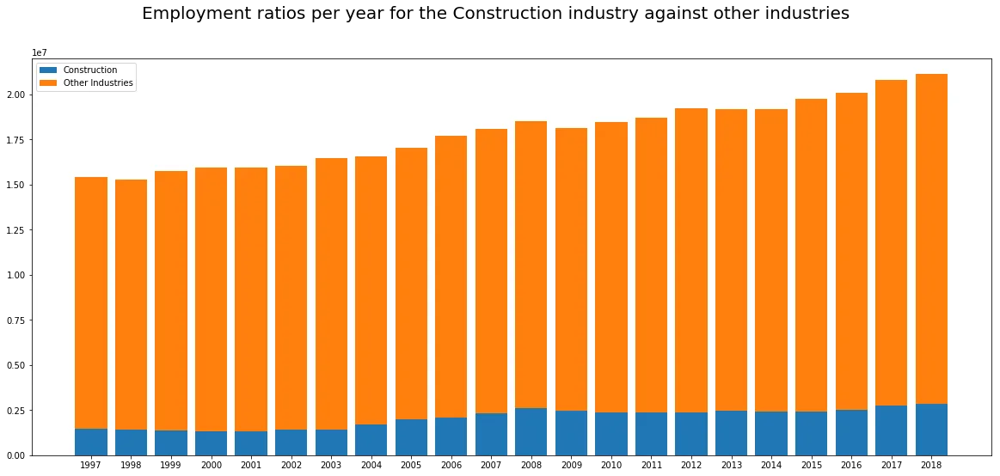

**3. Employment wise top 10 Industries.**

for answering this, I create a data frame with industry wise employment summary and plot an overview of it to see the ranks:

```python
industry_wise_summary.sort_values(ascending=False)[:10].plot(kind='barh')
plt.xlabel("Employment")
plt.title("Employment wise Top 10 Industries Bar plot")
```


And we can see that the construction industry came with the 1st place and the food services and drinking places came in 2nd place .

**4.How has the employment of Food services and drinking places evolved over time**

**T**he same steps as I did it fo the construction questions but in this part I sliced the data related to the Food services and drinking places.

```python
Food_services = data_output.loc[data_output["LMO_Detailed_Industry"] == "Food services and drinking places"]
```

and the results of the growth shown in this figure:

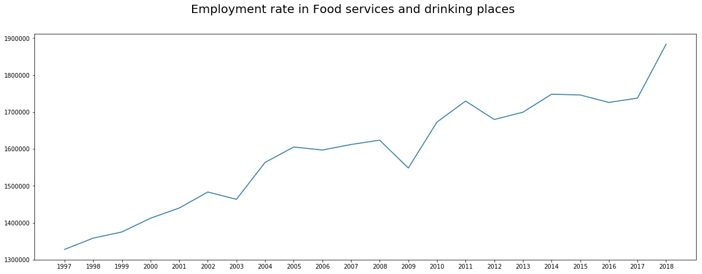

we could say that this field get a peak in 2002 and the get decreased in 2003 and get over times high ups and downs.

5. **compared with other industries?**

and when I compared to other industries I get the following plot:

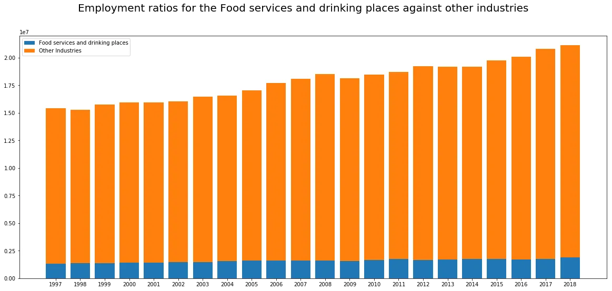

**6.** ***How has employment in the construction industry and that of the Food services and drinking places evolved over time?***

***Comparing the 2*** industries ***in the following code and plot***

```python
fig7, ax7 = plt.subplots(2, 1, sharey=True)
fig7.set_size_inches([20,20])

ax7[0].bar(Food_services_employment_by_year.index, Food_services_employment_by_year.values, label="Food services and drinking places")
ax7[0].bar(construction_employment_by_year.index, construction_employment_by_year.values, label="Construction", bottom=Food_services_employment_by_year.values)
ax7[0].set_xticks(range(1997, 2019))

ax7[1].plot(Food_services_employment_by_year.index, Food_services_employment_by_year.values, label="Food services and drinking places")
ax7[1].plot(construction_employment_by_year.index, construction_employment_by_year.values, label="Construction")
ax7[1].set_xticks(range(1997, 2019))

fig7.suptitle("Employment rate in the Construction industry against Food services and drinking places", fontsize=20)

plt.legend()
plt.show()
```

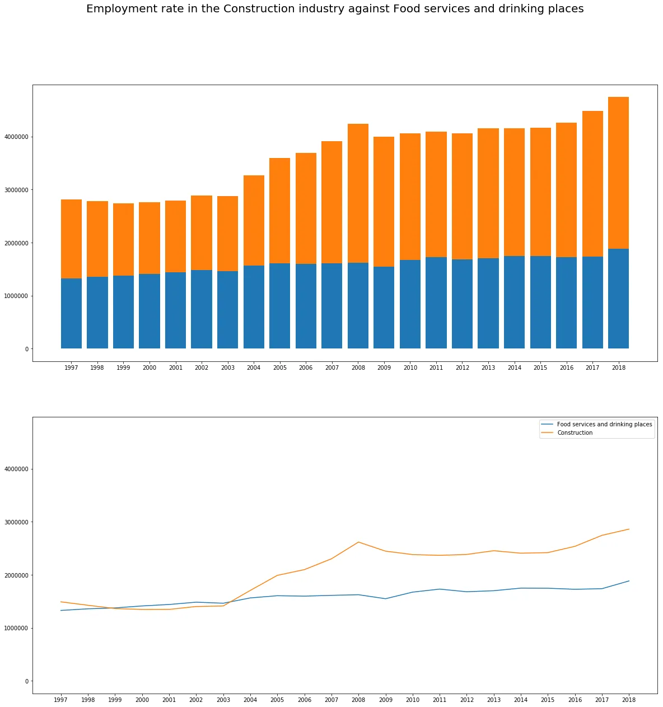

These plots show that the 2 industries were so close to each other from 1997 to 2003, but since 2004 I huge gap of growth started we can clearly see that the construction industry increased with rapidity while the food services and drinking places increased slowly and sometimes it is stable.
