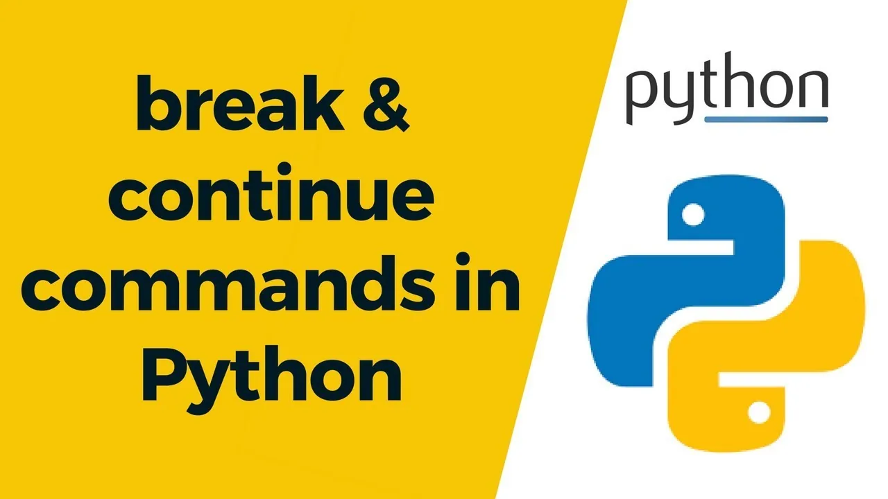

- 

The break and continue statements in python alters the flow of a normal loop.

Example of break state is illustrated below.

Here the program iterates through 'python' sequence, checks the letter 't', when 't' is encountered it breaks from the loop. The letters up till 't' gets printed, after that the loop terminates.

```python
#break statement
#terminates the loop containing it
for val in 'python':
    if val == 't':
        break
    print(val)
print('end')
p
y
end
```

Example of continue statement.

continue statement is used to skip an iteration. Here the program iterates through 'python' sequence, checks for the letter 't', and when 't' is met it skips the letter 't' and continues the loop until the end.

```python
#continue statement
#skips the loop containing it
for val in 'python':
    if val == 't':
        continue
    print(val)
print('end')
p
y
h
o
n
end
```
