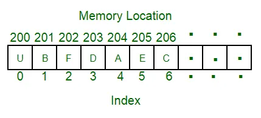

Arrays are Numpy's primary data type. They are a means of storing data of the same type in a particular memory location, such that the address of the next piece of data is determined by offsetting the address of the previous data.

Arrays are created with a fixed memory size, because we must choose a memory location with all the elements next to each other, and it is not possible to guarantee that there memory location after the array will always be free to extend it.

Some advantages of arrays:

- They store data more efficiently

- vectorized calculation is supported

- Arrays can handle very large datasets efficiently

creating an array and performing some basic operations.

other ways of creating arrays are;

empty_like(), full(), identity(), aeros_like(), ones_like(), eye() etc. read more about this here: [Array creation routines — NumPy v1.22 Manual](https://numpy.org/doc/stable/reference/routines.array-creation.html#routines-array-creation)

read more on them here [The N-dimensional array (ndarray) — NumPy v1.22 Manual](https://numpy.org/doc/stable/reference/arrays.ndarray.html#array-attributes)

Broadcasting capabilities of arrays

We do not need to manually loop over elements in an array before performing calculation operations. we can directly carry out multiplication, division and addition operations on arrays, just like working with vectors. This saves us time!

Explore more on numpy arrays in the documentation!
