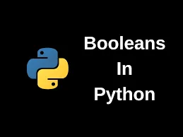

Python boolean is one of python's built in data types. It is used to evaluate expression(s) or in other words represent the truth value of a statement. Python boolean variables is defined by the **True** or **False** keywords. Python boolean function is represented by **bool()**.

Most python data types can be evaluated using the boolean function.

Using a **bool()** on most data type values returns **True**, except for the number 0, an empty string or list(or set, tuple, dictionary) which returns **False**. Here are some examples below:

```python
bool(1)
True
bool(0)
False
bool([2,'j',4.66])
True
```

**Evaluating expression**

You can compare different expression to know the truth statement between the expressions. An example is below:

```python
x=100
y=100.1
print(y < x)
False
```

Python allows you to the check the data type of an object using the built in function **isinstance()**, and it returns a boolean value. So if the data type you assigned in arguments of the **isinstance()** function is accurate, it returns a **True** value, if not it returns a **False** value.

```python
isinstance(100.1, int)
False

isinstance('name', str)
True
```

The global function **any()** also works with booleans. It returns a **True** if any item in an iterable is true, if not it returns **False**.

```python
any([2,1,0])
True

any([0,''])
False
```

**Booleans in decision making**

However booleans can help us in decision making in python. In python decision making (ie if statements), the expression passed to the 'if' statement has to be true before the statements passed to runs or it moves to the next line which is 'else'. You can make adjustments on how you want the decision to be made using booleans.

```python
if (45 <= 39.8) == False:
    print('Yes')
else:
    print('No')

Yes
```

**Booleans in Functions**

Booleans can also be defined in a function to return a boolean as a part of the function. It runs when the function is called.

```python
def function():
    return True

function()
True
```
