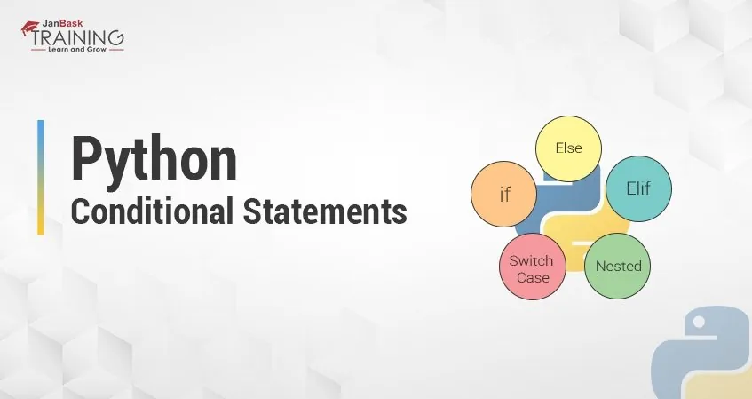

Conditional statements are also called *decision-making statements*. We use those statements while we want to execute a block of code when the given condition is true or false.

- In order to write useful programs, we almost always need the ability to check conditions and change the behavior of the program accordingly. Conditional statements give us this ability.
- A statement that controls the flow of execution depending on some condition. InPython the keywords if , elif , and else are used for *conditional statements.*

Let’s take a glance at how each of those works.

## If Statement
‘If’ statement is the simple and foremost decision-making statement that executes the block of code when the certain condition is proved TRUE otherwise not.

```python
if  :                                                                    /* will execute If condition is true */
```

**Sample Program:**

```python
Marks = 67

if marks >=65:
	print (“C+”)
```

**Output:**

```python
C+
```

Here, the marks are 67 which justify our condition saying, if marks are greater than or equal to 65, it would show ‘C+’.

In case, the ‘If’ condition is not true, it won’t execute the program and error would pop-up. For example: In the case of numbers less than 65, it won’t execute.

**Key Points:**

1. The colon ( : ) at the end of each condition is required indicating that the code block is following directly afterward and thus help to read the program easily.
2. The statements must be indented and would execute only if the condition is TRUE else not.
3. The condition can be used with bracket ‘(‘ ’)’ as well.

**Else Statement.**

What if we want to run the block of code when the condition is not TRUE but FALSE and we don’t want our program to end when it doesn’t justify our ‘If’ statement?

- To solve this, ‘else’ can be used with ‘If’ statement to execute the code when one condition fails to resume the execution of the program.
- If the condition is TRUE, the code of ‘If’ is executed while for FALSE, it skips the ‘If’ condition and executes the code for alternate condition specified in ‘Else’ statement.

**Sample Program**

```python
 marks = 67
if marks >=65
	print("C+")
else:
        print("Other grades")
```

## Elif statement
So far, we are good with two conditions either TRUE or FALSE. But, we may come to a situation with multiple conditions and options where just two conditions are not able to justify the result.

**Sample Program**

```python
marks = int(input())
if marks >= 95:
	print ("A grade")
elif  marks >=75:
	print ("B grade")
elif marks >=60:
	print ("C grade")
elif marks >=55:
	print ("D grade")else:
	print ("Failed")
```

Here in the above program, we have multiple conditions that need to be executed. i.e.

The grades are to be distributed in regards to the marks achieved by the students considering multiple conditions:

1. Grade ‘A’ -> For marks more than 95.
2. Grade ‘B’ -> For marks more than 75.
3. Grade ‘C’ -> For marks more than 60.
4. Grade ‘D’ -> For marks more than 55.

And at last, if none of the above condition matches, a student would be considered ‘Failed’.

**Let’s get started with an exercise!!!!!!**

Determining student's grade given the student exams score.

A = 80 or above

B+ = 75 or above

B = 70 or above

C+ = 65 or above

C = 60 or above

D+ = 55 or above

D = 50 or above

E = 40 or above

F = >=0

Below 0 and above 100 mark is invalid input

```python
mark = (int(input('Input your exams score:')))

if mark >= 80 and mark <=100:
    print("Your exams score is {} therefore you had A".format(mark))
elif mark >= 75:
    print("Your exams score is {} therefore you had B+".format(mark))
elif mark >= 70:
    print("Your exams score is {} therefore you had B".format(mark))
elif mark >= 65:
    print("Your exams score is {} therefore you had C+".format(mark))
elif mark >= 60:
    print("Your exams score is {} therefore you had C".format(mark))
elif mark >= 55:
    print("Your exams score is {} therefore you had D+".format(mark))
elif mark >= 50:
    print("Your exams score is {} therefore you had D".format(mark))
elif mark >= 40:
    print("Your exams score is {} therefore you had E".format(mark))
elif mark >= 0:
    print("Your exams score is {} therefore you had F".format(mark))
else:
    print("Invalid input. Make sure your value is within the range of 0 - 100 inclusively")
```

Output:

```python
Input your exams score:67
Your exams score is 67 therefore you had C+
```

***Happy Readings!!!!!!***

You can find the jupyter notebook and python scripts for this codes [here](https://github.com/Johnson-a-hash/Python-Concept-for-Data-Science-Conditional-Statement.git)
