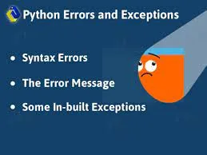

Errors are the problems in a program due to which the program will stop the execution. On the other hand, exceptions are raised when some internal events occur which changes the normal flow of the program.

**Two types of Error occurs in python**

1. Syntax errors
2. Logical errors (Exceptions)

## Syntax errors
When the proper syntax of the language is not followed then syntax error is thrown.

**Example**

```python
# initialize exam score
x = int(input("What is your exam score?"))

# check  whether the student has passed their exam or not
if(x>=10)
    print("Congrats! you succeed ")
else print("You did not pass the exam")
```

**this code returns a syntax error message because after if statement a colon : is missing.**

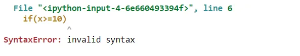

## logical errors(Exception)
Here’s a list of the common exception you’ll come across in Python:

- **ZeroDivisionError**: raised when you try to divide a number by zero
- **IndexError**: Raised when the wrong index of a list is retrieved.
- **AssertionErrorIt** Raised when assert statement fails.
- **AttributeErro**r Raised when an attribute assignment is failed.
- **ImportError**: Raised when an imported module is not found.
- **KeyError** Raised when the key of the dictionary is not found.
- **NameError** Raised when the variable is not defined.
- **TypeError** Raised when a function and operation is applied in an incorrect type.
- **MemoryError** Raised when a program run out of memory.
- **ValueError**: Raised when the built-in function for a data type has the valid type of arguments, but the arguments have invalid values specified
- **Exception**: Base class for all exceptions. If you are not sure about which exception may occur, you can use the base class. It will handle all of them.

**Example1: ZeroDivisionError**

```python
# initialize the amount variable
marks = 10000

# perform division with 0
a = marks / 0
print(a)
```

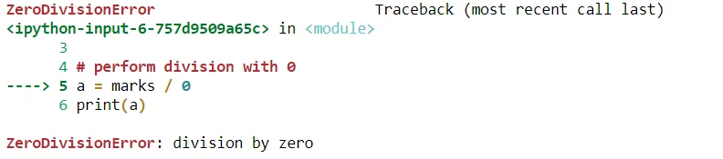

**Example2: Index Error**

```python
#initialize a list
a = [1, 2, 3]
print (a[3])
```

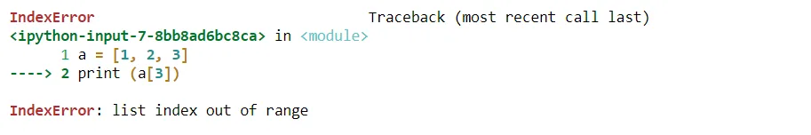

**Example3: AttributeError**

```python
class Attributes(object):
    pass

object = Attributes()
print (object.attribute)
```

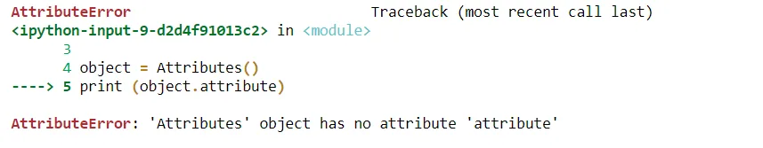

**Example4: ImportError**

```python
import module
```

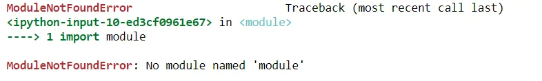

**Example5: KeyError**

```python
array = { 'a':1, 'b':2 }
print (array['c'])
```

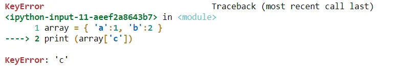

**Example6: NameError**

```python
def func():
    print (ans)

func()
```

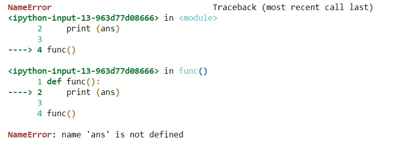

**Example6: TypeError**

```python
arr = ('tuple', ) + 'string'
print (arr)
```

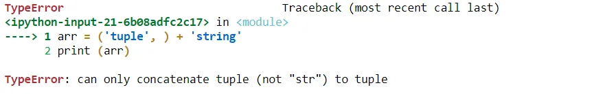

**Example7: ValueError**

```python
print (int('a'))
```

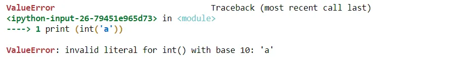

## Error Handling

When an error and an exception is raised then we handle them with the help of handling methods.

**Handling Exceptions with Try/Except/Finally**

We can handle error by Try/Except/Finally methods. We write unsafe code in the try, fall back code in except and final code in finally block.

```python
# put unsafe operation in try block
try:
     print("code start")

     # unsafe operation perform
     print(1 / 0)

# if error occur the it goes in except block
except:
     print("an error occurs")

# final code in finally block
finally:
     print("GeeksForGeeks")
```

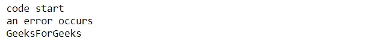

```python
try:
    a = 10/0
    print (a)
except ArithmeticError as e:
        print ("This statement is raising an arithmetic exception.")
        print(e)
else:
    print ("Success.")
```

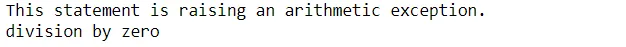

Thank you for regarding!

You can find the complete source code here [Github](https://github.com/rabebbenothmen/Data-Insight2021/blob/main/Assignments/4-Python%20Concept%20for%20Data%20Science%20Errors%20and%20Exceptions%20.ipynb)
