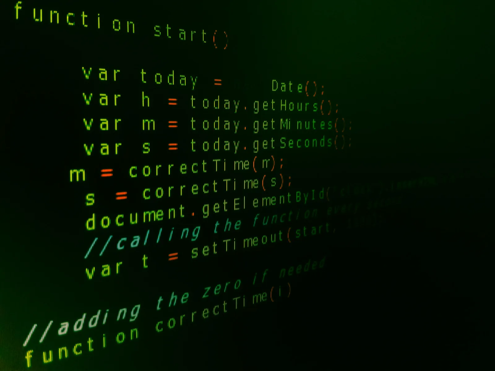

## Functions

In python a function is a group of related statements that perform a specific task. Functions help break our program into smaller and modular chunks.

Many programs react to user input. Functions allow us to define a task we would like the computer to carry out based on input. A simple function in Python might look like this:

```python
def square(number):
    return number**2
```

We define functions using the def keyword. Next comes the name of the function, which in this case is square. We then enclose the function's input in parentheses, in this case number. We use colon(:) to tell Python we're ready to write the body of the function.

In this case the body of the function is very simple; we return the square of number (we use \*\* for exponents in Python). The keyword return signals that the function will generate some output. Not every function will have a return statement, but many will. A return statement ends a function.

Let's see our function in action:

```python
# we can store function output in variables
squared = square(5.5)

print(squared)

my_number = 6
# we can also use variables as function input
print(square(my_number))
```

Output:

```python
30.25
36
```

We can pass different input to the `square` function, including variables. When we passed a float to `square`, it returned a float. When we passed an integer, `square` returned an integer. In both cases the input was interpreted by the function as the argument `number`.

Not all possible inputs are valid

Now let's work on a exercise on how to calculate the area and parameter of a rectangle using Python Functions;

```python
def calculate_area(length,breadth):
    area = length * breadth
    return area

def calculate_parameter(length,breadth):
    parameter = 2*length + 2*breadth
    return parameter
```

```python
length = int(input('Input the length'))
width = int(input('Input the breadth'))

print("Area of the rectangle is ",calculate_area(length,width))
print("Parameter of the rectangle is ",calculate_parameter(length,width))
```

Once we have defined a function, we can call it from another function, program, or even the Python prompt. To call a function we simply type the function name with appropriate parameters.

Output:

```python
Input the length4
Input the breadth6
Area of the rectangle is  24
Parameter of the rectangle is  20
```

**Note:** In python, the function definition should always be present before the function call. Otherwise, we will get an error.

### Why Functions?
We can see that functions are useful for handling user input, but they also come in handy in numerous other cases.

***Happy Reading!!!***

You can find the jupyter notebook and python scripts of this codes in this [link](https://github.com/Johnson-a-hash/Python-Concept-for-Data-Science-Functions.git)
