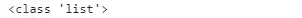
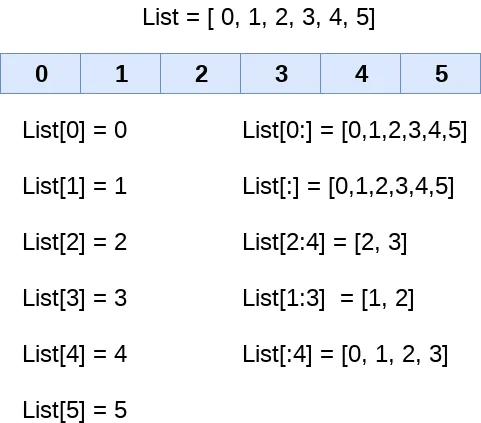

In this blog we will explain List concept in python so

**-what is the List ?why we used it?**

A list can be defined as a collection of values or items of different types.

A list in Python is used to store the sequence of various types of data.

List in python is mutable type its mean we can modify its element after it created.

**-create List:**

we can create list by using [ ]

```python
#createlist
list=["Ali",12,55.5,"sunny"]
print(list)
```

out: ['Ali', 12, 55.5, 'sunny']

if we check the type of list we created above the out will be <class 'list'>

```python
#checktype
print(type(list))
```



**-Characteristics of Lists**

- The lists are ordered.
- The element of the list can access by index.
- A list can be changeable.
- A list can store the number of various elements.
- Allow Duplicates

List is ordered:

When we say that lists are ordered, it means that the items have a defined order, and that order will not change.

If you add new items to a list, the new items will be placed at the end of the list

```python
#ordered
a = [1,2,"Peter",4.50,"Ricky",5,6]
b = [1,2,5,"Peter",4.50,"Ricky",6]
a ==b
out False
```

As we saw above both lists have consisted of the same elements, but the second list changed the index position of the 5th element that violates the order of lists. When compare both lists it returns the false. That's why it is the ordered collection of objects

The element of the list can access by index:

The indexing is processed in the same way as it happens with the strings. The elements of the list can be accessed by using the slice operator [].

The index starts from 0 and goes to length - 1. The first element of the list is stored at the 0th index, the second element of the list is stored at the 1st index, and so on.



indexing:

```python
list = [1,2,3,4,5,6,7]
print(list[0])
print(list[1])
print(list[2])
print(list[3])
out:
1
2
3
4
```

Slicing the elements:

which mean that I take a particular part from the list

```python
list = [1,2,3,4,5,6,7]
print(list[0:6])
```

```python
print(list[2:5])
```

```python
out:
```

```python
[1, 2, 3, 4, 5, 6]
```

```python
[3, 4, 5]
```

we can also use negative for indexing and slicing as we shown below


```python
list = [1,2,3,4,5]
print(list[-1])
print(list[-3:])
print(list[:-1])
print(list[-3:-1])
```

```python
out:
```

```python
5
[3, 4, 5]
[1, 2, 3, 4]
[3, 4]
```

list can be changeable:

The list is changeable, meaning that we can change, add, and remove items in a list after it has been created.

\*we can use append( ) method to add a new item to list :

```python
list=[0,3]
list.append(1)
list.append(2)
list.append(4)
print(list)
out:
[0, 3, 1, 2, 4]
```

\*insert( ) method and the difference between it and append():

append() method only works for addition of elements at the end of the List, for addition of element at the desired position, insert() method is used. Unlike append() which takes only one argument, insert() method requires two arguments(position, value).

List = [1,2,3,4]
print(List)
List.insert(3, 12)
List.insert(0, 'Geeks')
print(List)

```python
out:
[1, 2, 3, 4]
['Geeks', 1, 2, 3, 12, 4]
```

\* extend ( ) method :

like append() and insert() methods, there’s one more method for Addition of elements, extend(), this method is used to add multiple elements at the same time at the end of the list.

```python
List = [1,2,3,4]
print(List)
List.extend([8, 'hello', 'python'])

out:
[1, 2, 3, 4]
[1, 2, 3, 4, 8, 'hello', 'python']
```

\*Removing Elements from the List:

\* remove( ) method:

Elements can be removed from the List by using built-in remove()function but an Error arises if element doesn’t exist in the set. remove()method only removes one element at a time.

```python
List = [1, 2, 3, 4, 5, 6, 7, 8, 9, 10, 11, 12]
print(List)
List.remove(5)
List.remove(6)
print(List)
out:
[1, 2, 3, 4, 5, 6, 7, 8, 9, 10, 11, 12]
[1, 2, 3, 4, 7, 8, 9, 10, 11, 12]
```

\*pop( ) method :

it can also be used to remove and return an element from the set, but by default it removes only the last element of the set, to remove element from a specific position of the List, index of the element is passed as an argument to the pop() method

```python
List = [1,2,3,4,5]
List.pop()
print(List)
List.pop(2)
print(List)
out:
[1, 2, 3, 4]
[1, 2, 4]
```

## Python List Built-in functions
Python provides the following built-in functions, which can be used with the lists.

|  |  |  |
| --- | --- | --- |
| ​**Function** | ​**Description** | ​**Example** |
| len(list) | It is used to calculate the length of the list. | L1 = [1,2,3,4,5,6,7,8] print(len(L1))  8 |
| ​max(list) | It returns the maximum element of the list. | L1 = [12,34,26,48,72] print(max(L1)) 72 |
| ​min(list) | It returns the minimum element of the list. | L1 = [12,34,26,48,72] print(min(L1)) 12 |
| ​list(seq) | ​It converts any sequence to the list. | ​str = "Johnson" s = list(str) print(type(s)) <class list> |
| ​cmp(list1, list2) | It compares the elements of both the lists. | ​This method is not used in the Python 3 and the above versions. |

**conclusion :**

Lists are one of 4 built-in data types in Python used to store collections of data. It's an important concept that data scientist should be know it

**Resources:**

javaTpoint

geeks for geeks

w3school
