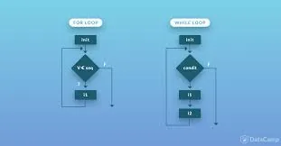

Loops in programming are used to repeat a specific block of code and to iterate over a sequence of elements.

We have two types of loops in python:

**While Loop**: is used to iterate over a block of code as a long as
 the test expression or the condition for the while loop is True:

***Syntaxe******:*** ***while*** ***<cond>:***

***expression***

Example 01:

```python
#example01
i=1
while i<7:
     print(i)i+=1
```

It will return the value of i as long as its value is less than 7. Our output will be :

```python
1
2
3
4
5
6
```

Example 02:

```python
#example02
num = 0
i=0
while i<4:
    num=int(input('number: '))
    sq=str(num*num)
    print("square: "+ sq)
    i+=1
else:print("done")
```

Here, we're going to display the square of the number introduced by the user, as long as the condition of our loop is verified (i<4). Once the condition is False it will return done.

the output :

```python
number: 10
square: 100
number: 24
square: 576
number: 22
square: 484
number: 8
square: 64
done
```

Example 03: Let's practise this to write down a code which will return an empty a liste:

```python
#exmample 03
### clear the list without using list.clear() method
lst = [ 1, 4, 56, 2, 4 , 12,  6, 89 ,11, 0]
i=len(lst)-1
while i>=0:
    lst1=lst.pop()
     print(lst)
     i-=1
else:
     print("print the empty list:" +str(lst))
```

we assign the index of the last value of the list to i. Then clear the list starting from the last element and repeat that till i=0. We display our empty list:

```python
1, 4, 56, 2, 4, 12, 6, 89, 11]
[1, 4, 56, 2, 4, 12, 6, 89]
[1, 4, 56, 2, 4, 12, 6]
[1, 4, 56, 2, 4, 12]
[1, 4, 56, 2, 4]
[1, 4, 56, 2]
[1, 4, 56]
[1, 4]
[1]
[]
print the empty list:[]
```

**For Loop****:** used to iterate over a sequence like: list, tuples, strings...

***Syntaxe******:*** ***for*** ***val in sequence :***

***expression***

The for loop continue working until it reach the last item in the sequence of elements

Example 01:

```python
#example 01
fruit=["lemon","cherry", "banana"]
for x in fruit:
      print(x)
```

We have a list of fruit. the for loop display each fruit in the list:

```python
lemon
cherry
banana
```

Example 02: using range() function

To iterate over a sequene of code a specific time we use the range function: it return a sequence of numbers starting from 0 by default and increminates by 1.

```python
#example02:with range function:range()
for x in range(7) :
       print(x)
```

output:

```python
0
1
2
3
4
5
6
```

Example 03: range () can have 3 arguments: range(start,end, incrementation)

```python
#example02:with range function:range(start,end,incrementation)
for x in range(2,30,3):
       print(x)
else :
        print("finally completed")
```

output:

```python
2
5
8
11
14
17
20
23
26
29
finally completed
```

Example 03:

```python
#example 03# Use for loop to create uniques list and print it!
a_list = [1, 3, 6, 1, 7, 6]
without_duplicates = []
for element in a_list:
    if element not in without_duplicates:
        without_duplicates.append(element)
print(without_duplicates)
```

So we're gonna go through all the element of the list and check if the element exist in the list we created (without_duplicates): We append the list with that element as long as it doesn't already exist.

output:

```python
[1, 3, 6, 7]
```

Thank you for reading

You'll find the code here:

[Github](https://github.com/asmakrl/datacampstd/blob/main/Loops%20in%20Python.ipynb)
