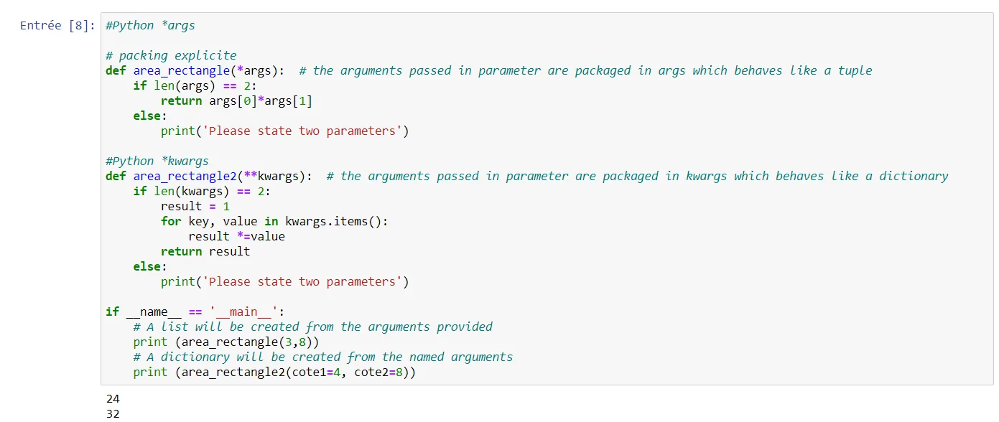

## Introduction to \*args and \*\*kwargs in Python
In Python, we can pass a variable number of arguments to a function using special symbols. There are two special symbols:

1. \*args (Non Keyword Arguments)
2. \*\*kwargs (Keyword Arguments)

In this post i will explain the python concept \*args and \*\*kwargs with the calculation of area of rectangle.

We use \*args and \*\*kwargs as an argument when we are unsure about the number of arguments to pass in the functions.

## Python \*args
Python \*args allow us to pass the variable number of non keyword arguments to function.

In the function, we should use an asterisk \* before the parameter name to pass variable length arguments.The arguments are passed as a tuple and these passed arguments make tuple inside the function with same name as the parameter excluding asterisk \*.

## Python \*\*kwargs
Python passes variable length non keyword argument to function using \*args but we cannot use this to pass keyword argument. For this problem Python has got a solution called \*\*kwargs, it allows us to pass the variable length of keyword arguments to the function.

In the function, we use the double asterisk \*\* before the parameter name to denote this type of argument. The arguments are passed as a dictionary and these arguments make a dictionary inside function with name same as the parameter excluding double asterisk.

**Let's explain \*arg and \*\*kwargs with this example below**

```python
def area_rectangle(*args):
    if len(args) == 2:
        return args[0]*args[1]
    else:
        print('Please state two parameters')
```

[#Python](https://www.datainsightonline.com/blog/hashtags/Python) \*kwargs

```python
def area_rectangle2(**kwargs):
    if len(kwargs) == 2:
        result = 1
        for key, value in kwargs.items():
            result *=value
        return result
    else:
        print('Please state two parameters')
```

```python
if __name__ == '__main__':
    print (area_rectangle(3,8))
    print (area_rectangle2(cote1=4, cote2=8))
```

**Here is the result of this code**



Thank you for reading!

You can find the complete source code here [Github](https://github.com/rabebbenothmen/Data-Insight2021/blob/main/Assignments/3-Python%20Concepts%20for%20Data%20Science%20args%20and%20kwargs.ipynb)
