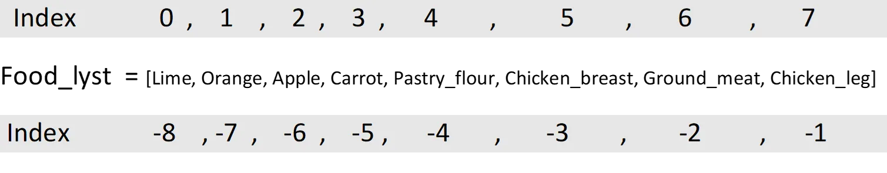

## 1. Introduction
With python we can collect and stock many variables in a list. This is a series of data enclosed in brackets, whose values are separated by commas. These values can be numbers, strings or mixed. For string values, single or double quotes must be used, for example: "fox" or 'fox'. Thus, a python list can stock a set of data of variable size and of different types, which gives them a great flexibility. For a simple case we will :

## 2. Simple list
```python
# Create a list that contains food prices in dollars/kilogram

# step 1 start defining the different variables

Lime = 1.2
Orange = 2.8
Apple = 3.1
Carrot = 1.6
Pastry_flour = 1.5
Chicken_breast = 11
Ground_meat = 12.1
Chicken_leg = 5.5

# step 2 create a list variable called 'Food_lyst' which will contain all the variables listed on it

Food_lyst = [Lime, Orange, Apple, Carrot, Pastry_flour, Chicken_breast, Ground_meat, Chicken_leg]

print(Food_lyst)
[1.2  ,  2.8  , 3.1 , 1.6 , 1.5 , 11 , 12.1 , 5.5]
```

## 3. Mixed list
Once printed, the list ''Food_lyst'' gives only values that correspond to the prices of foods products. This list can be improved by adding the names of foods products with the price that corresponds to each product. So, we will build a list so that the list contains first the name of the product as a string, then its price. In other words, add the strings "Lime", "Orange", "Apple", "Carrot", "Pastry_flour", "Chicken_breast", "Ground_meat", "Chicken_leg

```python
Food_prices = [" Lime", Lime, "Orange", Orange, "Apple", Apple, "Carrot", Carrot, "Pastry_flour", Pastry_flour, "Chicken_breast", Chicken_breast, "Ground_meat", Ground_meat, "Chicken_leg", Chicken_leg]

print(Food_prices)

[' Lime', 1.2, 'Orange', 2.8, 'Apple', 3.1, 'Carrot', 1.6, 'Pastry_flour', 1.5, 'Chicken_breast', 11, 'Ground_meat', 12.1, 'Chicken_leg', 5.5]
```

## 4. Accessibility of the values in the list
One of the advantages of a python list is that we can call its elements by their position. That is, after creating a list of values containing "n" elements (integer, string etc.), these values are automatically associated with numbers ranging from 0 to n-1 in order of entry or from -n to -1 in the opposite direction. These numbers are called "indices" or "indexes" of the list.



Thus, we can easily call a value or values with the following formula:

```python
print(Food_prices[4])
"Apple"
Print(Food_prices[-2])
"Chicken_leg"
Pint(Food_prices[0:6]
[" Lime", 1.2, "Orange", 2.8, "Apple", 3.1]
```

## 5. Put lists in a list
We can also put this list in the form of a list in list by putting square brackets between the variables. For example in our case we can put between brackets the name of each product and its price. Thus, each product with its price represents a list.

```python
Food_prices = [[" Lime", Lime] , ["Orange", Orange] , ["Apple", Apple] , ["Carrot", Carrot] , ["Pastry_flour" , Pastry_flour] , ["Chicken_breast", Chicken_breast] , ["Ground_meat", Ground_meat] , ["Chicken_leg", Chicken_leg]]

print(Food_prices)

[[' Lime', 1.2], ['Orange', 2.8], ['Apple', 3.1], ['Carrot', 1.6], ['Pastry_flour', 1.5], ['Chicken_breast', 11], ['Ground_meat', 12.1], ['Chicken_leg', 5.5]]
```
