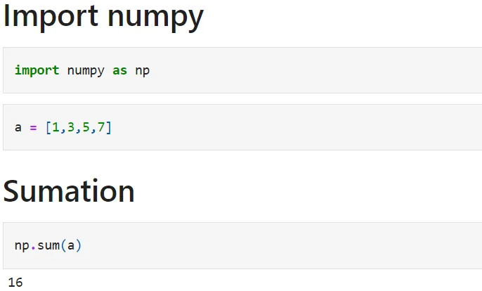
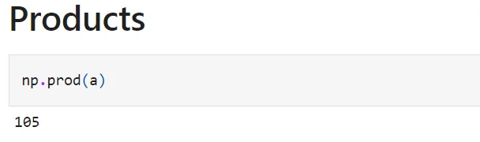
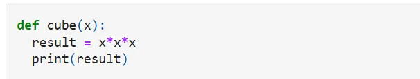
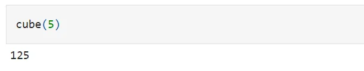

A function is a sequence of organized, reusable code that is used to perform a single, related action. Functions provide better modularity and a higher level of code reuse for your application. Some functions are built-in and some functions create according to their own choice.

**Built-in-function**

Any function that is provided as part of a high-level language can be executed by a simple reference with the specification of the argument. Example(sum):

Example(product):

**Create function**

In python, the function is created by the keyword def:

**Calling function**

To call a function, use the function name followed by parentheses:

To find the code click [here](https://github.com/AliMourtaza/Functions/blob/main/Function.ipynb).
