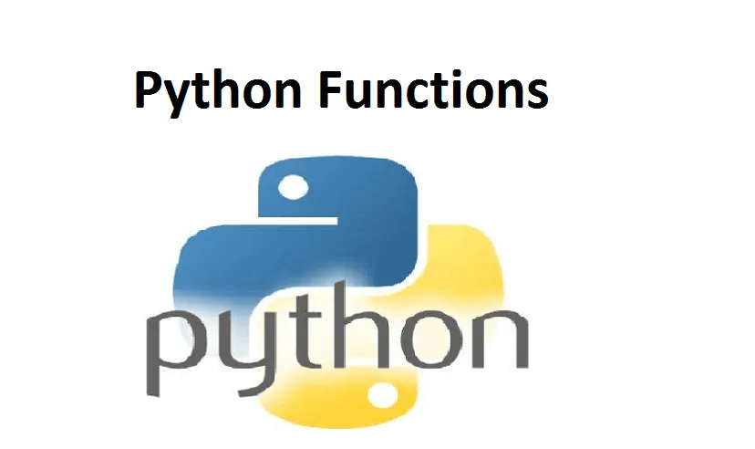
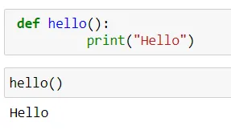
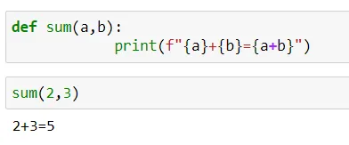
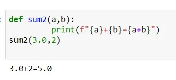
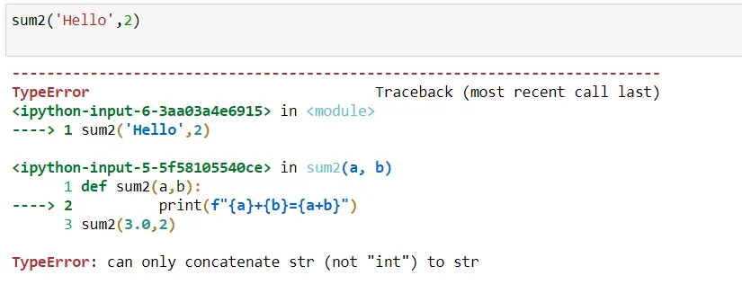
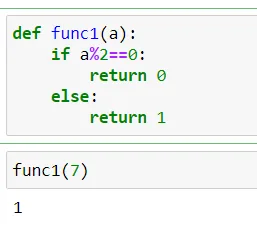
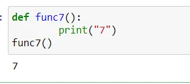
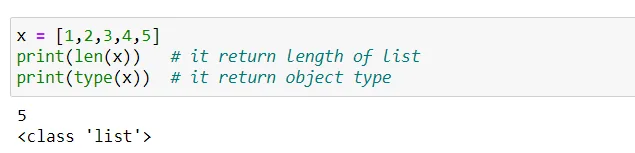
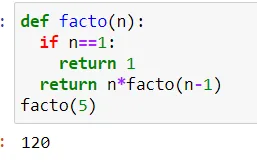

Function in any programming language is a sequence of statements in a certain order, given a name. When called, those statements are executed. So we don’t have to write the code again and again for each [type of] data that we want to apply it to. This is called code re-usability.

Python lets us group a sequence of statements into a single entity, called a function. A python function may or may not have a name.

## Rules for naming python function (identifier)
We follow the same rules when naming a function as we do when naming a variable.

1. It can begin with either of the following: A-Z, a-z, and underscore(_).
2. The rest of it can contain either of the following: A-Z, a-z, digits(0-9), and underscore(_).
3. A reserved keyword may not be chosen as an identifier.

## Types of Functions in Python

## 1. User-Defined Function
User-defined functions in python are the functions that are defined or customized to perform certain specific tasks.

## 1.1 Advantages of User-defined Functions
- Python Function help divide a program into modules. This makes the code easier to manage, debug, and scale.
- It allows function reuse. Every time we need to execute a sequence of statements, all we need to do is to call the function.
- It allows us to change functionality easily, and different programmers can work on different functions.

## Defining a Function
- To define our own Python function, we use the ‘def’ keyword before its name. And its name is to be followed by parentheses, before a colon(:).
- **Example1: Defining a Function**

```python
 def hello():
          print("Hello")
```

## *Note: The contents inside the body of the function must be equally indented.*

### Calling a Function
- To call a Python function at a place in our code, we simply need to name it, and pass arguments, if any. Let’s call the function hello() that we defined in defining a function.
- **Example 2: Calling a Function**

```python
hello()
```



### Functions with Parameter
- Sometimes, we may want a function to operate on some variables, and produce a result. Such a function may take any number of parameters. Let’s take a function to add two numbers.
- **Example 3: Function with Parameter**

```python
def sum(a,b):
            print(f"{a}+{b}={a+b}")
sum(2,3)
```



Here, the function sum() takes two parameters- a and b. When we call the function, we pass numbers 2 and 3. These are the arguments that fit a and b respectively. We will describe calling a function in point f. A function in Python may contain any number of parameters, or none.

- **Example 3a: Adding two parameter in two different datatype i.e. integer and float.**

```python
def sum2(a,b):
         print(f"{a}+{b}={a+b}")
sum2(3.0,2)
```



## *Note: We can't add two incompatible type.*
- **Example 3b: Adding two incompatible type**

```python
sum2('Hello',2)
```

**Output:**



### Python Return Function
- A Python function may optionally return a value. This value can be a result that it produced on its execution. Or it can be something you specify, an expression or a value.
- **Example 4: Returning in a Function**

```python
def func1(a):
    if a%2==0:
        return 0
    else:
        return 1
func1(7)
```

**Output:**



### Deleting Python Function
- We can delete a function with the ‘del’ keyword.
- **Example 5: Deleting a Function**



## 2. Built-In Function
- In-built functions in Python are the in-built codes for direct use. For example, print() function prints the given object to the standard output device .
- In Python 3.9 (latest version), there are 69 built-in functions. Some of the commonly used in-built functions in Python are:

|  |  |
| --- | --- |
| **Method** | **Description** |
| abs() | returns the absolute value of a number |
| all() | ​returns true when all elements in iterable are true |
| ascii() | ​Returns String Containing Printable Representation |
| format()​ | ​Formats a specified value |

- **Example 6: Built-In Function in Python**

```python
x = [1,2,3,4,5]
print(len(x))   # it return length of list
print(type(x))  # it return object type
```



## 3. Python Recursive Function
- A very interesting concept in any field, recursion is using something to define itself. In other words, it is something calling itself.
- In Python function, recursion is when a function calls itself. To see how this could be useful, let’s try calculating the factorial of a number. Mathematically, a number’s factorial is:

n!=n\*n-1\*n-2\*…\*2\*1

- **Example 7: Recursive Function in Python**

```python
def facto(n):
  if n==1:
    return 1
  return n*facto(n-1)
facto(5)
```

**Output:**



In this article we learned about the Python function. First, we saw the advantages of a user-defined function in Python. Then, we can studied create, update, and delete a function. We also learned that a function may take arguments and may return a value.

Hence we can conclude that, functions is the core building blocks of any programming language that a programmer must learn to use. Python provides a large number of in-built methods for direct use and also allows us to define our custom functions.

Thank you for our time! Enjoy reading.

Link to the GitHub repository [Data-Insight-s-Data-Scientist-Program-2021/Funtion.ipynb at master · Tanushree28/Data-Insight-s-Data-Scientist-Program-2021 (github.com)](https://github.com/Tanushree28/Data-Insight-s-Data-Scientist-Program-2021/blob/master/Funtion.ipynb)
