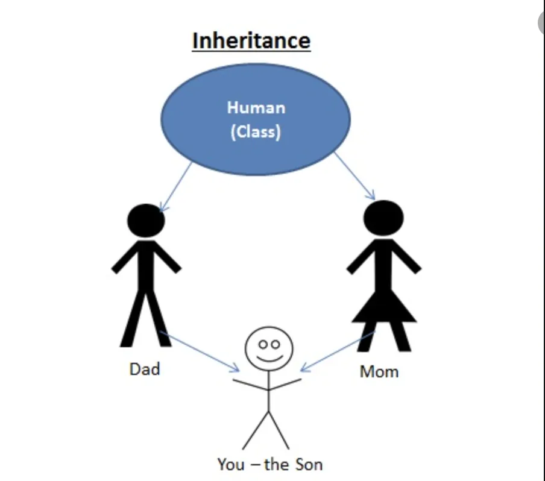

Inheritance generally means to inherit the characters from another things(can be person, object, class or anything)



As in the diagram, the son inherits the characters from Dad and Mom. Futher Dad and Mom have the characters inherited from a general human class.

Similar to human, inheritance is useful in programming so as child(derived) class inherits from base/parent class.

```python
class Human:
    def __init__(self, firstname, lastname):
        self.firstname = firstname
        self.lastname = lastname

    def printname(self):
        print(self.firstname, self.lastname)

class Man(Human):
    pass

x= Man("Ram","Shyam")
x.printname()

Output
Ram Shyam
```

In above example, Human class is the base class and Man is derived from it inheriting all the functions of Human. We created an object x of class Man. The printname() function of Human class is callable from Man object due to inheritance.

We can also add other function or attributes in derived class as:

```python
class Human:
    def __init__(self, firstname, lastname):
        self.firstname = firstname
        self.lastname = lastname

    def printname(self):
        print(self.firstname, self.lastname)

class Man(Human):
    def __init__(self, firstname, lastname):
        super().__init__(firstname,lastname)
        self.gender = "Male"
    def printgender(self):
        print(self.gender)

x= Man("Ram","Shyam")
x.printname()
x.printgender()
```

The functions of base class can be manipulated in derived class as:

```python
class Human:
    def __init__(self, firstname, lastname):
        self.firstname = firstname
        self.lastname = lastname

    def printname(self):
        print(self.firstname, self.lastname)

class Man(Human):
    def __init__(self, firstname, lastname):
        super().__init__(firstname,lastname)
        self.gender = "Male"
    def printgender(self):
        print(self.gender)

class Daughter(Man):
    def __init__(self, firstname, lastname):
        super().__init__(firstname,lastname)
        self.gender = "Female"

y= Daughter("ABC","XYZ")
y.printname()
y.printgender()

Output
ABC XYZ
Female
```

Gitub Link: <https://github.com/ranjan435/data-insight-2021/blob/assignment-2(Python-Concepts-for-Data-Science)/inheritance.ipynb>
