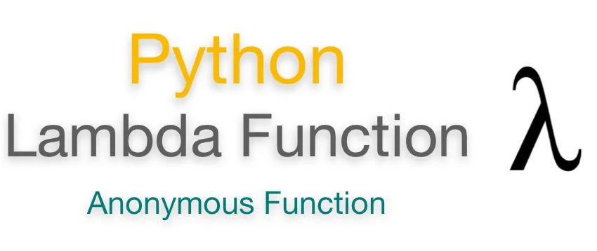

**In this blog we will explain lambda function so what is the lambda function?**

Python Lambda function is known as the anonymous function that is defined without a name. Python allows us to not declare the function in the standard manner by using the def keyword. Rather, the anonymous functions are declared by using the **lambda** keyword. However, Lambda functions can accept any number of arguments, but they can return only one value in the form of expression.

**why it named lambda?**

The names "lambda abstraction", "lambda function", and "lambda expression" refer to the notation of function abstraction in lambda calculus, where the usual function *f*(*x*) = *M* would be written (λ*x*. *M*) (*M* is an expression that uses *x*). Compare to the Python syntax of lambdax:M.

The syntax of lambda function is :

```python
lambda arguments: expression
```

Example of lambda:

```python
x = lambda a:a+10
print(x)
print("sum = ",x(20))
```

```python
out :
```

```python
<function <lambda> at 0x0000019E285D16A8>
sum =  30
```

**Why Use Lambda Functions?**

Lambda functions are used when you need a function for a short period of time. This is commonly used when you want to pass a function as an argument to higher-order functions, that is, functions that take other functions as their arguments.

The lambda function is commonly used with Python built-in functions **filter()** function and **map()** function.

\* lambda with filter()

The Python built-in filter() function accepts a function and a list as an argument. It provides an effective way to filter out all elements of the sequence.

```python
lst = (10,22,37,41,100,123,29)
oddlist = tuple(filter(lambda x:(x%3 == 0),lst))
print(oddlist)
```

```python
out:
```

```python
(37, 41, 123, 29)
```

\* lambda with map()

The map() function in Python accepts a function and a list. It gives a new list which contains all modified items returned by the function for each item.

```python
st = (10,20,30,40,50,60)
square_list = list(map(lambda x:x**2,lst))
print(square_list)
```

```python
out:
```

```python
(100, 400, 900, 1600, 2500, 3600)
```

Finally, This is all about lambda function fundamental. I hope this article helped you understand the basics of the lambda function

**Resources**

\* JavaTpoint

\*W3 school
