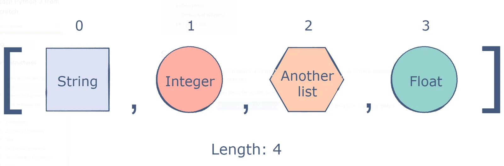

## Lists

In this tutorial, we are going to talk about python lists and their importance.

In Python, lists are perhaps the most frequently used data structure. They can store elements of all types of data.



**Creating a List**

In Python programming, a list is created by placing all the items (elements) inside square brackets [], separated by commas.

```python
 # empty list
empty_list = []
print(empty_list)

# list of integers
int_list = [2, 3, 4]
print(int_list)

# list with mixed data types
m_list = [1, "Hello", 3.4]
print(m_list)
```

## Creating a List Using range()
Using the list() method, a range can also be converted into a list

```python
# A sequence from 0 to 4
seq = range(0, 5)
num_list = list(seq)  # The list() method casts the sequence into a list
print(num_list)
```

## Nested lists
Lists can be nested inside other lists as shown below.

```python
world_cup_winners = [[2006, "Italy"], [2010, "Spain"],
                     [2014, "Germany"], [2018, "France"]]
print(world_cup_winners)
```

It's not even necessary that the nested lists be equal in size. This is not something we see in other programming languages.

## Indexing
To access an item in a list, we can use the index operator []. Indexes in Python begin at 0. Thus, the index of a list with five elements will be 0 to 4.

Using nested indexing, nested lists can be accessed.

```python
# List indexing

H_list = ['H', 'a', 'p', 'p', 'y']

print(H_list[0])  # H

print(H_list[2])  # p

print(H_list[4]) # y

# Nested List
n_list = ["car", [2, 0, 1, 5]]

# Nested indexing
print(n_list[0][1])

print(n_list[1][3])
```

## Merging Lists
Lists can be merged in Python very easily. The + operator is the easiest way to accomplish this.

```python
A = [1, 2, 3, 4, 5]
B = [11,12, 13, 14, 15]
merged_list = A + B
print(merged_list)
```

You can also add elements to another list using the extend() method:

```python
A = [1, 2, 3, 4, 5]
B = [11,12, 13, 14, 15]
A.extend(B)
print(A)
```

## Adding Elements

It is not always possible to specify all the elements of a list before running and we may need to add more elements during running.

To add a new element to the end of a list, use the append() method

The following is an example:

```python
n_list = []  # Empty list
n_list.append(4)
n_list.append(5)
nu_list.append(6)
print(n_list)
```

## Removing Elements

An element can be deleted as easily as it can be added. Pop() is the counterpart of append(), which removes the last element from the list.

The popped element can be stored in a variable:

```python
Countries = ["Canada", "Japan", "Germany", "Switzerland"]
last_Country = Countries.pop()
print(last_Country)
print(Countries)
```

## Sorting
The sort() method can be used to sort a list in ascending order. Depending on the content of the list, the list can be sorted alphabetically or numerically:

```python
n_list = [20, 4, 10, 50.4, 300, 100, 5]
n_list.sort()
print(n_list)
```

The jupyter notebook related to this post can be found [here](https://github.com/safia-bashir/List-)
