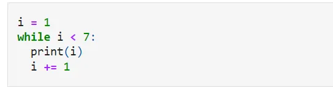
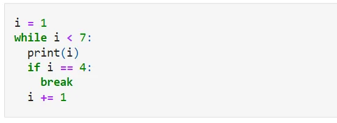
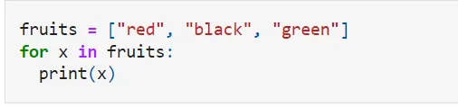
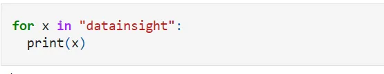

**Loops**

Looping means repeating something over and over until a certain condition is satisfied. A Python loop is a control flow statement that is used to repeatedly execute a group of statements until the condition is satisfied. Such a statement is also known as a repetitive statement.

There is two primitive loop command in python. These are for loop and while loop.

**While Loop:**

With the while loop, we can execute a set of statements as long as a condition is true.

Example 1:

Print i as long as i is less than 7:

Example 2:

With the break statement we can stop the loop even if the while condition is true:

Exit the loop when i is 4:

**For Loop**

A for loop used for the repetition of a sequence. It is less like keywords for other programming languages and works like a repetitive approach like other object-oriented programming languages.

With the help of for loop we can run a set of once, tuple, set, etc. statements for each item in a list.

Example 1:

Print each color in a fruit list:

Example 2:

Loop through the letters in the word "datainsight":

To find the code click [here](https://github.com/AliMourtaza/Loops/blob/main/Loop.ipynb).
