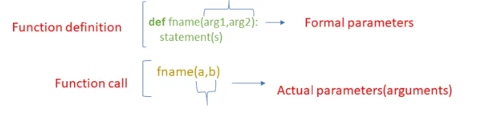

When we are talking about functions, there are two parts -

- **Function definition** - The definition of a function contains the code that determines the function’s behavior.
- **Function invocation** - A function is used within a program via a function invocation

Every function has exactly one definition but may have many invocations.
An ordinary function definition consists of four parts:

- **def** The def keyword introduces a function definition.
- **Name** The name is an identifier. As with variable names, the name chosen for a function should accurately portray its intended purpose or describe its functionality.
- **Parameters** every function definition specifies the parameters that it accepts from callers. The parameters appear in a parenthesized comma-separated list.
- **Body** every function definition has a block of indented statements that constitute the function’s body. The body contains the code to execute when callers invoke the function. The code within the body is responsible for producing the result, if any, to return to the caller.



**Parameters or Arguments?**
The terms parameter and argument can be used for the same thing: information that are passed into a function.
From a function's perspective:

- A parameter is the variable listed inside the parentheses in the function definition.
- An argument is the value that are sent to the function when it is called.

Based on the data passing through into the function, we can classify five types of arguments or parameters:

1. Default argument
2. Positional argument
3. Keyword argument
4. Arbitrary Positional argument
5. Arbitrary Keyword argument

In this blog I will mainly talk about positional argument and keyword argument.

**Positional Argument**
During a function call, **positional arguments** pass through into the function in the order of proper position or order. The first positional argument always needs to be listed first when the function is called. The second positional argument needs to be listed second and the third positional argument listed third, etc.

Let create a function, this function is declared with three parameters (a, b, c). The function will print out with each values of 'a', 'b', 'c' in sequence , and then returns the sun of all inputs

```python
Value of 'a' is 3
Value of 'b' is 5
Value of 'c' is 30
38
```

When we call this function, the values passed through arguments are passed to parameters by their position. 3 is assigned to 'a', 5 is assigned to 'b' and 30 is assigned to 'c'.

A function can be declared with default value by assigning to the parameters. This is called **default argument**. Lets modify by adding default argument to function, 5 assign to 'b' and 10 is assigned to 'c'.

When we call the function with custom values, the arguments will overwrite the default parameter and return the output. During call the function with arguments (3, 20, 13), 3 will assigns to 'a', 20 and 13 will overwrite the default parameter 'b' and 'c'.

Value of 'a' is 3
Value of 'b' is 20
Value of 'c' is 13
36

Default arguments become optional during the function calls. When we give only one argument for 'a', the function will take default values 5 and 10 for 'b' and 'c'.

```python
Value of 'a' is 3
Value of 'b' is 5
Value of 'c' is 10
18
```

And we can give one of the optional argument

```python
Value of 'a' is 3
Value of 'b' is 4
Value of 'c' is 10
17
```

When creating a function we can have any number of default arguments, and the default arguments should follow the positional arguments. If we give default argument in front of positional, the function gives a error.

```python
 File "<ipython-input-33-dc1040eb6292>", line 1    def add(a=5 ,b=5,c):
           ^
SyntaxError: non-default argument follows default argument
```

### Keyword arguments
During a function call, values passed through arguments need not be in the order of parameters in the function definition. This can be achieved by **keyword arguments**. But all the **keyword arguments** should match the parameters in the function definition. Keyword argument can be denoted as **kwarg**.

Example:

This function is declared with default parameters for 'b' and 'c'. During a function call, it will print out with each values of 'a', 'b', 'c' in sequence, and then returns the sun of all inputs. We can call this function with positional arguments in sequence of order.

This function can be achieved as **keyword arguments**. Calling the function by giving keyword arguments, all parameters are given as keyword arguments, so no need to maintain the same order. The arguments' values for 'b' and 'c' will be overwrite.

```python
Value of 'a' is 20
Value of 'b' is 10
Value of 'c' is 15
45
```

During a function call, only giving mandatory argument as a keyword argument. Optional default arguments are skipped.

```python
Value of 'a' is 10
Value of 'b' is 6
Value of 'c' is 10
26
```

Giving a mix of positional and keyword arguments, keyword arguments should always follow positional arguments.

```python
Value of 'a' is 10
Value of 'b' is 20
Value of 'c' is 30
60
```

The parameter 'a' is assigned with positional argument value 10 and then 'b' and 'c' is assigned with keyword argument.

### Important points to remember for positional argument and keyword argument
- Default arguments should not follow non default arguments.
- Keyword arguments should follow positional arguments.
- All keyword arguments passed must match one of the arguments accepted by the function and their order is not important.
- All arguments should not receive a value more than one.
- Default arguments are optional arguments

[Source code can be found here](https://github.com/DoublePK/DataScientistProgramAssignments/blob/master/Python%20Positional%20and%20Keyword%20Argument.ipynb)
