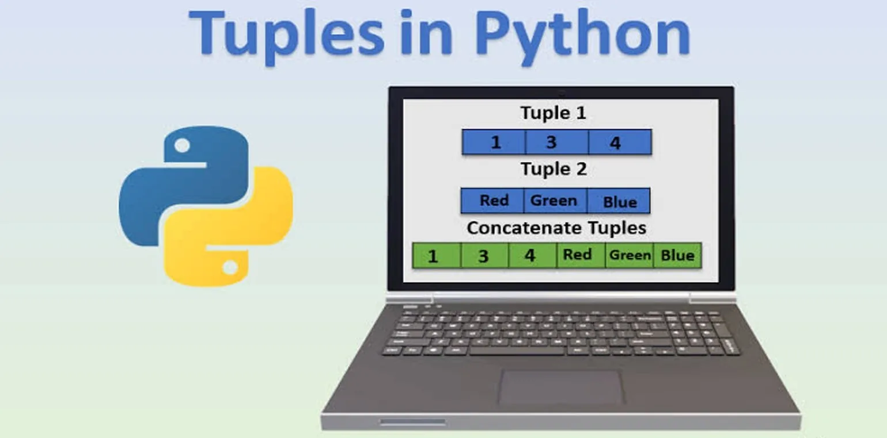
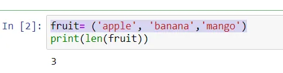
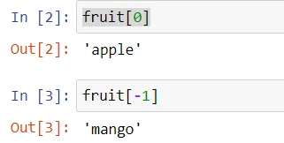
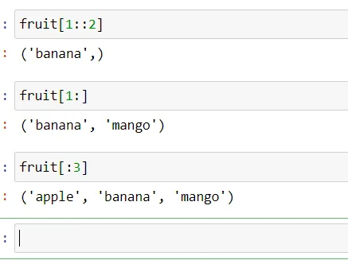
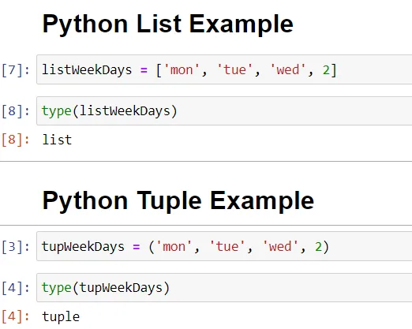

A tuple is a built-in datatype in python and it is used to store multiple items in a single variable. It is one of the data types in python which is used to store collections of data.

A tuple is a collection that is ordered and unchangeable means we can not change items after declaring them in the tuple. Tuples are written with round brackets.

**Example:-**fruit= ('apple' , 'banana' , 'mango') this is a tuple.

Tuple items are ordered, unchangeable, and also allow duplicate values.

Tuple items are indexed like the first item has index [0], the second item has index [1], etc.

In tuple, we can not change the order of items once the tuple is created. To find the length of a tuple we can use the length function with **syntax**: len(tuple name).

**Example1:-Printing Length of Tuples**

```python
fruit= ('apple', 'banana','mango')
print(len(fruit))
```

*This gives output 3 because there are three items inside the tuple.*



**Example2:-Indexing in Tuples**

```python
fruit[0]
fruit[-1]
```

**Output:**



**Example3:- Slicing in Tuples**

```python
fruit[1::2]
fruit[1:]
fruit[:3]
```

**Output:**



#### Tuples and List
Tuples are identical to lists in all respects, except for the following properties:

- Tuples are defined by enclosing the elements in parentheses (()) instead of square brackets ([]).
- Tuples are immutable.

### Why use a tuple instead of a list?
- Program execution is faster when manipulating a tuple than it is for the equivalent list. (This is probably not going to be noticeable when the list or tuple is small.)
- Sometimes we don’t want data to be modified. If the values in the collection are meant to remain constant for the life of the program, using a tuple instead of a list guards against accidental modification.

### Example of Difference between List and Tuple
```python
#Python List Example
listWeekDays = ['mon', 'tue', 'wed', 2]
type(listWeekDays)
```

```python
#Python Tuple Example
tupWeekDays = ('mon', 'tue', 'wed', 2)
type(tupWeekDays)
```

**Output:**



Hence, we can conclude that tuples are used to store multiple items in a single variable.

Thank you for your time! Happy reading.

Link to the GitHub repository [here](http://github.com).
