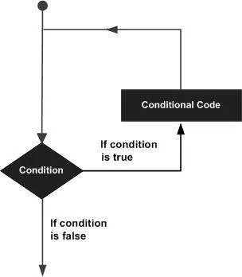

Hello there,

When I think of loops and how useful they can be, I remember Gauss's way sum the number from 1 to 100 in a simple way as n\*(n+1)/2 [n being 100 here]. But let's say I actually had to do it today without knowing that formula?
I wouldn't just write this, would I?:

```python
s = 1
s += 2
s += 3
...
s += 100
```

This would be worse than the punishment given the Gauss back in the day. But, programming can circumvent this with loops if we write:

```python
s = 0
for i in range(1,101):
    s+=i
print(s)
""" output:
5050
"""
```

Don't worry, you'll get this with easier examples, But for now just reflect on how easy it was to count a hundred numbers with only 3 lines of code.

So, what are loops? In simple programming terms: **"A loop statement allows us to execute a statement or group of statements multiple times". "As long as condition is satisfied, keep doing this treatment"** if we want to explain it in everyday terms.



To achieve this we can use two loops offered to us in python:

- **for** loop
- **while** loop

### for loop:

Let's start with the for loop and see what it can do:

- We can use it to iterate over an array:

```python
for i in [1,2,3,4,5,6,5,4,3,2,1]:
    print(i, end=' ')
""" output
1 2 3 4 5 6 5 4 3 2 1
"""
```

- We can also use it to iterate over a **range** of numbers, I felt a little mean so I left behind the even numbers:

```python
for i in range(1,10,2):
    print(i,end=' ')
""" Output
1 3 5 7 9
"""
```

- We can also go through the letters of a string (considering that it is an array after all, why not!).

```python
for i in 'datainsight':
    print(i,end=' ')
"""Output
d a t a i n s i g h t
"""
```

Okay this seems fairly handy, but I want something a bit more complicated, let's say, a loot within a loop!! Those are called **nested loops**! They are really needed when there treatments of **2D arrays** for example, or going through the **lines** of **multiple files**.

### nested for loops:

Let's use this to print ranges of numbers multiple times! **Here is a fun fact about ranges:** They always start from the first number specified but they can never reach the end number (they only to go the number before, so always keep that in mind when using ranges!)

```python
for i in range(1,10,1):
    for j in range(10,1,-1):
        print(j,end=' ')
    print('\n')

"""output (9 lines!!)
10 9 8 7 6 5 4 3 2
10 9 8 7 6 5 4 3 2
10 9 8 7 6 5 4 3 2
...
10 9 8 7 6 5 4 3 2
10 9 8 7 6 5 4 3 2
```

### while loop:

A while loop is more straightforward when you think about it, "If this is still right, do it again!". It actually is as simple as that. Let's see that more with some examples and show one of its important use cases.

```python
x = 0
while x < 10: #stop condition
    print(x, end=' ')
    x+=1
""" output
0 1 2 3 4 5 6 7 8 9
"""
```

It can do counting like a for loop, but you have to take care of the counting variable yourself! unlike a for loop which does it on its own. Else you might end up with an **infinite loop**. These are common with while loops because it can be easy to mess up the stop condition and end up running it eternally. Although, ***infinite loops***are not always the enemy. Sometimes we need them for specific things that must run uninterrupted.

We also can use a while loop to do input control. I'll show this through a mini guessing game:

```python
guess = 'lucky guess'
user_input = ''
while user_input!= guess :  # This constructs an infinite loop
    user_input = input("Enter a guess  : ")
print('You did it!')
""" output
Enter a guess  : wrong guess
Enter a guess  : lucky guess
You did it!
"""
```

In this case, as long as the user doesn't guess the word, he'll have to try it as many time as humanly possible to find the right word. Or in my case, only two ;) .

### Nesting different loops:

Let's see the loops in action. We'll play a guessing game where there are 3 words and 3 tries per words. We'll use the for loop for easy access to the words and the while loop for tries count and input control. You think we can win this?

```python
tries = 3
words = ['work','game','home']
print('You get three guesses per word')
guessed_right = False
for w in words:
    t = 0
    print('Secret word to guess', w)
    user_input=''
    while w != user_input and t < tries:
        t+=1
        user_input = input("Enter a guess  : ")
    if w == user_input:
        guessed_right = True
        break
    else:
        continue
if guessed_right == False:
    print("you're out of tries :( , you lost")
else:
    print('you did it!')
```

If what I've written in the past paragraphs made any sense, we can see that the for loop is iterating the words and the while loop is seeing if the user guessed right or if he still has any tries.

But wait, You noticed didn't you? What are those **break** and **continue** statements? Those are called **control statements.**  They help us keep the loops under even more control conditions, let's say while counting I want to stop at 5, but the range goes as far as 10. This where a **break** statement comes into play.

The are three control statements that can be used in loops:

- **continue:** Skip to the next step, (ignores any instructions that are left within the current iteration)
- **break:** Get out of this loop immediately
- **pass:** The best way to describe this is by calling it a placeholder. It is needed when an instruction must be given but you still don't know what to code in that block.

Check these examples to understand them more:

**continue:** yes yet again, the even numbers fall victim to my cruelty

```python
for i in range(1,10,1):
    if i % 2 == 0:
        continue
    print(i,end=' ')
""" output
1 3 5 7 9
"""
```

**break:** Why wait for the range to end when you can quit on your own?

```python
for i in range(1,10,1):
    print(i,end=' ')
    if i  == 5:
        break
""" output
   1 2 3 4 5
"""
```

**pass:** I don't know what am doing, so just keep it there for now!

```python
for i in range(10):
    if i == 5:
        pass
        print("I don't know what to do when it's {}, but I'll keep this here so I come back to it".format(i))
    print(i,end = ' ')
""" output
0 1 2 3 4 I don't know what to do when it's 5, but I'll keep this here so I come back to it
5 6 7 8 9
"""
```

This concludes my post about loops. I hope it was worth reading and that it has been to your liking. You can check the notebook [here](https://github.com/zqngetsu96/DataInsight_Assignments_and_projects/blob/main/Assignment%202/Python%20Concepts%20loops.ipynb) to download it and try more things on your own.

Thank you for your time.
