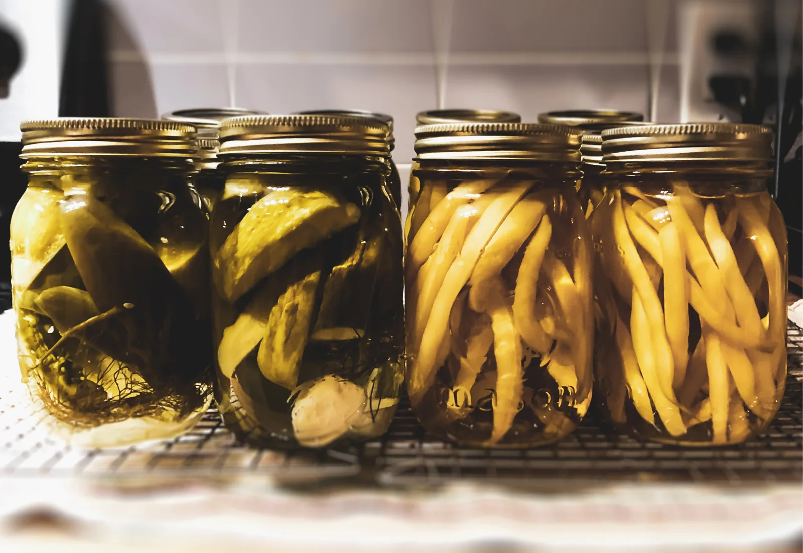

Pickling is the process of serializing an object hierarchy into a byte stream. Unlike JSON or XDR and other formats, pickling is Python's specific which means it is not restricted to the rules of JSON. Unpickling is doing the opposite.

Pickling is a binary serialization process, JSON is a string serialization process. JSON is more safer than pickling.

Pickling can be done by writing these byte streams into a file, send them across a network, or store them in a database.

Two modules Interfaces are used for pickling and unpickling:

- dumps() – to serialize an object hierarchy.
- loads() – to de-serialize a data stream.a

**Lets look at an example:**

**PICKLING:**

```python
import pickle

serial_dic = {"type1":"text-based", "type2":"binary-format" }
```

As seen, we first need to import pickle, then we create a file to pass the dictionary to it.

we have three types:

1. w - write mode.
2. b - binary mode
3. wb - write in binary mode

```python
with open("serial_dic.pkl", "wb") as f:
        pickle.dump(serial_dic, f)
```

The file **serial_dic.pk1** is created as **wb** type file, then the content of **serial_dic** is dumped into it, in the format of character stream, which means it is been serialized.

with choosing the highest protocol, the higher the protocol the newer python edition that can deal with it.

**UNPICKLING:**

To unpickl the previous file from **.pk1** format to its original format, we simply use the **load()** function.

we have three types:

1. r - read mode.
2. b - binary mode
3. rb - read in binary mode

```python
with open("serial_dic.pkl", "rb") as f:
        retreived_dict = pickle.load(f)

print(retreived_dict)
```

The result is:

```python
{'type1': 'text-based', 'type2': 'binary-format'}
```

It seems the de-serialization has been done successfully.

Do not forget to follow me on twitter: :3

Mine is: @sanaomaro
